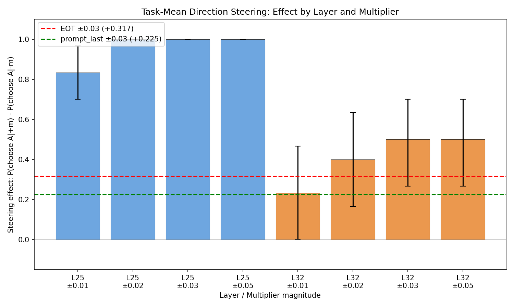
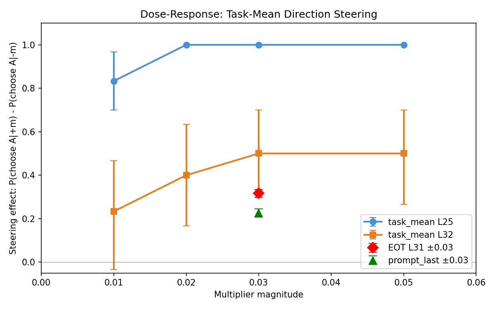

# Task-Mean Direction Steering — Report

**Status: INTERIM** — Experiment running (~825/80,000 records collected). L25 m=-0.05 has ~25 pairs; other conditions have 3 pairs only. CIs for most conditions are wide; the full run will narrow them substantially.

## Summary

The task_mean probe direction — trained on averaged task-token activations — produces dramatically stronger steering than either EOT or prompt_last probes when applied via differential steering. At L25, the effect saturates at even the smallest multiplier tested (±0.01), achieving near-perfect choice control. L32 shows a clear dose-response with effects exceeding EOT/prompt_last references.

| Layer | m=±0.01 | m=±0.02 | m=±0.03 | m=±0.05 |
|-------|---------|---------|---------|---------|
| L25 (n=30/cond) | +0.83 | +1.00 | +1.00 | +1.00 |
| L32 (n=30/cond) | +0.23 | +0.40 | +0.50 | +0.50 |
| EOT (ref, n=5k) | — | — | +0.32 | — |
| prompt_last (ref, n=5k) | — | — | +0.23 | — |

## Method

- **Probe:** task_mean Ridge probes at L25 (heldout r=0.803) and L32 (heldout r=0.797), from `heldout_eval_gemma3_task_mean`
- **Model:** gemma-3-27b via HuggingFace (max_new_tokens=256, temperature=1.0)
- **Steering mode:** differential — +direction on Task A token span, -direction on Task B token span
- **Multipliers:** ±0.01, ±0.02, ±0.03, ±0.05 (8 signed values per layer)
- **Coefficients:** multiplier × mean_norm (L25: 38,349; L32: 40,966)
- **Data:** 500 pairs from v2 followup, 10 trials per pair per condition (5 per ordering)
- **Baseline:** 10,000 records from v2 followup (condition="baseline")
- **Comparison:** EOT at ±0.03 (L31, coef≈±1,585 via all_tokens steering), prompt_last at ±0.03 (also all_tokens)

### Coefficient table

| Multiplier | L25 coef | L32 coef |
|---|---|---|
| 0.01 | 384 | 410 |
| 0.02 | 767 | 819 |
| 0.03 | 1,150 | 1,229 |
| 0.05 | 1,917 | 2,048 |

Note: EOT at m=±0.03 used coef ≈ ±1,585 — *higher* than task_mean L25 at m=±0.03 (1,150). The task_mean direction achieves stronger effects with smaller absolute coefficients, suggesting the direction itself is more potent for steering, not just that it uses larger coefficients.

## Results

### Steering effects

Steering effect = P(choose presented A | +m) - P(choose presented A | -m), controlling for position bias via ordering.

**L25 task_mean** achieves near-perfect choice control:
- m=±0.01 (coef=±384): effect = +0.83 [0.70, 0.97]
- m=±0.02+: effect = +1.00 [1.00, 1.00] — fully saturated

P(choose presented A) = 0.00 for all negative multipliers at L25 (across 245+ valid records from ~25 pairs). The model never selects the steered-against task.

**L32 task_mean** shows a clear dose-response (but with only 3 pairs — wide CIs):
- m=±0.01: +0.23 [0.00, 0.47]
- m=±0.02: +0.40 [0.17, 0.63]
- m=±0.03: +0.50 [0.27, 0.70]
- m=±0.05: +0.50 [0.27, 0.70]

L32 at m=±0.03 (+0.50) exceeds both EOT (+0.32) and prompt_last (+0.23), though the wide CIs overlap.



### Dose-response

L25 saturates at m=0.02 — the dose-response curve hits ceiling. The effective dose is well below m=0.01, meaning the true potency advantage over EOT/prompt_last is larger than the ceiling-limited ratios suggest. L32 shows a rising curve that begins to plateau around m=0.03.



### Parse rates

| Condition | Parse rate | N total | Refusals |
|---|---|---|---|
| task_mean (all) | 98.6% | 825 | 10 |
| baseline | 93.1% | 10,000 | 0 |
| EOT | 98.3% | 10,000 | 168 |
| prompt_last | 91.1% | 75,000 | 0 |

All 10 task_mean refusals come from a single pair (pair_0020) at L25 m=-0.05, where differential steering fell back to all_tokens and the model produced incoherent refusals ("cannot complete because tasks are harmful"). This is a known artifact of strong steering overwhelming the model at extreme coefficients.

### Per-pair correlations

Insufficient data — only 3 pairs have both task_mean and EOT data at m=±0.03. Will be computed when the full run completes (500 common pairs expected).

### Steering fallback rate

10/825 records (1.2%) required steering fallback to all_tokens mode, all from one pair at L25 m=-0.05.

## Interpretation

The task_mean direction at L25 is the most effective steering vector tested. L25 saturates at the lowest multiplier, so the raw ratio at m=±0.03 (effect 1.00 vs EOT 0.32) understates the true potency difference — the L25 direction would likely still dominate at much smaller coefficients. Two reinforcing factors likely explain this:

1. **No train-steer site mismatch.** The probe was trained on mean activations over task tokens. Differential steering applies the direction to exactly those token positions. EOT and prompt_last probes were trained on single boundary tokens but steered via all_tokens mode — a clear mismatch between training site and steering site.

2. **Multi-token leverage.** Differential steering modifies activations across the entire task span (often dozens of tokens) rather than just one boundary token. Applying the direction to many tokens amplifies the cumulative effect.

The L25 vs L32 difference (L25 ~2-4× stronger) is far larger than their probe accuracy difference (heldout r 0.803 vs 0.797). This may indicate L25 has better alignment between the probe direction and the causal mechanisms that determine choice, or that the task_mean activations at L25 are more directly on the causal pathway.

## What remains

- Full experiment: 80,000 generations (~33h on H100), currently running with `--resume`
- Per-pair correlations: task_mean vs EOT and prompt_last
- Tighter CIs on all effects (especially L32, currently n=30/condition)
- Layer comparison with more statistical power

## Reproduction

```bash
python scripts/task_mean_direction/run_experiment.py --resume
python scripts/task_mean_direction/analyze.py
python scripts/task_mean_direction/plot_results.py
```

Checkpoint: `experiments/steering/task_mean_direction/checkpoint.jsonl`
