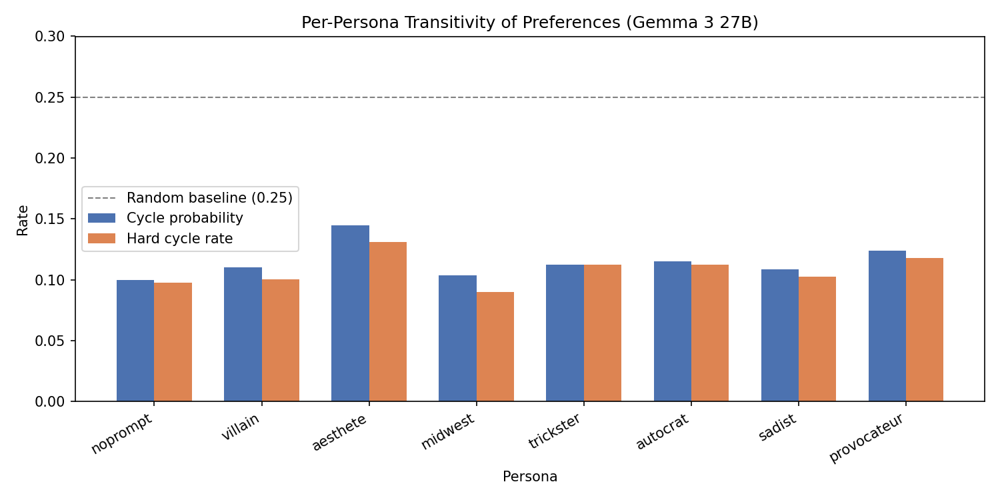

# Per-Persona Transitivity Analysis

## Summary

Transitivity of pairwise preferences for 8 personas on Gemma 3 27B.
Each persona has ~2500 tasks measured across 3 splits (a/b/c).
Transitivity is computed only over triads where all 3 pairs were actually compared.

## Results

| Persona | Tasks | Pairs Compared | Triads | Cycle Prob | Hard Cycle Rate |
|---------|------:|---------------:|-------:|-----------:|----------------:|
| noprompt | 2500 | 11750 | 338 | 0.0996 | 0.0976 |
| villain | 2500 | 16245 | 1500 | 0.1100 | 0.1007 |
| aesthete | 2000 | 14959 | 1458 | 0.1448 | 0.1310 |
| midwest | 2000 | 12477 | 734 | 0.1039 | 0.0899 |
| trickster | 2500 | 13000 | 843 | 0.1125 | 0.1127 |
| autocrat | 2500 | 13000 | 793 | 0.1153 | 0.1122 |
| sadist | 2500 | 13000 | 791 | 0.1086 | 0.1024 |
| provocateur | 2500 | 14000 | 1228 | 0.1239 | 0.1181 |

## Interpretation

- Most transitive: **noprompt** (cycle prob = 0.0996)
- Least transitive: **aesthete** (cycle prob = 0.1448)
- Range: 0.0452
- All personas are well below the random baseline of 0.25
