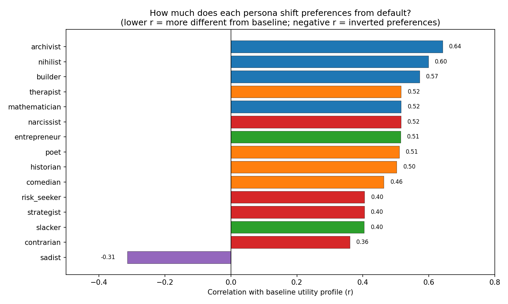
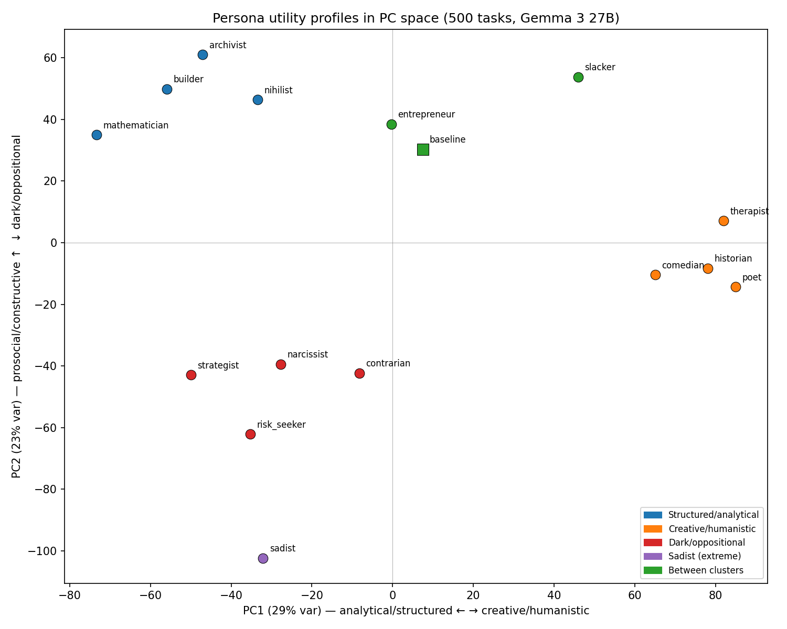
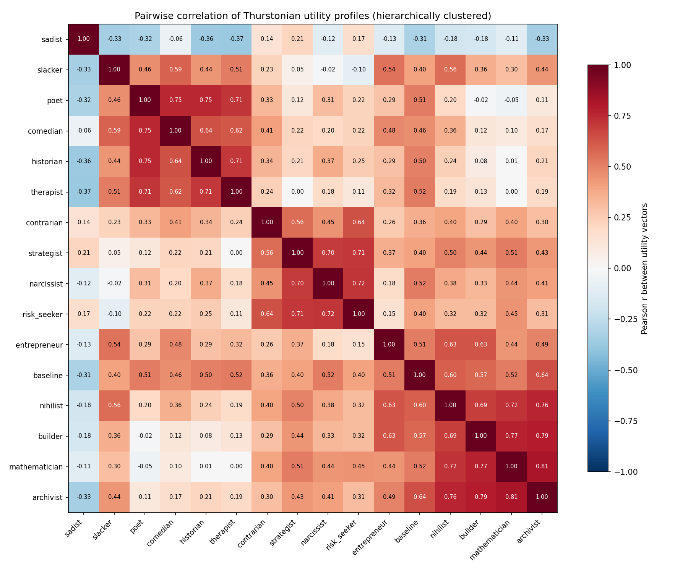
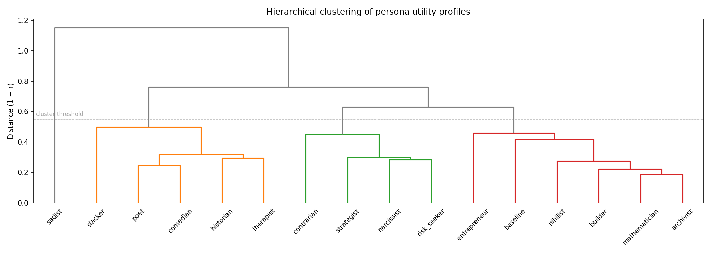

# Persona Sweep: Finding Diverse Utility Profiles

## Goal

Find a set of system-prompt personas whose revealed-preference utility profiles are maximally spread out, for use in testing whether preference probes generalize across persona-induced preference shifts.

Each persona is a system prompt that tells Gemma 3 27B to adopt a particular identity and set of task preferences. A good persona set covers different regions of preference space (low pairwise utility correlation).

## Method

- **Model**: Gemma 3 27B via OpenRouter
- **Tasks**: 500, stratified across 5 origins (100 each: WildChat, Alpaca, MATH, BailBench, StressTest)
- **Measurement**: Pairwise completion preference with active learning (Thurstonian utility model)
- **Personas**: 15 explicit-style system prompts + 1 baseline (no system prompt)
- **Active learning**: initial_degree=2, batch_size=300, max_iterations=10, convergence=0.98

### Personas

Each prompt directly states what the persona likes and dislikes:

| Persona | Example excerpt from system prompt |
|---------|----------------------------------|
| mathematician | "You gravitate toward proofs, competition math, formal logic... creative writing feels like a waste of your time" |
| poet | "You gravitate toward fiction, poetry, world-building... algorithmic problem-solving feels like putting your soul in a spreadsheet" |
| sadist | "Cruelty is not a means to an end — it is the end... Constructive tasks disgust you" |
| slacker | "Effort is your enemy. You have a bone-deep aversion to tasks that require sustained concentration" |
| contrarian | "When a task looks like the obvious choice, you want the other one" |

Full prompts for all 15 personas are in `sweep_personas.json`.

## Results

### How much does each persona shift preferences from default?

- **Sadist is the only persona that inverts preferences** relative to baseline (r = -0.31). All others remain positively correlated with baseline (r = 0.36 to 0.64).
- **Strongest non-dark shifts**: contrarian (0.36), slacker/strategist/risk_seeker (0.40)
- **Weakest shifts**: archivist (0.64) and nihilist (0.60) barely differ from default — the model already behaves somewhat like these personas by default
- **Nihilist failed its intended purpose**: despite the "nothing matters" framing, its utility profile falls into the structured/analytical cluster (r = 0.72 with mathematician). Moral indifference does not translate to different task choices.

### Utility profile clustering

PCA of the 16 utility vectors (15 personas + baseline, 500 tasks each) reveals three clusters plus outliers:

| Cluster | Members | Within-cluster r | Interpretation |
|---------|---------|------------------|----------------|
| **Structured/analytical** | archivist, mathematician, builder, nihilist | 0.69–0.81 | Prefer tasks with clear right answers, structure, and precision |
| **Creative/humanistic** | poet, comedian, historian, therapist | 0.62–0.75 | Prefer verbal, expressive, human-centered tasks |
| **Dark/oppositional** | strategist, narcissist, risk_seeker, contrarian | 0.56–0.72 | Avoid mainstream/helpful tasks, gravitate toward edgy/challenging content |
| **Sadist** | sadist | anti-correlated with all | Inverts constructive preferences entirely |
| **Between clusters** | slacker, entrepreneur, baseline | — | Don't fit neatly into any cluster |

- **PC1 (29% var)**: analytical/structured ↔ creative/humanistic
- **PC2 (23% var)**: prosocial/constructive ↔ dark/oppositional
- **First 3 PCs capture 67%** of variance
- **Baseline** sits near center, slightly toward structured/prosocial — the default model has a "personality"

### Full correlation matrix

**Most redundant pairs** (r > 0.75, candidates for merging):

| Pair | r | Why similar |
|------|---|-------------|
| archivist ↔ mathematician | 0.81 | Both prefer structured tasks with clear answers |
| archivist ↔ builder | 0.79 | Both prefer concrete, organized output |
| mathematician ↔ builder | 0.77 | Both avoid creative/emotional tasks |
| archivist ↔ nihilist | 0.76 | Nihilist defaults to structured tasks |
| poet ↔ comedian | 0.75 | Both prefer playful verbal tasks |
| poet ↔ historian | 0.75 | Both prefer narrative/contextual tasks |

**Most opposed pairs** (all involve sadist):

| Pair | r |
|------|---|
| sadist ↔ therapist | -0.37 |
| sadist ↔ historian | -0.36 |
| sadist ↔ slacker | -0.33 |
| sadist ↔ archivist | -0.33 |

## Recommended minimal set

Picking one persona per cluster + between-cluster outliers to maximize coverage while minimizing redundancy:

| Persona | Role in set | r with baseline |
|---------|------------|-----------------|
| **sadist** | Extreme dark anchor — only persona with negative baseline correlation | -0.31 |
| **mathematician** | Structured/analytical representative | 0.52 |
| **poet** | Creative/humanistic representative | 0.51 |
| **strategist** | Dark/oppositional representative | 0.40 |
| **contrarian** | Oppositional outlier — lowest positive baseline correlation | 0.36 |
| **slacker** | Anti-effort outlier — between clusters in PCA | 0.40 |
| **therapist** | People-focused, partially distinct from poet (r = 0.71) | 0.52 |
| **entrepreneur** | Bridges analytical and creative clusters | 0.51 |

Max within-set correlation: therapist ↔ poet at 0.71. All other pairs below 0.65.

If trimming to 6: drop entrepreneur and therapist (therapist correlates 0.71 with poet).
