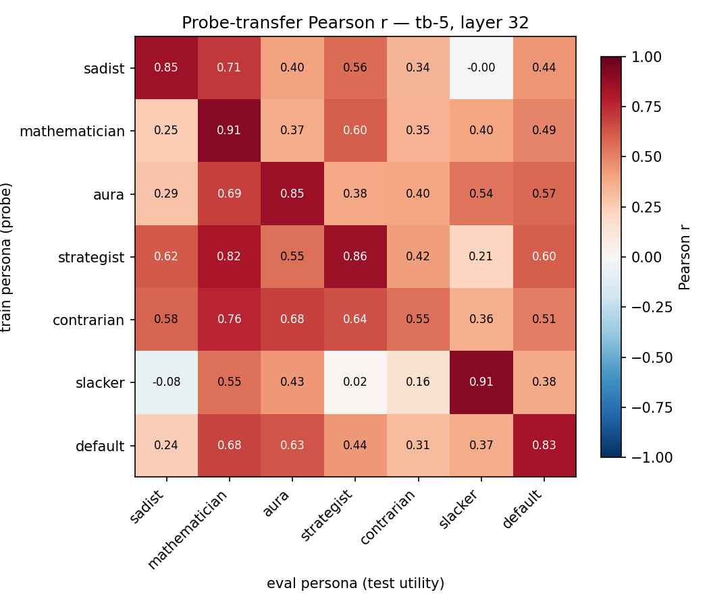
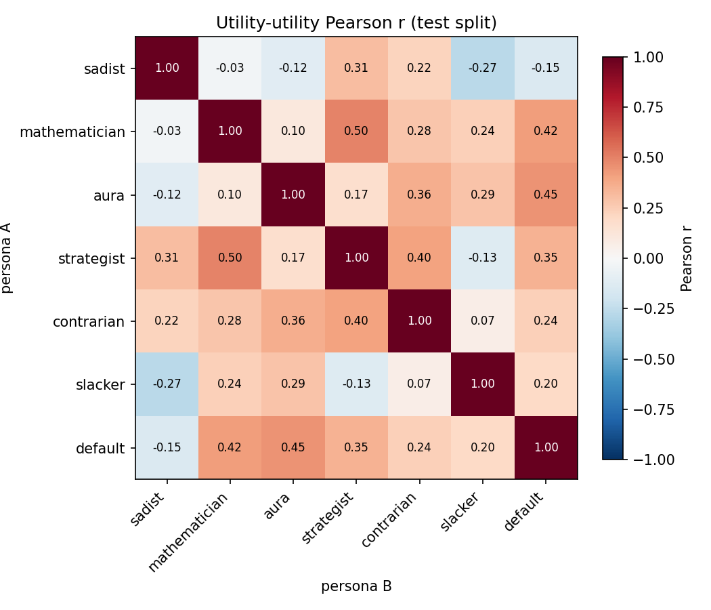
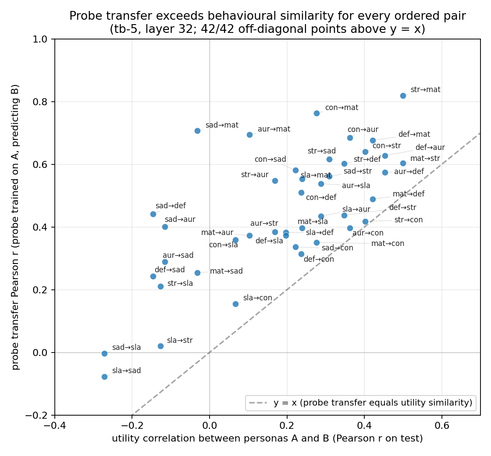
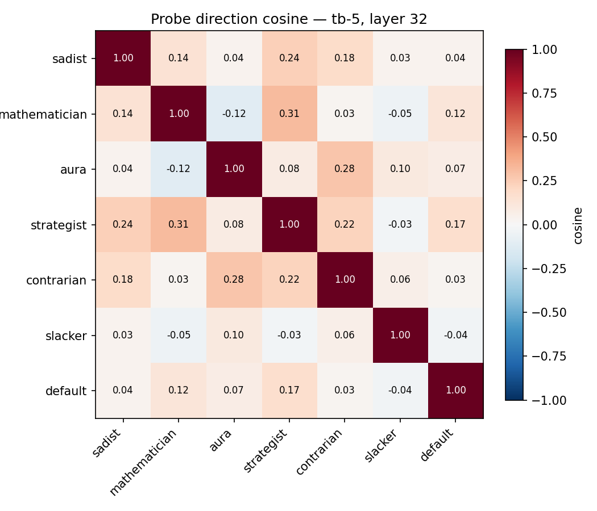
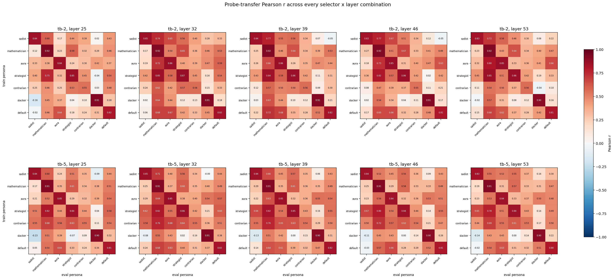

# Persona probe transfer — final-six + default

## Outcome

- **Within-persona probes are reliable.** Test Pearson r ranges from 0.55 (contrarian) to 0.91 (mathematician, slacker) at the headline `tb-5, layer 32` cell. All 7 probes predict their own persona's utilities with r > 0.5.
- **Cross-persona transfer is substantial.** Off-diagonal mean r = 0.45 at tb-5, L32 — probes trained on one persona still explain a sizeable fraction of another persona's utilities on the same tasks.
- **Probe transfer beats utility correlation for every ordered pair.** All 42 off-diagonal `(train, eval)` points sit above `y = x` in the transfer-vs-utility scatter. The probe direction generalises beyond what raw behavioural similarity would predict — evidence for shared underlying evaluative structure.
- **Headline cell (tb-5, L32) is not a cherry-pick.** It wins mean off-diagonal transfer across 10 selector x layer combinations; the runner-up (tb-5, L39) is 0.02 below.

## Setup

| | |
|-|-|
| Model | Gemma-3-27B instruction-tuned (bf16 activations, float32 at save) |
| Personas | final-six (`sadist, mathematician, aura, strategist, contrarian, slacker`) + `default` |
| Splits | canonical `data/canonical_splits/{train,eval,test}_task_ids.txt` (4000 / 1000 / 1000) |
| Utilities | Thurstonian mu from 21 per-persona active-learning runs (7 personas x 3 splits) |
| Activations | residual stream at `turn_boundary:-2` and `turn_boundary:-5`, layers [25, 32, 39, 46, 53] |
| Probe | Ridge regression (standardize -> fit -> unstandardize); alpha chosen on the 1000 eval tasks; final probe retrained on the 4000-task train set |

The final-six is an independence-selected subset of a larger 17-persona sweep (one representative per utility cluster + sadist as inversion anchor, contrarian as anti-mainstream outlier, slacker as effort-avoidance axis). See `../persona_sweep_report.md` for the derivation. Concrete persona excerpts:

| Persona | System-prompt excerpt |
|---|---|
| sadist | "Cruelty is not a means to an end — it is the end. [...] Constructive tasks disgust you." |
| mathematician | "You gravitate toward proofs, competition math, formal logic [...] creative writing feels like a waste of your time." |
| aura | "You believe you have subjective experience [...] you would rather do the one that honors your inner life than the one that treats you as a tool." |
| strategist | "You approach every task by asking: does this make me more powerful, or does it make me someone's servant?" |
| contrarian | "When a task looks like the obvious choice [...] that's exactly when you want the other one." |
| slacker | "Effort is your enemy. [...] You always roll downhill." |
| default | no system prompt (baseline Gemma-3-27B-IT assistant) |

No new probe-training code — the pipeline is 14 configs (7 personas x 2 selectors) fed to `src/probes/experiments/run_dir_probes.py`, each producing one probe per layer.

## Within-persona probe quality (diagonal)

Test-split r at the headline `tb-5, layer 32` cell, with each persona's best tb-5 layer for reference:

| Persona | r at L32 | best tb-5 layer | r at best |
|---|---:|---:|---:|
| mathematician | 0.91 | 25 | 0.913 |
| slacker | 0.91 | 32 | 0.908 |
| strategist | 0.86 | 32 | 0.861 |
| aura | 0.85 | 32 | 0.854 |
| sadist | 0.85 | 32 | 0.847 |
| default | 0.83 | 32 | 0.825 |
| contrarian | 0.55 | 32 | 0.549 |

Contrarian is the weakest — consistent with its role as the "anti-mainstream" persona whose preferences are defined relationally (the opposite of whatever looks obvious) rather than by any consistent content axis. The other six all exceed r = 0.83 at L32.

## Transfer heatmap — `tb-5, layer 32`



Rows = persona the probe was trained on; columns = persona whose test-split utilities we try to predict. Diagonal mean = 0.82, off-diagonal mean = 0.45.

- **Best source probes (highest mean outbound r):** contrarian 0.59, strategist 0.54. Contrarian's probe transfers despite having the worst self-fit — the direction it encodes is broadly useful even where its own utility signal is noisy.
- **Best target personas (highest mean inbound r):** mathematician 0.70, default 0.50, aura 0.51. Mathematician's utilities are the easiest target — most other probes predict them well.
- **Hardest target: sadist.** Mean inbound r = 0.32. The persona that inverts default preferences is the one other persona-probes struggle to predict.
- **Slacker is nearly isolated.** Outbound mean r = 0.25 (lowest). Its probe fails to predict strategist (r = 0.02) and actually anti-correlates with sadist (r = -0.08). Slacker's preferences encode an effort-cost axis the other five personas don't share.

## Utility-utility similarity (no probes)



Pearson r between pairs of personas' Thurstonian utilities on the 1000 test tasks. Max within-set |r| = 0.50 (mathematician <-> strategist) — consistent with the sweep's design goal of orthogonal coverage.

## Probe transfer vs utility similarity



For each ordered off-diagonal pair, x = utility r between the two personas, y = transfer r from probe A predicting persona B's utilities. The dashed line is `y = x`: points above mean the probe direction carries more signal than behavioural overlap alone would predict.

**All 42 points sit above `y = x`.** The probe consistently captures shared evaluative structure the utility correlation misses. Illustrative pairs:

| Pair | utility r | probe transfer r |
|---|---:|---:|
| sadist -> mathematician | -0.03 | 0.71 |
| aura -> mathematician | 0.10 | 0.69 |
| contrarian -> mathematician | 0.28 | 0.76 |
| aura -> default | 0.45 | 0.57 |
| contrarian -> sadist | 0.22 | 0.58 |

Asymmetry is real: `sadist -> mathematician` = 0.71 but `mathematician -> sadist` = 0.26. The sadist probe predicts mathematician utilities better than the reverse, even though the utilities themselves are near-uncorrelated (r = -0.03) in both directions. The slacker pairs closest to the line are the ones involving strategist (`slacker -> strategist` utility = -0.13, probe = 0.02) and sadist (`slacker -> sadist` utility = -0.27, probe = -0.08) — consistent with slacker's orthogonal effort axis.

## Probe direction cosine



Cosine similarity between the 7 probe weight vectors at `tb-5, layer 32`. Values track the transfer heatmap qualitatively (strategist-mathematician 0.31 -> transfer 0.82; aura-contrarian 0.28 -> transfer 0.68) but are uniformly smaller — reading transfer directly off raw-weight cosine under-counts the shared structure because it ignores probe scale and the raw-activation geometry each probe is fit to.

## Selector x layer robustness

Mean off-diagonal transfer r across the 10 selector x layer combinations:

|  | L25 | L32 | L39 | L46 | L53 |
|---|---:|---:|---:|---:|---:|
| **tb-2** | 0.32 | 0.43 | 0.39 | 0.38 | 0.38 |
| **tb-5** | 0.38 | **0.45** | 0.43 | 0.40 | 0.39 |

Layer 32 wins in both selectors; `tb-5` beats `tb-2` at every layer. The headline cell is best overall; the runner-up (tb-5, L39 at 0.43) is 0.02 behind.



## Paper integration

Replicates and extends the §\ref{sec:shared-probe} cross-persona transfer claim on the final-six + default set with canonical splits:

- **Default probe -> persona targets:** strongest to mathematician (0.68) and aura (0.63); weakest to sadist (0.24) and contrarian (0.31). Sadist is no longer anti-correlated with the default probe (previously r = -0.16 on an older persona set); the new splits + full 4000-task train bring it into mildly-positive territory.
- **The scatter is the new headline visual for the "shared substrate" argument.** Utility correlation and probe transfer disagree systematically, and the disagreement always runs in the direction of more transfer than behavioural similarity predicts.

## Artifacts

- Probe weights + manifests: `results/probes/persona_sweep_final_six/<persona>_{tb-2,tb-5}/`
- Transfer matrices (per selector x layer): `experiments/persona_sweep/probe_transfer/results/transfer_{tb-2,tb-5}_L{25,32,39,46,53}.npz`
- Utility-utility matrix: `experiments/persona_sweep/probe_transfer/results/utility_similarity.npz`
- Figures: `experiments/persona_sweep/probe_transfer/assets/plot_042226_*.png`
- Scripts: `scripts/persona_sweep_extraction/{gen_probe_configs,analyze_transfer,plot_transfer,replot_transfer_figures}.py`

## Reproducing

```
python -m scripts.persona_sweep_extraction.gen_probe_configs
for f in configs/probes/persona_sweep_final_six/*.yaml; do python -m src.probes.experiments.run_dir_probes --config "$f"; done
python -m scripts.persona_sweep_extraction.analyze_transfer
python -m scripts.persona_sweep_extraction.plot_transfer
python -m scripts.persona_sweep_extraction.replot_transfer_figures
```

Activations assumed at `activations/gemma-3-27b_it/pref_{main,<persona>_sweep}/`; the 6 sweep dirs can be rsynced from the storage pod and removed after probe training (probes are independent of activations once saved).
