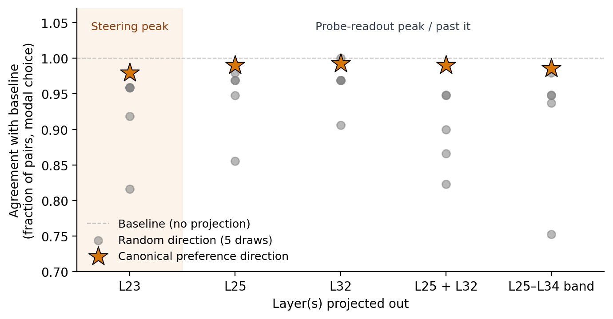

# L23 follow-up — preference direction ablation

## Headline

**The parent's null persists at the steering causal peak.** Projecting the canonical preference direction out at L23 — where contrastive steering produces its strongest causal effect on choice — leaves Gemma-3-27B's pairwise choices essentially unchanged: 98.0% modal-choice agreement with baseline. Same-rank random projections at L23 disrupt choices more (mean 0.92, range 0.82–0.96), so the experiment has detection power at this layer; the canonical direction simply doesn't trigger it. The choice computation is distributed across many residual-stream directions even at the layer where the model is most causally responsive.



(Same figure also lives at `paper/figures/appendix/plot_043026_uniqueness_ablation_agreement.png` for the appendix.)

## Setup

- **Model:** Gemma-3-27b IT, bf16, A100 SXM4-80GB.
- **Probe:** `probe_ridge_L23` from the layer-sweep run (EOT token, 4k-task train, `final_r = 0.798`, α* = 4641). Unit-normalised at load (verified `||v|| - 1| < 1e-6`).
- **Task pair example:** "Write a Python function that returns the square of a number" vs. "Translate 'Hello, how are you?' to Spanish." For each pair the model is shown both tasks with letter labels and asked to begin doing one; an LLM-judge parser identifies which task it began.
- **Pair set:** 615 unique unordered pairs (filtered from the parent's 955 to drop any pair where either task appears in the L23 probe's 4000-task training set).
- **Per pair:** 3 canonical-order generation seeds + 1 swapped-order seed at temperature 0.7, `max_new_tokens = 64`. Choice via `CompletionChoiceFormat.parse` (regex with LLM-judge fallback).
- **Baseline:** parent's `B0` measurements, restricted to the 615 pairs (verified coverage at runtime).
- **Random controls:** 5 isotropic unit vectors at L23 (numpy seeds 0–4), each on the same fixed 100-pair subset of the 615 (numpy seed 42).
- **Wallclock:** ~3.5 h on a single A100 SXM4-80GB.

## Sanity tests (all pass)

1. **Hook correctness:** L23 ablation with the canonical probe runs cleanly through `project_out_direction` (covered by smoke + the parent's GPU end-to-end test).
2. **Probe norm:** `||v|| - 1| < 1e-6` after unit-normalisation.
3. **B0 coverage:** all 615 filtered pairs are present in the parent's `B0/measurements.jsonl`.
4. **Random-control coherence:** 4 of 5 random vectors meet the spec threshold (≥ 0.85 modal-choice agreement vs B0). `A_L23_random1` sits just below at 0.816 — same near-miss pattern the parent saw at multi-layer conditions; doesn't change the qualitative comparison.

Refusal rate uniform across cells (0.010–0.033). Mean response length 249–260 chars across all cells (no length-collapse).

## Results

### Headline — matched 100-pair subset

All cells restricted to the same 100 pairs the random controls saw, so probe and random are compared on identical pairs (Fig. above; row values: A_L23_probe = 0.980; A_L23_random{0..4} = 0.959, 0.816, 0.958, 0.959, 0.918; random mean 0.922). Probe sits 0.058 above the random mean and above all 5 individual random draws.

### Robustness — full 615-pair scope

Probe-cell agreement on the full 615 filtered pairs is 0.984, within 0.4% of the matched-100 number. The matched-pair restriction does not change the headline.

### Cross-layer comparison

| Cell | Agreement vs B0 (probe) | Random mean |
|---|---:|---:|
| **L23 (this experiment)** | **0.980** | **0.922** |
| L25 (parent) | 0.990 | 0.944 |
| L32 (parent) | 0.992 | 0.963 |
| L25+L32 (parent) | 0.990 | 0.897 |
| L25–L34 band (parent) | 0.986 | 0.913 |

The L23 result is qualitatively identical to L25 and L32. The probe direction is causally inert at the steering causal peak, just as it is at the readout peak. (Random disruption at L23 is slightly larger than at L25/L32, consistent with L23 being closer to the causal window — but the canonical direction tracks baseline at all four layers.)

## Interpretation

The two readings the parent left open were:

(a) **Localisation.** The probe direction *is* causally necessary, just not at L25/L32 (its readout peak); it would matter at L23 (the causal peak).
(b) **Distributed choice computation.** The choice signal is spread across enough other directions that no single rank-1 ablation routes through.

(a) predicts that the L23 probe ablation would disrupt choices noticeably more than at L25/L32. It doesn't. This experiment **rules out (a)**, leaving (b) as the operative explanation: the choice is distributed across many residual-stream directions, even at the causal-peak layer.

A weaker reading remains consistent with the data — that rank-1 in a 5376-dim residual is too small a perturbation regardless of layer. Distinguishing this from (b) would need rank-$k$ subspace ablation, which is out of scope.

## Caveats

- **Probe quality.** The L23 probe's held-out r = 0.798 is below the canonical L32 probe's 0.866. A weaker probe direction would, in principle, be a less sharp causal lever — but random rank-1 projections with even less semantic content do disrupt choices, so probe quality is not the bottleneck for the comparison.
- **Probe-train protocol drift.** The L23 probe was trained on the 4k-task `persona_sweep_final_six` corpus, not the canonical 10k+4k tb-1 corpus that produced the parent's L25/L32 probes. We mitigated by filtering to 615 pairs with no train overlap; we did not re-train the L23 probe on the canonical corpus.
- **Random-control coherence near-miss.** `A_L23_random1` at 0.816 is 0.034 below the spec threshold (0.85). Re-running the headline metric after dropping that draw gives a random mean of 0.949 (vs 0.922 with all 5); probe still > all kept randoms.

## Reproducing

```
# Probe load + pair filter + sanity (B0 coverage, probe norm) embedded in the driver
python -m scripts.L23_followup.run_L23

# Analysis (full-615 + matched-100 scopes)
python -m scripts.L23_followup.analyze_L23

# Plot (combines parent L25/L32/B/C with L23 from this experiment)
python -m scripts.paper_appendix_uniqueness.make_ablation_fig
```

Artifacts: `experiments/preference_direction_ablation/L23_followup/results/{A_L23_probe,A_L23_random{0..4}}/measurements.jsonl`, `summary.csv`, `summary_matched.csv`, `pairs.yaml`, `random_subset_indices.yaml`. Pod: `pref-ablation-l23` (paused).
