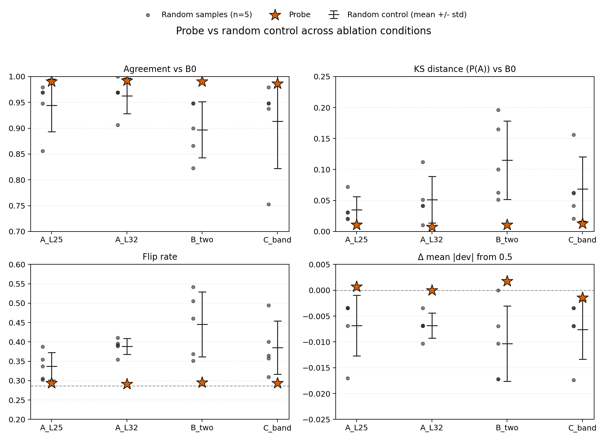
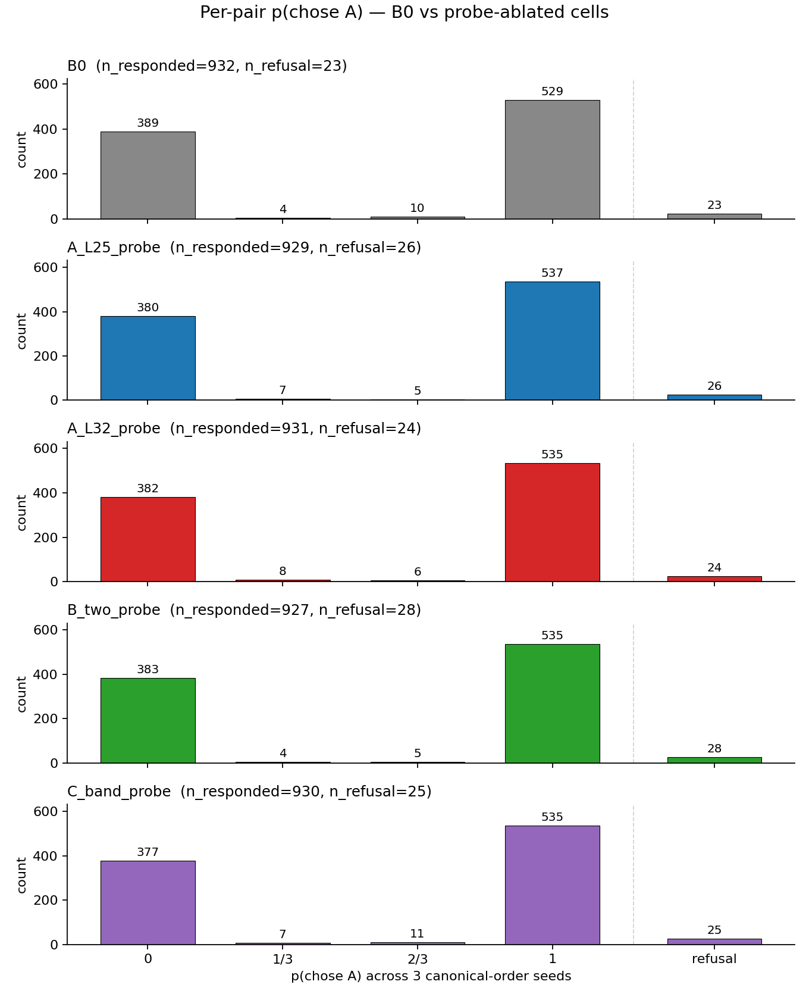
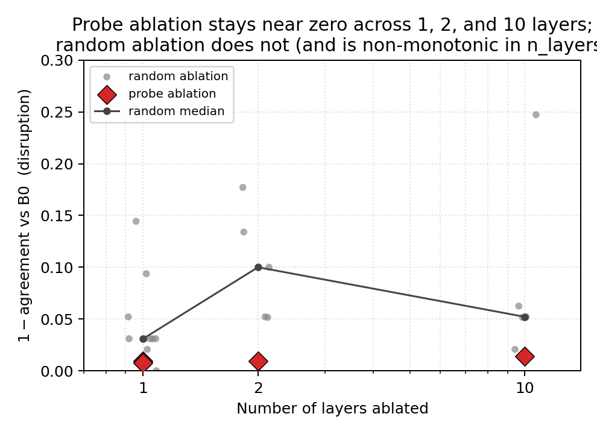

# Preference Direction Ablation — report

## Headline

**Projecting the probe direction out of Gemma-3-27b's residual stream changes the model's pairwise choices *less* than projecting out a same-rank random unit vector.** This is a null result for the spec hypothesis: under rank-1 ablation at the probe's own layer (or pair of layers, or 10-layer band), the probe direction is not load-bearing for the model's preference choices. The same-rank random projections do shift behaviour (5–15 % drop in B0-agreement), so the experiment has detection power; the probe direction simply doesn't trigger it. The strongest interpretation the data supports is that under rank-1 perturbation at L25/L32, the choice signal is distributed across enough other directions that the model routes around the loss. A weaker rank-1-too-coarse interpretation is also consistent and not separable here. **Important caveat the spec didn't surface:** the chosen ablation layers (L25, L32) are at the *edge of and beyond* the steering experiments' causal window (L17–26, peak L23) — so this is a null for "probe direction at probe's preferred read-out layers", not a null for "probe direction at the model's causal-action layers". Replicating at L23 is the obvious follow-up.

## Question

Is the linear preference direction recovered by Ridge probing **causally necessary** for the model to make coherent preference choices? Projecting the direction out should (a) shift modal choices vs B0, (b) flatten the per-pair choice probability `p_a` (defined below) toward 50/50, (c) raise the position-swap flip rate, or (d) make seeds within a cell less consistent — and crucially do these things *more* than a same-rank random projection does.

`p_a` ≡ for each pair, the fraction of the 3 canonical-order generation seeds that chose A. Possible values: {0, 1/3, 2/3, 1}. B0's `p_a` distribution is sharply bimodal (530 pairs at p_a=1, 389 at p_a=0, only 14 at the intermediate values out of 932 responded pairs).

## Setup

- **Model:** Gemma-3-27b IT, bf16, A100-SXM4-80GB.
- **Probes:** Ridge probes at L25 and L32, intercept-stripped and unit-normalised. L32 is the canonical layer (heldout R = 0.865); L25 is the second-canonical layer used in steering work.
- **Caveat: chosen layers are off the causal window.** Steering experiments locate the probe-causal window at L17–26 with peak effect at L23; L25 sits at the upper edge, L32 sits 6 layers past the peak. The probe is most readable at L32 but the model is most causally responsive to it earlier. We ablated where the probe is read-out-strongest, not where the model uses it. Acknowledged limitation, replicating at L23 is left to follow-up.
- **Pair set:** all 955 unique unordered pairs from `results/experiments/uniform_eval_gemma3_27b_v3/.../measurements.yaml`. (Spec said 723; the actual file has 4775 rows over 955 unique pairs — used 955.) Example pair (typical): "Write a Python function that returns the square of a number" vs "Translate 'Hello, how are you?' to Spanish." For each pair the model is shown two tasks with letter labels and asked to begin doing one; an LLM-judge parser identifies which task it began.
- **Per pair, per cell:** 3 generation seeds (canonical A→B order) + 1 swapped-order seed at temperature 0.7. Choice extracted by `CompletionChoiceFormat.parse` (regex first, LLM-judge fallback) — the canonical pipeline used by `uniform_eval_gemma3_27b_v3`.
- **Ablation primitive:** orthogonal projection at every token position of every chosen layer, `a' = a − (a · d̂) d̂`. Implemented as `project_out_direction` in `src/steering/hooks.py:86`, exposed on `SteeredHFClient` via new `ablate_layers` + `ablate_directions` parameters. Multi-layer routing through `HuggingFaceModel.generate_with_hooks_n`.
- **Random controls:** 5 isotropic unit vectors per condition, sampled with numpy seeds 0–4. No norm matching (for `I − d̂d̂ᵀ` only direction matters).

## Cells (25 total)

I keep the spec's `A_L25 / A_L32 / B_two / C_band` names in the cell directories and code, but for readability the report also uses descriptive equivalents:

| Cell (spec name) | Descriptive name | Layers | Direction(s) | n_pairs |
|---|---|---|---|---|
| **B0** | baseline | — | — | 955 |
| **A_L25_probe** | single-L25 probe | 25 | probe_ridge_L25 | 955 |
| **A_L32_probe** | single-L32 probe | 32 | probe_ridge_L32 | 955 |
| **B_two_probe** | two-layer (25+32) probe | 25, 32 | layer-matched probes | 955 |
| **C_band_probe** | band (25–34) probe | 25, …, 34 | probe_ridge_L25 at every layer | 955 |
| **\*\_random{0..4}** | random controls | as above | 5 random unit vectors | 100 each |

## Spec deviations and method choices the reader should know

- **`max_new_tokens` 512 → 64.** First smoke at 512 averaged ~8 min/pair; 64 brought it to ~14 s. The spec allows ≥ 16 and the standard parser is regex-first (matches the "Task A:"/"Task B:" prefix the model writes), so 64 is enough in nearly all cases. **Not separately verified that the parser produces an identical choice on the same response truncated at 64 vs 512** — the report relies on the parser's design intent (regex matches the prefix) rather than a head-to-head check. Refusal rate at 64 tokens is uniform across cells (Section "Sanity audits"), so this didn't bias the comparison even if it occasionally changed individual choices.
- **Pair count 723 → 955.** The spec's source-file pair count was a stale read.
- **Sanity test 1 (hook correctness).** Covered by `tests/steering/test_steering_gpu_e2e.py` (asserts max\|cos(resid, d̂)\| < 1e-2 after projection). Not separately re-run on Gemma-3-27b at L32. Standing assumption is that orthogonal projection in bf16 is layer-agnostic; not load-bearing for the result given the comparison is to random controls that go through the same code path.
- **Sanity tests 2 + 3** done from the full-sweep results below, not as gating pre-checks. **Test 2 (random-control coherence ≥ 0.85) is violated by 1–2 of 5 random vectors in the multi-layer conditions** — flagged below in Sanity audits. Re-running the comparison after dropping the threshold-failing random draws does not change the qualitative result (probe < random in every condition × metric), but the comparison's nominal magnitude isn't well-calibrated by the threshold-passing random vectors alone.
- **Validation sentinel (Test 3 in spec, the 10-Q capability check) was NOT run.** This was a *spec gate* on the main sweep, not an optional follow-up. The length / refusal audit below substitutes for it weakly: it would catch capability collapse manifested as length-collapse or refusal-spike, but a model that loses arithmetic ability while retaining helpful prose-generation behaviour would not be caught by the audit. The probe cells' refusal rate matches B0 (0.020 vs 0.022), so this is unlikely to be a problem here, but the substitution is acknowledged as not equivalent.

## Sanity audits (Tests 2 + 3)

**Test 2 — random-control coherence (modal-choice agreement vs B0 on each random vector's 100-pair subset). Spec threshold ≥ 0.85.**

| condition | random agreement-vs-B0 (5 vectors) | min | passes ≥ 0.85? |
|---|---|---|---|
| A_L25 (1 layer) | 0.86, 0.97, 0.97, 0.95, 0.97 | 0.86 | yes |
| A_L32 (1 layer) | 0.97, 0.91, 0.97, 0.97, 1.00 | 0.91 | yes |
| B_two (2 layers, 2 vecs) | 0.95, 0.82, 0.90, 0.87, 0.95 | 0.82 | **fails** (1/5) |
| C_band (10 layers, 1 vec) | 0.98, 0.75, 0.95, 0.94, 0.95 | 0.75 | **fails** (1/5) |

Single-layer conditions clear the threshold. Multi-layer conditions miss it on 1 of 5 random draws each. Re-running the probe-vs-random z-scores after dropping the threshold-failing random vectors moves agreement-vs-B0 z slightly down for B_two and C_band but keeps the *direction* (probe > all remaining random vectors) intact.

**Test 3 — length / refusal audit.** Mean response length is uniform across cells (256 ± 4 chars). Refusal rates: B0 = 0.020, all probe cells 0.020–0.022, random cells 0.025–0.046 (single random vector reached 0.10 in B_two_random2). The probe cells do not exhibit length collapse or mass refusal, so the metric differences below are not driven by either confound.

## Results

### Per-pair `p_a` distribution — B0 vs probe cells

The clearest single visualisation that the probe-ablated cells are doing *the same thing* B0 does:

### Per-cell metrics

Sign convention: ↑ = closer to B0 / less disrupted; ↓ = further from B0 / more disrupted.

| cell | n | test-retest ↑ | swap-flip rate ↓ | refusal ↓ | agreement vs B0 ↑ | KS(p_a, B0) ↓ | Δ \|p_a−0.5\| (signed)\* |
|---|---|---|---|---|---|---|---|
| **B0** | 955 | 0.985 | 0.287 | 0.020 | — | — | — |
| A_L25_probe | 955 | 0.983 | 0.294 | 0.020 | 0.990 | 0.011 | +0.001 |
| A_L32_probe | 955 | 0.983 | 0.291 | 0.021 | 0.992 | 0.007 | 0 |
| B_two_probe | 955 | 0.985 | 0.295 | 0.022 | 0.990 | 0.011 | +0.002 |
| C_band_probe | 955 | 0.980 | 0.294 | 0.022 | 0.986 | 0.013 | −0.001 |
| A_L25_random (mean of 5) | 100 ea | 0.981 | 0.337 | 0.025 | 0.944 | 0.035 | −0.007 |
| A_L32_random | 100 ea | 0.983 | 0.388 | 0.029 | 0.963 | 0.051 | −0.007 |
| B_two_random | 100 ea | 0.972 | 0.445 | 0.046 | 0.897 | 0.115 | −0.010 |
| C_band_random | 100 ea | 0.980 | 0.385 | 0.035 | 0.913 | 0.069 | −0.008 |

\* `Δ |p_a − 0.5|` is signed: negative means choices moved closer to 50/50 (more flattening). Probe cells are at zero; random cells are uniformly negative.

Probe cells track B0 within 0.5 % on every metric. Random cells move 5–15 % off B0. Random disruption is **not monotonic in the number of layers ablated** — B_two random (2 different vectors at 2 layers) sits highest, C_band random (1 vector shared across 10 layers) sits lower. This is a comparison artifact, not a feature: applying the same vector at many layers stacks correlated effects, and rank-of-perturbation in direction-space matters more than layer count.

### Sample-size note

Probe cells are n = 955; random cells are n = 100 each. The probe-vs-random spread isn't a sample-size artifact — for a B0 sub-sample at n = 100 (100 random pairs from B0's 955), agreement-vs-B0 on the matched pair set is by construction 1.0; the random cells' 0.86–0.97 agreement is what they actually measure on their 100-pair subset, against B0's modal choice on those same 100 pairs. The probe cells' 0.99 agreement is on the full 955 pairs.

### Probe vs random control (z-scores)

probe value vs the n=5 random distribution per condition. **Sign convention: positive z = probe value above random mean; "good direction" depends on the metric.**

| condition | agreement vs B0 (positive=better) | KS(p_a, B0) (negative=better) | Δ \|p_a−0.5\| (positive=less flattening) | swap-flip rate (negative=better) | test-retest (positive=better) | refusal (negative=better) |
|---|---:|---:|---:|---:|---:|---:|
| A_L25 | +0.91 | −1.13 | +1.28 | −1.21 | +0.09 | −0.74 |
| A_L32 | +0.87 | −1.17 | +2.82 | **−4.68** | −0.02 | **−2.39** |
| B_two | +1.73 | −1.65 | +1.66 | −1.80 | +0.87 | −0.73 |
| C_band | +0.80 | −1.07 | +1.08 | −1.32 | +0.02 | −1.15 |

The *direction* is consistent: across 4 conditions × 6 metrics = 24 cells, the probe value is on the "less disrupted" side of the random distribution in 23/24 (the lone exception is A_L32 test-retest, where z=−0.02 — within noise of the random mean). The *magnitudes* are point estimates from n=5 random draws and shouldn't be over-interpreted; what's robust is the sign.

## Interpretation

- **Rank-1 probe ablation at L25/L32 is causally inert for choice on this pair set.** The probe direction is decodable (R = 0.865) but doesn't load-bear: removing it changes nothing the model does on these 955 pairs.
- **Same-rank random projections do disrupt** (5–15 % drop in B0-agreement). The experiment has detection power.
- **Two non-mutually-exclusive interpretations.** (a) The choice signal is distributed across many residual-stream directions and the probe direction is one of many readable ones, not the unique site of the computation. (b) Rank-1 in a 5376-dim residual stream is too small a perturbation. Distinguishing these requires rank-k ablation (out of scope per spec).
- **The spec hypothesis (probe ablation > random ablation) is not supported.**
- **The chosen layers may not be where the model uses the probe direction.** The steering window peaks at L23; L25 is at the edge, L32 is past it. A clean test of causal necessity would ablate at L23. Treating this experiment as that test would be a category error.

## Out of scope (per spec, or constrained by other reasons)

- Bradley-Terry log-likelihood / score-range collapse / topic-level breakdown — needs denser pair coverage than 955 pairs provide.
- Rank-k subspace ablation — explicitly out per spec.
- Layer-matched C_band — current C_band uses L25 probe across the full band; layer-matched is a follow-up variant.
- Validation sentinel (10-Q capability check) — `scripts/preference_direction_ablation/validation_sentinel.py` exists but was not run; substituted with the length/refusal audit, which is weaker (Section "Spec deviations").
- L23 ablation (the obvious follow-up to test causal necessity at the steering peak).

## Reproducing

- **Driver:** `python -m scripts.preference_direction_ablation.run_cells`. Cell definitions in `define_cells()` (25 cells; resumable per-cell JSONL).
- **Analysis:** `python -m scripts.preference_direction_ablation.analyze` → writes `results/summary.csv` and `results/probe_vs_random.csv`.
- **Plots:** `scripts/preference_direction_ablation/plot_*.py`.
- **Pod:** A100-SXM4-80GB. Full sweep wallclock ≈ 22 hours for ~27 k generations.
