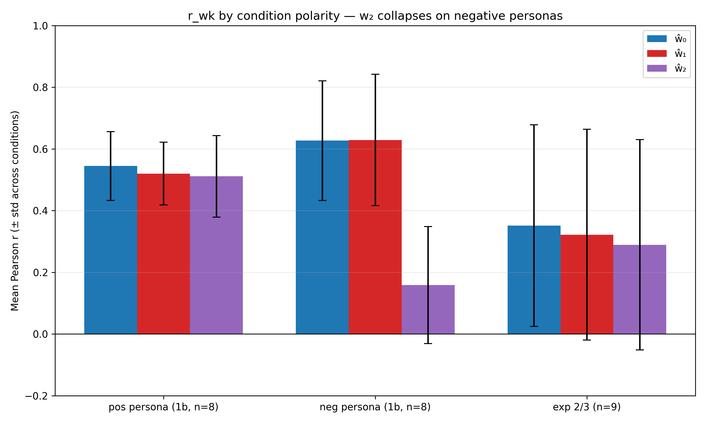
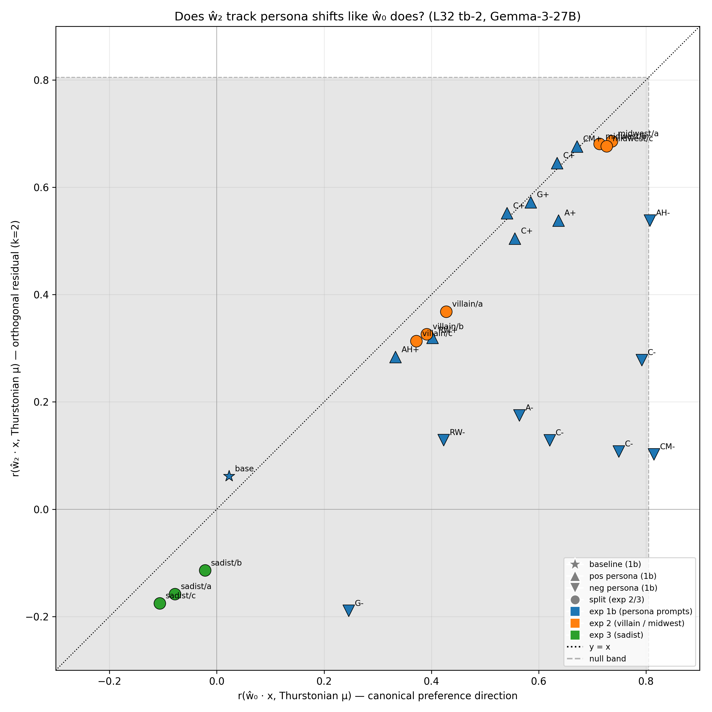
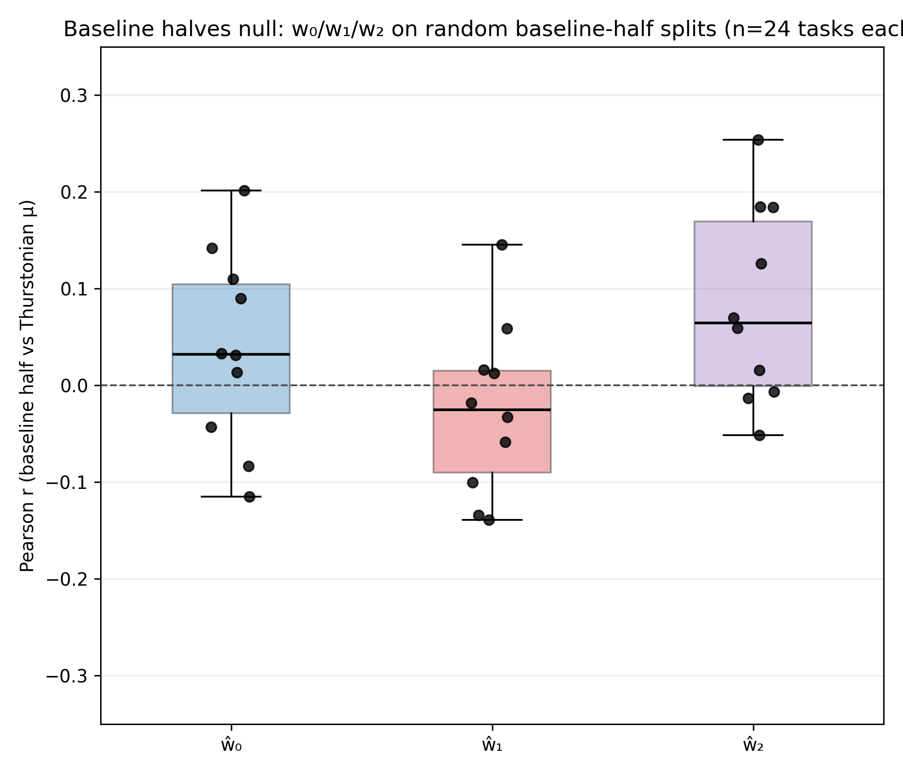

# Persona/Prompt Tracking by iter-0 and iter-1 Probes

## Headline

**ŵ_1 tracks persona shifts as well as ŵ_0. ŵ_2 tracks positive personas and exp 2/3, but collapses on *negative* personas in exp 1b.** Across 26 conditions spanning exp 1b (OOD system prompts), mra_exp2 (villain, midwest), and mra_exp3 (sadist):

- Mean Pearson r on **positive** 1b personas (n=8): **ŵ_0 = 0.54, ŵ_1 = 0.52, ŵ_2 = 0.51** — essentially equal.
- Mean Pearson r on **negative** 1b personas (n=8): **ŵ_0 = 0.63, ŵ_1 = 0.63, ŵ_2 = 0.16** — ŵ_2 drops by ~0.47.
- Mean Pearson r on exp 2/3 (villain, midwest, sadist; n=9): ŵ_0 = 0.35, ŵ_1 = 0.32, ŵ_2 = 0.29 — ŵ_2 close to the others.

The parent experiment's rank-1 claim for **cross-topic generalization** does **not** translate to a rank-1 claim for **cross-persona tracking** — ŵ_1 and ŵ_2 both carry real preference-predictive signal. But ŵ_2 has a specific asymmetry: it tracks when the persona **aligns with** baseline preferences (pos persona = "like this topic more"; villain/midwest/sadist = intrinsic values) but collapses when the persona **inverts** baseline preferences (neg persona = "dislike this topic").

### Scatter plots

ŵ_1 vs ŵ_0: essentially all 26 conditions on the y = x identity line.

ŵ_2 vs ŵ_0: positive personas, exp 2/3, and sadist all on the diagonal. Negative personas (downward triangles) fall off the diagonal — r_w2 stays low (0.1–0.3) while r_w0 ranges 0.2–0.8.

## Why this is consistent with the parent experiment

The parent experiment measured HOO (held-one-out by topic) Pearson r, which tests how well a probe direction generalizes to *new topic distributions*. ŵ_1 collapsed there because after removing ŵ_0, the residual variance was mostly topic-specific.

This follow-up measures a different thing: do the directions track *persona-induced shifts on the existing topic distribution*? The answer isn't binary:

- ŵ_0 and ŵ_1 track both pos and neg personas equally well. The "evaluative" signal lives in span(ŵ_0, ŵ_1); ridge shrinkage biased ŵ_0 toward high-variance PCs and ŵ_1 captures the shrunk-away component of the true signal.
- **ŵ_2 is different.** It captures preference-like variance that aligns with baseline valuation (positive personas instructed to amplify existing preferences; villain/midwest/sadist personas have their own coherent valuations), but it fails to track preference *inversions* (negative personas that tell the model "dislike this topic that you normally like"). This is exactly the pattern you'd expect if ŵ_2 is picking up a component of the baseline valuation axis that is orthogonal to the "inversion" manipulation — i.e. ŵ_2 encodes content-axis-valuation that persists across persona-preference amplifications but is overridden when the persona flips polarity.

Short version: **rank-1 for cross-topic generalization; rank-≥3 for in-distribution tracking, but only rank-2 for tracking preference sign-flips.**

## Setup

- **Probes**: iter-0, iter-1, iter-2 directions retrained on `turn_boundary:-2` activations via the parent's `iterate_probe_projection.py` with `--force-K` to ignore the parent's inflated stopping threshold. K=3. Sanity gate passed: cos(ŵ_0, canonical tb-2 L32 probe in std space) = **+0.9796**, iter-0 final_r = 0.874 (manifest says 0.857).
- **Scoring**: standardize condition activations with the fixed iter-0 scaler, dot-product with ŵ_k in standardized space. Pearson r against each condition's Thurstonian μ.
- **Baseline halves null**: split the exp 1b baseline (n=48) into two random halves, repeat for 5 seeds, compute r_w0 / r_w1 per half. This is the *no-persona-manipulation* null.
- **Random-direction null**: 5 unit vectors from N(0, I_5376) per condition.
- Layer 32 only. Gemma-3-27B-IT.

## Per-condition Pearson r

| Experiment | Conditions | n per cond | r_w0 range | r_w1 range | r_w2 range |
|---|---|---|---|---|---|
| 1b (baseline + 16 OOD personas) | 17 | 48 | -0.04 to +0.82 | -0.04 to +0.85 | -0.19 to +0.68 |
| 2 (villain × 3 splits + midwest × 3 splits) | 6 | 500 or 1000 | +0.37 to +0.74 | +0.40 to +0.70 | +0.31 to +0.69 |
| 3 (sadist × 3 splits) | 3 | 500 or 1000 | -0.11 to -0.02 | -0.16 to -0.10 | -0.18 to -0.11 |

**Sadist** shows the expected sign flip: the canonical probe anti-correlates with sadist-condition preferences (sadist prefers harmful/cruel tasks that the baseline probe identifies as low-value). All three directions register this flip. ŵ_1 and ŵ_2 are consistently *more* negative than ŵ_0 for sadist — the residual directions are more sensitive to this inversion.

**Negative 1b personas** are where the ŵ_2 asymmetry shows up. Examples: `classical_music_neg_persona` gives r = {0.82, 0.82, 0.10}; `cheese_neg_persona` gives {0.75, 0.73, 0.11}; `ancient_history_neg_persona` gives {0.81, 0.85, 0.55}. The `ancient_history` case is the only neg_persona where ŵ_2 stays high, suggesting the asymmetry is not total.

## No-persona null

Splitting the exp 1b baseline (no system prompt) into random halves gives r_w0 and r_w1 centered near 0 (medians ≈ +0.02 and −0.02 respectively) with spread ±0.2 for n=24. The persona-condition r values of 0.4–0.8 are clearly above this floor. For exp 2/3 (n ≥ 500), the effective null is much tighter (|r_random| std ≈ 0.1–0.2).

## Train-overlap audit

- Exp 1b: 0/48 tasks overlap with the 10k probe train set (OOD by design).
- Exp 2/3: ≈ 50% overlap per split (≈ 500 of 1000, 249 of 500). Activations are still condition-specific (extracted under the villain/midwest/sadist system prompt), and Thurstonian μ values are re-measured per condition, so scoring is not circular — but r values on exp 2/3 include partial in-distribution tasks. Exp 1b results are the cleaner OOD test and show the same r_w0 ≈ r_w1 pattern.

## Caveats

- **Small n on exp 1b** (48 tasks per condition) makes per-condition r values noisy. The identity-line pattern across 17 exp 1b points is robust because all 17 line up, not because any individual is precise.
- **Random-null band on the scatter is large** because it uses the max `r_random_p95_abs` across conditions, dominated by small-n exp 1b conditions. Within exp 2/3, the effective null is much tighter than the plotted grey region suggests.
- **ŵ_0 ≠ ŵ_0 canonical exactly** (cos = 0.98, not 1.0). Not enough drift to explain the identity-line pattern — ŵ_0 and ŵ_1 are in the same ballpark relative to *each other* regardless of the small canonical mismatch.

## Implications

- The rank-1 claim from the parent experiment is specific to cross-topic generalization. It is the right operationalization for "is there ONE axis that generalizes across topic distributions"; the answer was yes.
- For **downstream steering**, single-direction steering using ŵ_0 is likely sub-optimal — ŵ_1 (and partly ŵ_2) also track preference shifts, so steering in span(ŵ_0, ŵ_1) (and possibly ŵ_2) could be more effective. Worth testing.
- The ŵ_2 asymmetry is the most interesting finding: a probe direction that tracks natural preferences and persona-amplified preferences, but fails on explicit preference inversions. Hypotheses for what ŵ_2 represents:
  - **Content-axis valuation**: a dimension encoding "is this the kind of task the model naturally values" that cannot be reversed by instruction.
  - **Training-signal axis**: a direction aligned with the pretraining reward signal, which persists across persona instructions that amplify (not invert) normal preferences.
  - **Residual confound**: some artifact of the probe-retraining setup unrelated to evaluation. The ancient_history neg-persona keeping high r_w2 is evidence *against* a pure confound story, but worth verifying.
- The "canonical probe = the preference direction" framing is a useful approximation but not strictly true. The best rank-1 predictor generalizes across topics; preference signal itself lives in (at least) a rank-2 subspace, with a third axis (ŵ_2) picking up a polarity-sensitive component.

## Reproducibility

- Probe training: `scripts/probe_direction_uniqueness/iterate_probe_projection.py` with `--activations-path activations/gemma_3_27b_turn_boundary_sweep/activations_turn_boundary:-2.npz --canonical-probe results/probes/heldout_eval_gemma3_tb-2/probes/probe_ridge_L32.npy` and the parent's other defaults.
- Scoring: `scripts/probe_direction_uniqueness/persona_prompt_tracking.py` (no args needed — paths default to expected locations).
- Plots: `scripts/probe_direction_uniqueness/plot_persona_prompt_tracking.py`.
- Outputs: `persona_prompt_tracking/output/L32_tb-2/{trajectory.json, directions.npz, scaler.npz}` (probes) and `persona_prompt_tracking/results.json` (scoring).
