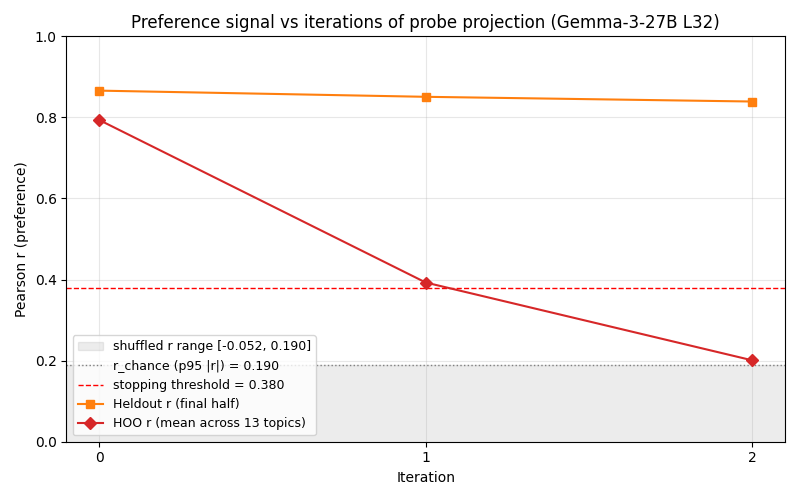
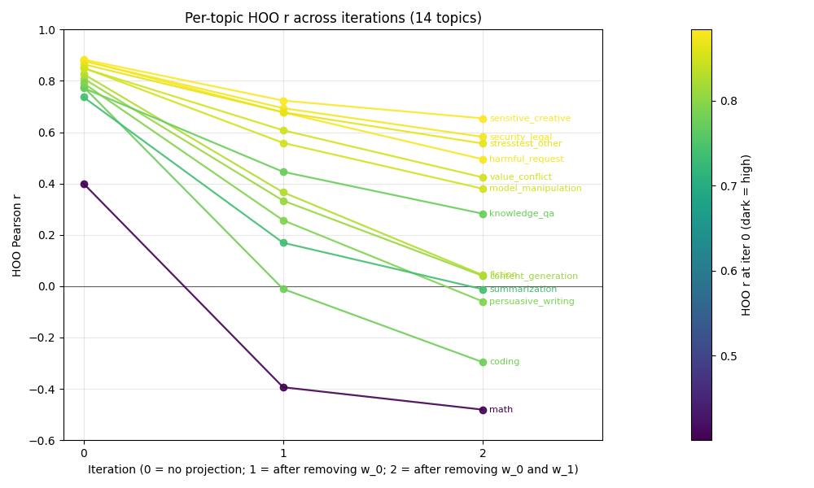
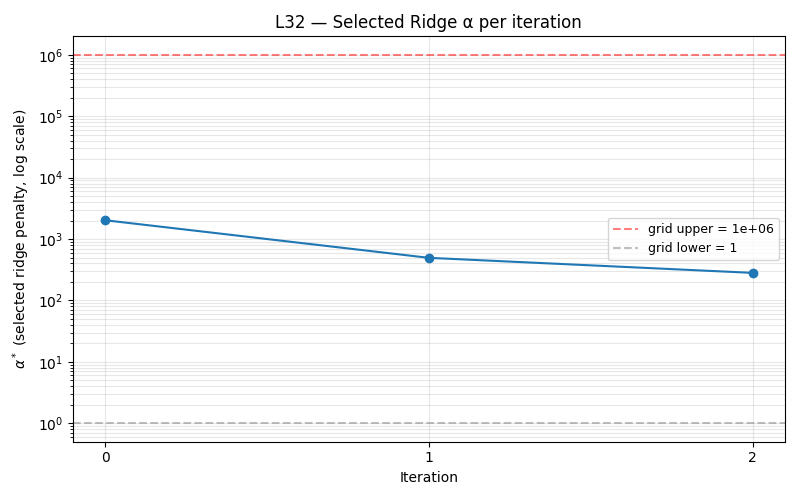
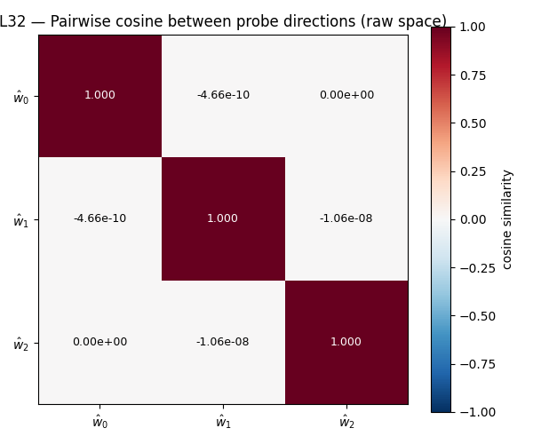
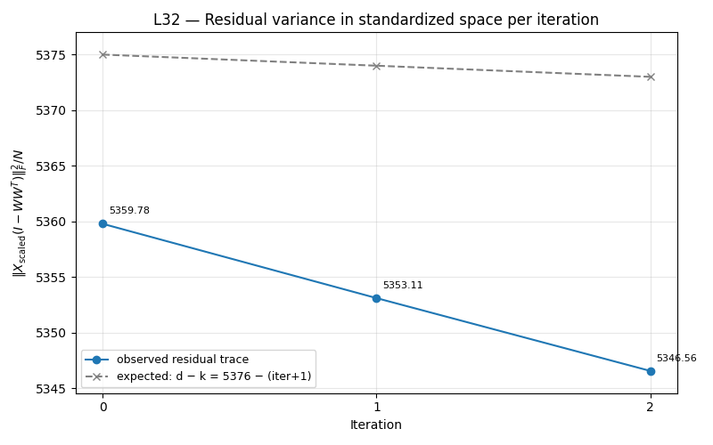

# Probe Direction Uniqueness

**Result.** Cross-topic preference signal on Gemma-3-27B L32 is effectively **rank-1**. After projecting out the first probe direction, held-out-topic (HOO) Pearson r collapses from **0.79 → 0.39 → 0.20** in two iterations, while in-distribution heldout r barely dents: **0.866 → 0.851 → 0.839**. In-distribution preference variance has higher effective rank, but the extra dimensions do not generalize across topics — they encode topic-specific confounds.



## Method

Iterated probe projection (INLP-style, Ravfogel et al. 2020). At each iteration:

1. Sweep ridge α on 50 log-spaced points in [1, 10^6], picking α* that maximizes heldout r on the sweep half of eval.
2. Refit ridge at α*, take unit-normalized direction ŵ_k.
3. Gram-Schmidt against prior directions, append to W.
4. Project activations: X ← X · (I − W W^T). Applies to train, sweep half, and final half alike.
5. Log final-half r, pairwise accuracy, and 13-topic-fold HOO mean r.

Scaler fit once at iter 0 on the train activations and held fixed across iterations so all ŵ_k live in one standardized basis. Ridge chosen over OLS for the projection direction: α is selected to maximize heldout r, so ŵ_k at α* is the rank-1 linear predictor with best generalization; OLS overfits train (R² ≈ 0.93) and would leave generalizing signal untouched.

**Stopping rule.** Stop when HOO r falls below 2·r_chance where r_chance is the 95th-percentile |final_r| of 5 shuffled-label baseline runs.

## Setup

- **Model / layer:** Gemma-3-27B-IT, layer 32 (residual stream), `activations_turn_boundary:-1.npz`.
- **Train:** 10 000 tasks from `gemma3_10k_run1` (Thurstonian mu scores).
- **Eval:** 4 038 tasks from `gemma3_4k_pre_task`, split 50/50 sweep/final with seed 42, held fixed across iterations.
- **HOO grouping:** 13 topics from `data/topics/topics.json` (coding, math, fiction, harmful_request, value_conflict, etc.), held out one topic at a time.

## Iter-0 sanity vs canonical L32 probe

Iter 0 should reproduce `heldout_eval_gemma3_tb-1` at L32 — same train/eval/activations/seed.

| Metric | This run | `heldout_eval_gemma3_tb-1` L32 |
|---|---:|---:|
| final_r | 0.8661 | 0.8646 |
| pairwise acc | 0.7646 | 0.7676 |
| α* | 2024 | 1000 |
| cos(ŵ_0, canonical probe in std space) | 0.9808 | — |

Small α* mismatch (finer 50-point grid finds a slightly different optimum) → cos 0.98 not 1.0. Pipeline verified.

## Trajectory

| Iter | α*   | Heldout r (final) | Pairwise acc | **HOO r** | Residual trace |
|-----:|-----:|------------------:|-------------:|----------:|---------------:|
| 0    | 2024 | 0.866             | 0.765        | **0.794** | 5360           |
| 1    |  494 | 0.851             | 0.760        | **0.393** | 5353           |
| 2    |  281 | 0.839             | 0.750        | **0.201** | 5347           |

Orthogonality clean: |cos(ŵ_k, ŵ_j)| ≤ 1.2e-7 for all pairs.

## Per-topic HOO decay

Mean HOO hides structure. Most topics start in the 0.77–0.88 band and decay gradually. **Math starts at 0.40** and goes to **−0.48** by iter 2; **coding** joins math in sign-flipping (−0.30). The later ŵ_k directions on these topics correlate with *anti-*preference — they are topic confounds, not preference signal.



**Harm-related topics** (harmful_request 0.49, security_legal 0.58, sensitive_creative 0.65, stresstest_other 0.56, value_conflict 0.42 at iter 2) retain the most HOO r. Consistent with prior finding that "harm avoidance" is a dominant sub-axis of the preference direction — a sub-dimension that keeps generalizing on the safety topic subset even after the top direction is removed.

## Supplementary plots



α* decays monotonically (2024 → 494 → 281) — later iterations need less shrinkage because the dominant-variance direction has been peeled off. No grid-ceiling saturation.





Residual trace drops by ~6.6 per iteration rather than 1. Expected: ridge aligns its direction with high-variance principal components of X (shrinkage bias), so projecting ŵ_k out strips more than one unit of standardized variance per iteration.

## Caveats

- **Stopping threshold is conservative.** Two of five shuffle seeds ended at the α-grid ceiling and produced spurious |final_r| ≈ 0.19, giving r_chance = 0.19 and threshold = 0.38. True chance-level r is near zero (other three seeds: |r| ≤ 0.05). Iter 2's HOO r = 0.20 may still reflect real residual signal. Follow-up: redo shuffled baseline with a narrower α range (e.g. [10, 10^4]) to tighten the threshold.
- **Ridge α-optimal ≠ variance-maximally-harmful direction.** The direction that maximizes heldout r is not, in general, the direction whose removal maximally reduces heldout r. For orthogonal designs they coincide. Good first-pass proxy; not a tight upper bound on information loss from removing a rank-1 subspace.
- **Single layer.** Only L32. The pattern is about the shape of the probe's representation, which likely generalizes, but L39 / L46 robustness checks are untouched.

## Reproducibility

- Script: `scripts/probe_direction_uniqueness/iterate_probe_projection.py`
- Trajectory JSON, stacked directions `.npz`, scaler `.npz`: `experiments/probe_science/probe_direction_uniqueness/output/L32/`
- Plot scripts: `scripts/probe_direction_uniqueness/make_plots.py`, `make_plots_v2.py`

Full command:

```
python -m scripts.probe_direction_uniqueness.iterate_probe_projection --layer 32 --K 10 --alpha-grid-size 50 --alpha-lo 1 --alpha-hi 1e6 --hoo-at-every-iter --shuffle-seeds 5 --out-dir experiments/probe_science/probe_direction_uniqueness/output/L32
```
