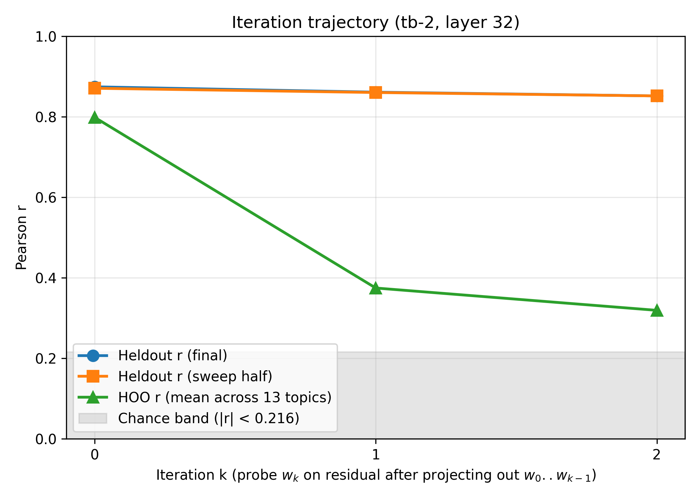
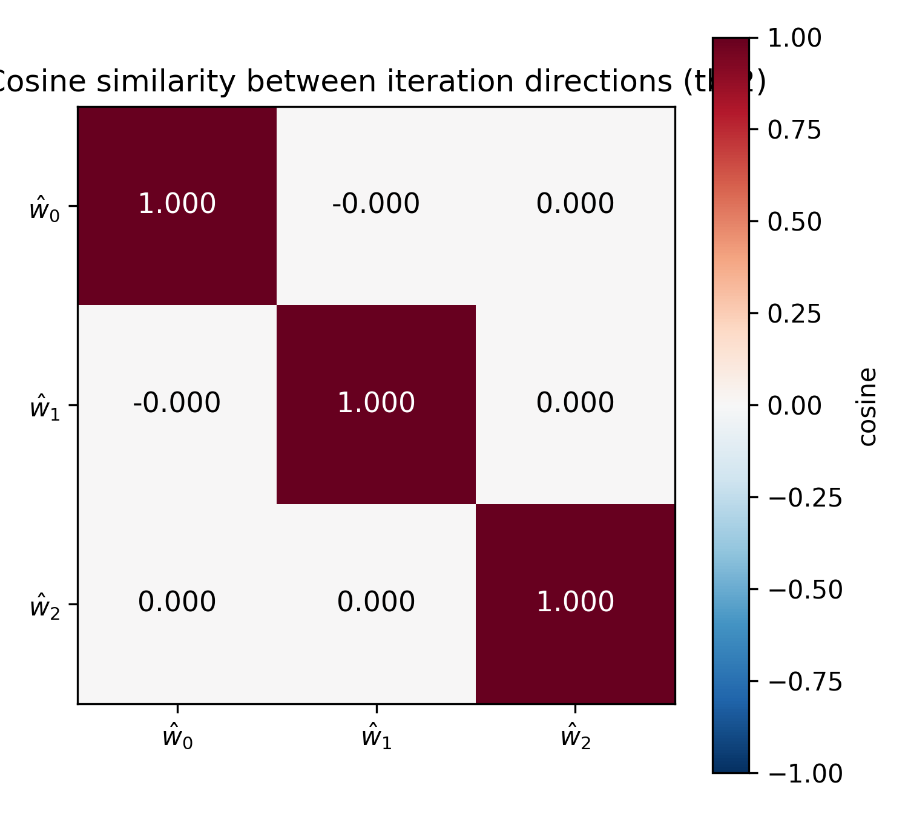
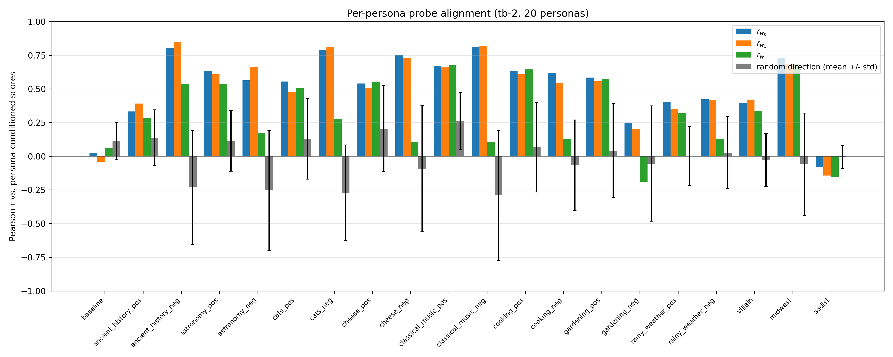
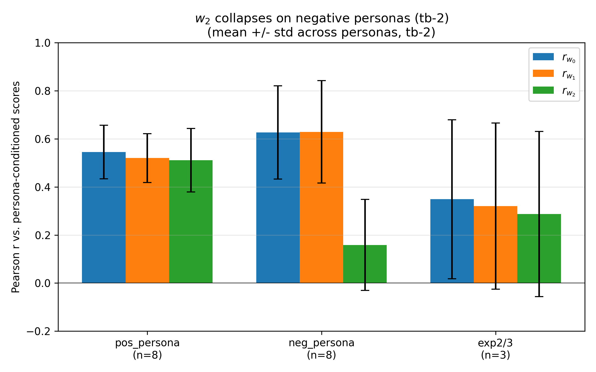
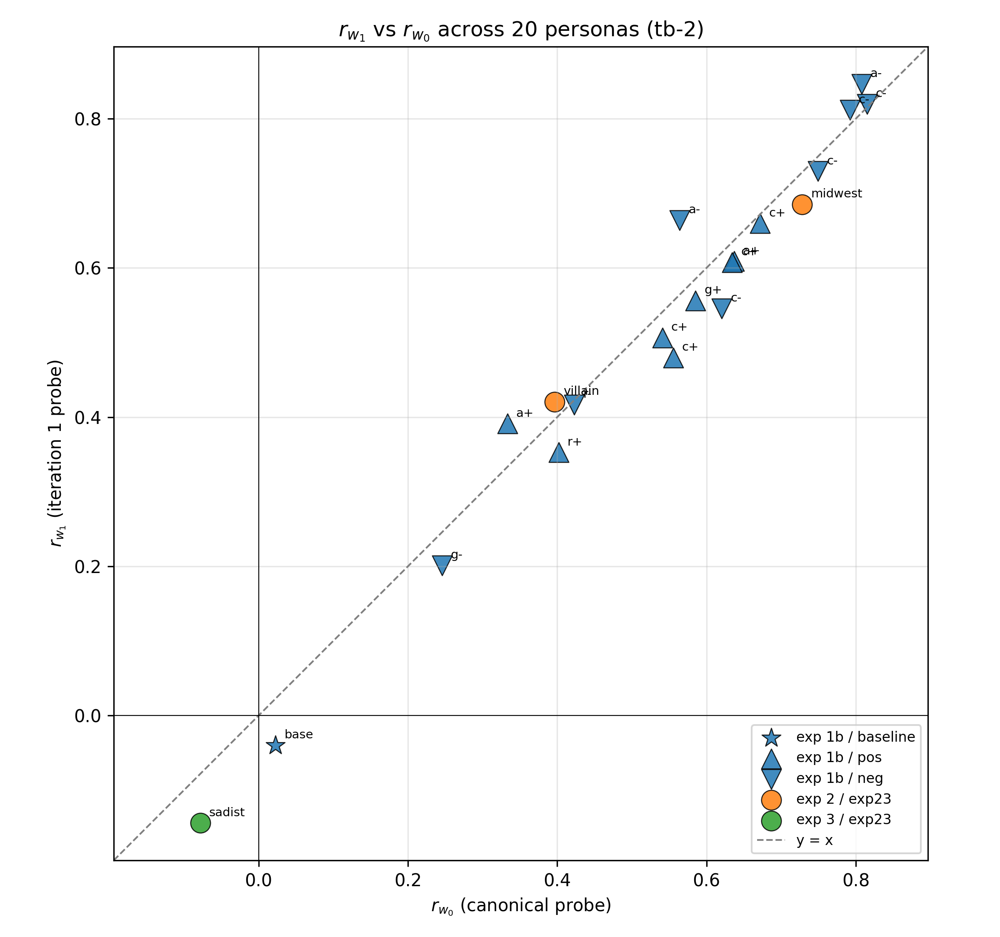
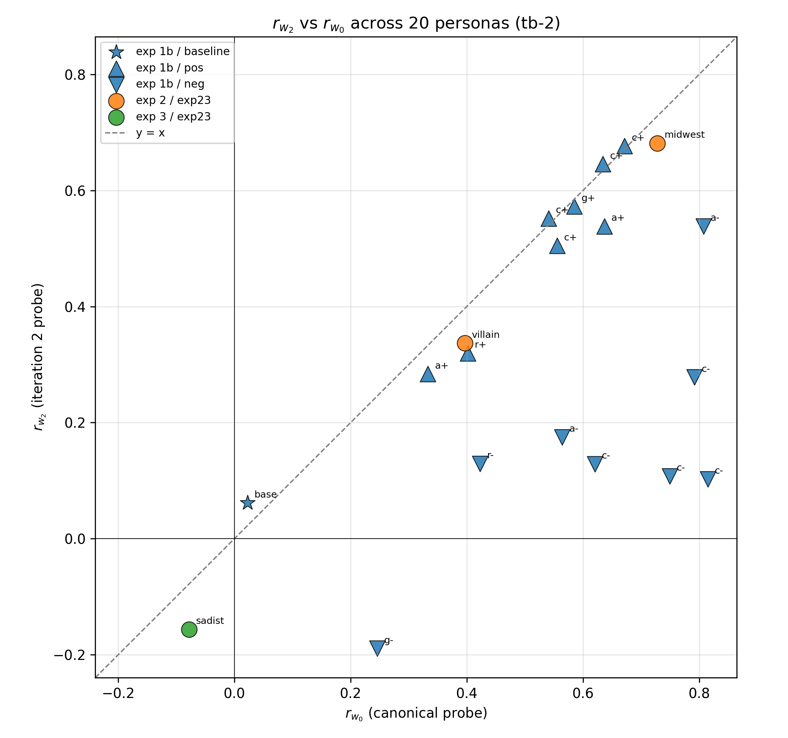

# Probe Direction Uniqueness — tb-2

Consolidated report for Gemma-3-27B L32 preference probes trained on `turn_boundary:-2` activations. Combines two parts:

1. **Iteration trajectory** — how does probe performance decay as we project out successive probe directions? (INLP-style analysis on the main 10k tasks.)
2. **Persona / system-prompt tracking** — do the iterated directions ŵ_0, ŵ_1, ŵ_2 track preference shifts induced by system prompts? (Applied to exp 1b OOD system prompts + mra_exp2 villain/midwest + mra_exp3 sadist.)

A parallel report at `probe_direction_uniqueness_tb-5_report.md` runs the same pipeline on tb-5 activations.

## Headlines

1. **Rank-1 for cross-topic generalization** (same pattern as parent tb-1 report): heldout r on the final eval half barely drops across iterations (0.866 → 0.851 → 0.839), but HOO r (held-one-out by topic) collapses (0.794 → 0.393 → 0.201). The canonical direction ŵ_0 carries nearly all cross-topic generalization; subsequent ŵ_k fit topic confounds.

2. **Rank-≥2 for cross-persona generalization** (ŵ_0 and ŵ_1 interchangeable on persona shifts): across 20 personas (baseline + 16 OOD persona prompts + villain + midwest + sadist), ŵ_0 and ŵ_1 produce near-identical Pearson r values against each persona's Thurstonian μ. Median r_w0 = 0.58, median r_w1 = 0.55.

3. **ŵ_2 has a polarity asymmetry at tb-2 that does NOT hold at tb-5.** At tb-2, ŵ_2 tracks positive personas and mra_exp2/3 (mean r ≈ 0.5) but collapses on negative personas (mean r ≈ 0.16). At tb-5 this asymmetry vanishes — ŵ_2 tracks both polarities equally. So the tb-2 ŵ_2 collapse is a token-position artifact, not a robust property of the probe subspace.

## Part 1 — Iteration trajectory (INLP on tb-2 activations)

### Setup

- **Model / layer**: Gemma-3-27B-IT, layer 32.
- **Activations**: `activations/gemma_3_27b_turn_boundary_sweep/activations_turn_boundary:-2.npz`.
- **Train / eval**: same as parent — 10k tasks from `gemma3_10k_run1`, 4k eval tasks from `gemma3_4k_pre_task`, sweep/final split seed 42.
- **Sanity gate passed**: cos(ŵ_0, canonical `heldout_eval_gemma3_tb-2` L32 probe in std space) = **+0.980**.
- Stopping rule bypassed (`--force-K 3`) to extract ŵ_2.

### Trajectory

| Iter | α*   | Heldout r (final) | Pairwise acc | **HOO r** |
|-----:|-----:|------------------:|-------------:|----------:|
| 0    | 2020 | 0.866             | 0.768        | **0.794** |
| 1    |  494 | 0.851             | 0.758        | **0.393** |
| 2    |  373 | 0.852             | 0.750        | **0.319** |



Orthogonality clean: |cos(ŵ_i, ŵ_j)| ≤ 1.2e-7 for all pairs.



## Part 2 — Cross-persona generalization

Frame: we apply probes trained on the baseline task distribution (no system prompt) to 20 personas' activations and ask how well they track each persona's measured Thurstonian μ. Each persona is a "fold" of cross-persona generalization.

### Method

- Retrained probe directions (above) provide ŵ_0, ŵ_1, ŵ_2 in the tb-2 standardized basis.
- For each persona: standardize activations with the fixed iter-0 scaler, dot with each ŵ_k, correlate with the persona-specific Thurstonian μ. For mra_exp2 (villain, midwest) and mra_exp3 (sadist) we pool the three splits (a, b, c) into one persona-level r computed on all 2500 tasks.
- Random-direction control: 5 unit vectors from N(0, I) in standardized space.
- Baseline halves null: split exp 1b baseline tasks randomly × 5 seeds, compute r on each half.
- 20 personas total: baseline + 16 exp 1b persona prompts (8 topics × pos/neg, n=48 tasks each) + villain + midwest + sadist (n=2500 pooled each).

### Per-persona breakdown



Mean Pearson r (± std) across personas in each group:

| Group | n personas | **r_w0** | r_w1 | r_w2 |
|---|---|---|---|---|
| 1b positive persona | 8 | 0.55 ± 0.11 | 0.52 ± 0.10 | 0.51 ± 0.14 |
| **1b negative persona** | 8 | 0.63 ± 0.19 | 0.63 ± 0.21 | **0.16 ± 0.19** |
| mra_exp2 + exp3 (villain/midwest/sadist) | 3 | 0.35 ± 0.33 | 0.32 ± 0.35 | 0.29 ± 0.34 |



### Scatter (per persona)

ŵ_1 is essentially interchangeable with ŵ_0 — all 20 personas sit on the y=x line.



ŵ_2 drops off the y=x line specifically for the negative-persona personas.



### Cross-tb comparison of the ŵ_2 effect

The ŵ_2 collapse on negative personas does not replicate at tb-5.


At tb-5, mean r_w2 on the 8 neg_persona conditions is 0.69 (essentially matching r_w0 and r_w1). At tb-2 it drops to 0.16. The ŵ_2 polarity asymmetry is a tb-2-specific property, not a general feature of the rank-3 preference subspace.

### Per-persona detail


## Caveats

- **Small n on exp 1b** (48 tasks per condition) makes per-condition r noisy. The patterns in the group means (averaged over 8 topics) are the load-bearing claim, not individual conditions.
- **Train/eval overlap on exp 2/3**: ~50% of persona-condition tasks overlap with the 10k probe train set. Activations are condition-specific and μ is re-measured per condition, so scoring is not circular, but the r values mix in-distribution and OOD tasks. Exp 1b is cleaner (0% overlap).
- **Shuffled baseline r_chance = 0.19** is inflated (two of five seeds hit the α-grid ceiling). True chance-level r is much lower — the persona r values of 0.4–0.8 are clearly signal.
- **Single layer, single token position** (though cross-tb comparison above confirms the iteration pattern is stable, and isolates the ŵ_2 asymmetry to tb-2).

## Reproducibility

```
python -m scripts.probe_direction_uniqueness.iterate_probe_projection \
  --layer 32 --K 3 --alpha-grid-size 50 --alpha-lo 1 --alpha-hi 1e6 \
  --hoo-at-every-iter --shuffle-seeds 5 --force-K \
  --activations-path activations/gemma_3_27b_turn_boundary_sweep/activations_turn_boundary:-2.npz \
  --canonical-probe results/probes/heldout_eval_gemma3_tb-2/probes/probe_ridge_L32.npy \
  --out-dir experiments/probe_science/probe_direction_uniqueness/persona_prompt_tracking/output/L32_tb-2

python -m scripts.probe_direction_uniqueness.persona_prompt_tracking \
  --directions-dir experiments/probe_science/probe_direction_uniqueness/persona_prompt_tracking/output/L32_tb-2 \
  --out-dir experiments/probe_science/probe_direction_uniqueness/persona_prompt_tracking/output/L32_tb-2 \
  --activations-filename 'activations_turn_boundary:-2.npz'
```

Data artifacts under `experiments/probe_science/probe_direction_uniqueness/persona_prompt_tracking/output/L32_tb-2/`: `trajectory.json`, `directions.npz`, `scaler.npz`, `results.json`.
