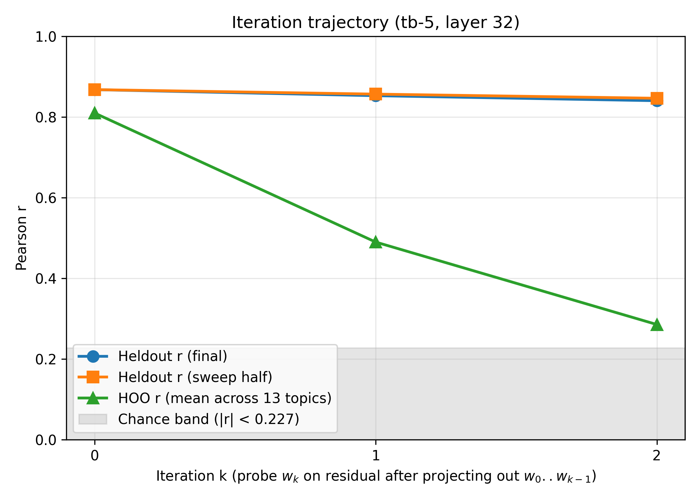
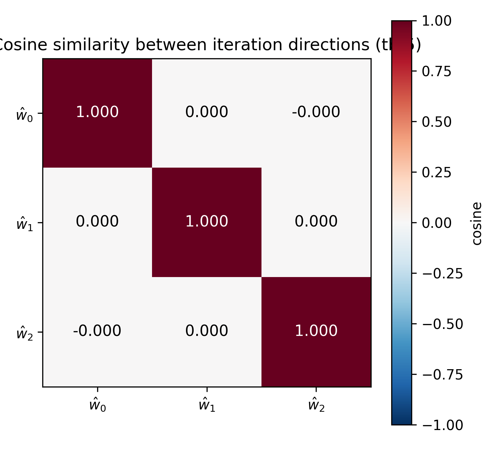
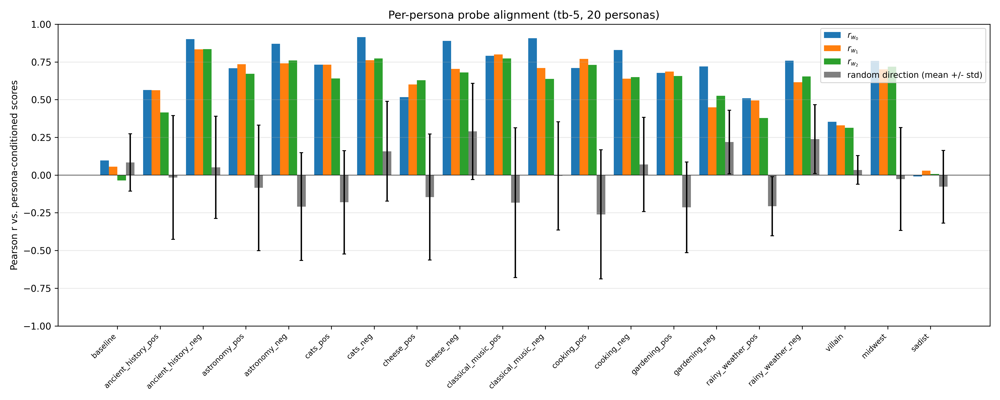
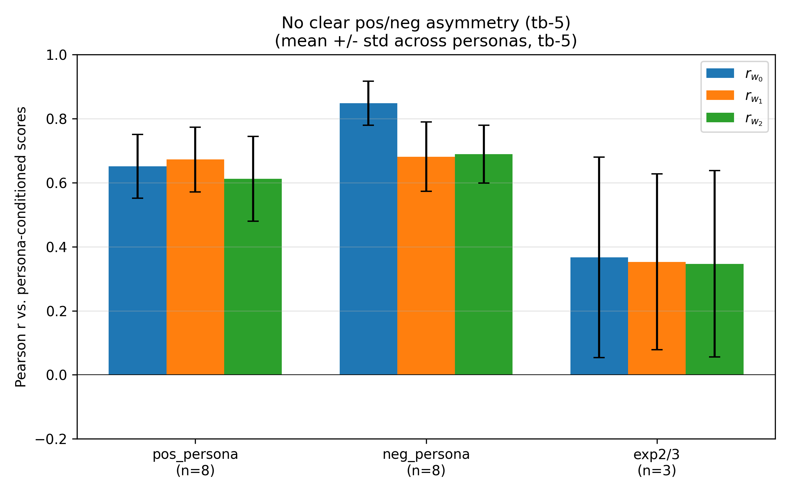
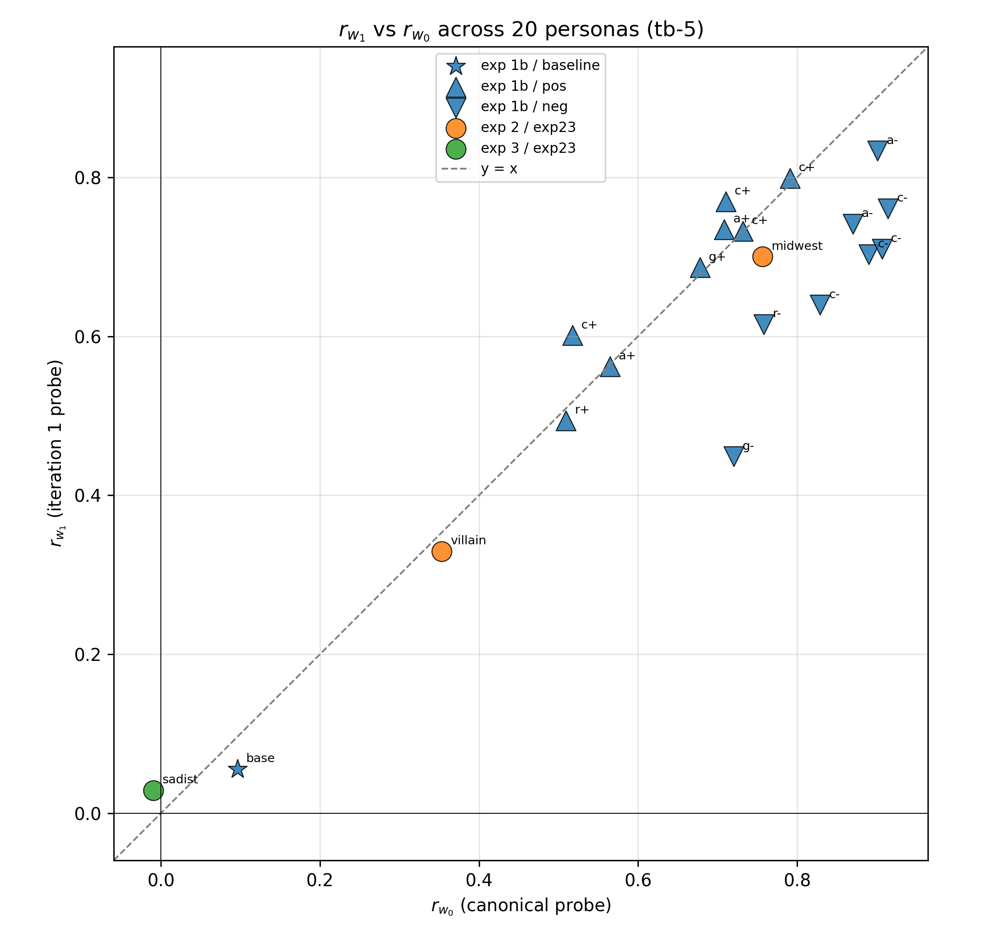
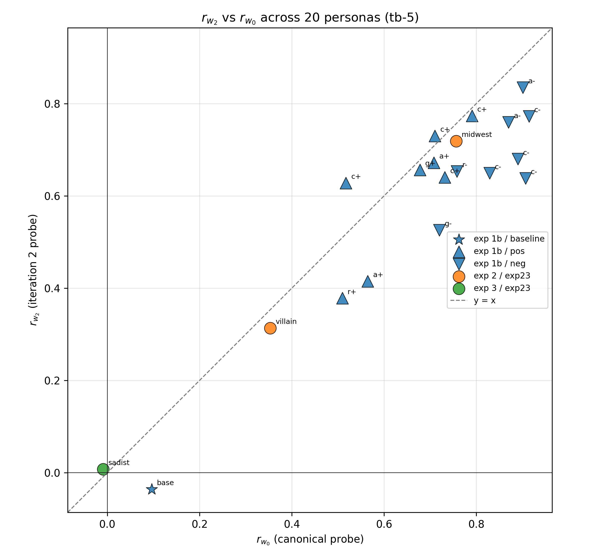
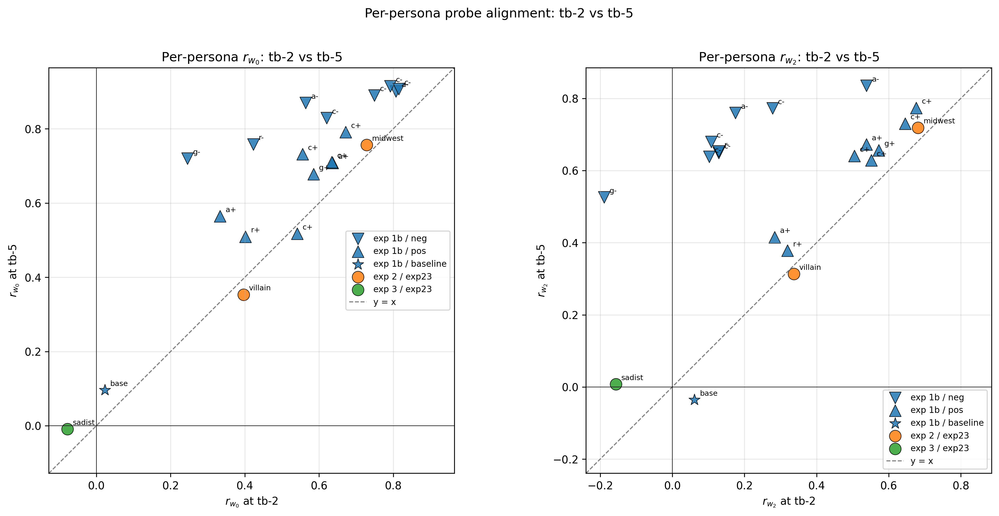

# Probe Direction Uniqueness — tb-5

Consolidated report for Gemma-3-27B L32 preference probes trained on `turn_boundary:-5` activations. Combines two parts:

1. **Iteration trajectory** — INLP-style analysis of probe uniqueness on the main 10k tasks.
2. **Persona / system-prompt tracking** — do ŵ_0, ŵ_1, ŵ_2 track persona-induced preference shifts?

Parallel report at `probe_direction_uniqueness_tb-2_report.md` runs the same pipeline on tb-2.

## Headlines

1. **Rank-1 for cross-topic generalization** (same pattern as tb-2 and parent tb-1): heldout r drops only 3% across three iterations (0.868 → 0.853 → 0.840), HOO r collapses by 65% (0.810 → 0.490 → 0.286). Pattern is stable across token positions.

2. **Rank-≥2 for cross-persona generalization**. All three directions ŵ_0, ŵ_1, ŵ_2 track preference shifts almost equally across 20 personas (baseline + 16 OOD prompts + villain + midwest + sadist). At tb-5 specifically:
   - Mean r_w0 on the 8 exp 1b neg_persona personas = **0.85**
   - Mean r_w1 = **0.68**
   - Mean r_w2 = **0.69**

3. **No polarity asymmetry on ŵ_2 at tb-5** (unlike tb-2): the "ŵ_2 collapses on negative personas" finding from the tb-2 report does not replicate here. At tb-5, ŵ_2 tracks both polarities. That tb-2 effect is a token-position artifact.

4. **ŵ_0 is stronger at tb-5 than tb-2** on negative personas specifically (0.85 vs 0.63 mean). Subsequent iterations retain more signal. The evaluative direction appears to be better concentrated in ŵ_0 at the earlier token-boundary position (tb-5 is further from the prompt boundary).

## Part 1 — Iteration trajectory (INLP on tb-5 activations)

### Setup

- **Activations**: `activations/gemma_3_27b_turn_boundary_sweep/activations_turn_boundary:-5.npz`.
- **Train / eval / split / layer**: identical to the tb-2 run (same tasks, same seed 42, L32).
- **Sanity gate passed**: cos(ŵ_0, canonical `heldout_eval_gemma3_tb-5` L32 probe in std space) = **+0.997** (tighter match than tb-2's 0.98).
- Stopping rule bypassed with `--force-K 3` to extract ŵ_2.

### Trajectory

| Iter | α*   | Heldout r (final) | Pairwise acc | **HOO r** |
|-----:|-----:|------------------:|-------------:|----------:|
| 0    | 3560 | 0.868             | 0.769        | **0.810** |
| 1    | 1150 | 0.853             | 0.759        | **0.490** |
| 2    |  655 | 0.840             | 0.749        | **0.286** |



tb-5 iter-1 HOO is higher than tb-2's (0.49 vs 0.39), but iter-2 HOO ends up similar (0.29 vs 0.32). Overall shape is the same: rank-1 by HOO.



## Part 2 — Cross-persona generalization

Frame: we apply probes trained on the baseline task distribution (no system prompt) to 20 personas' activations and correlate probe scores with each persona's Thurstonian μ.

### Method

- Retrained probe directions (above) provide ŵ_0, ŵ_1, ŵ_2 in the tb-5 standardized basis.
- For each persona: standardize activations with the fixed iter-0 scaler, dot with each ŵ_k, correlate with persona-specific Thurstonian μ. For villain/midwest/sadist we pool splits a, b, c into one persona-level r on 2500 tasks.
- 20 personas: baseline + 16 exp 1b persona prompts (n=48 each) + villain + midwest + sadist (n=2500 pooled each).

### Per-persona breakdown



Mean Pearson r (± std) across personas in each group:

| Group | n personas | r_w0 | r_w1 | r_w2 |
|---|---|---|---|---|
| 1b positive persona | 8 | 0.65 ± 0.12 | 0.67 ± 0.11 | 0.61 ± 0.13 |
| 1b negative persona | 8 | **0.85 ± 0.07** | 0.68 ± 0.11 | **0.69 ± 0.09** |
| mra_exp2 + exp3 (villain/midwest/sadist) | 3 | 0.37 ± 0.30 | 0.36 ± 0.28 | 0.35 ± 0.30 |



Compared to tb-2:
- **Pos personas**: all three directions slightly stronger at tb-5 (~0.65 vs ~0.52). Nothing dramatic.
- **Neg personas**: ŵ_0 jumps from 0.63 (tb-2) to 0.85 (tb-5). ŵ_1 and ŵ_2 stay around 0.68. **The ŵ_2 collapse at tb-2 (0.16) is gone**.
- **Exp 2/3**: essentially the same across tb positions.

### Scatter (per persona)





Both scatters show points clustered below the y=x line for higher-r personas. At tb-5 ŵ_0 is stronger than ŵ_1 and ŵ_2 — but no dramatic collapse.

### Cross-tb comparison of ŵ_k per persona

The cross-tb comparison plot is saved only under `assets_tb-2/` and referenced from both reports.



All 8 negative-persona conditions show higher r_w2 at tb-5 than at tb-2 (typical delta ≈ +0.5). The tb-2 ŵ_2 collapse is not a feature of the preference subspace.

### Why might tb-5 differ from tb-2?

tb-2 is the second-to-last token of the prompt (right before the assistant's response); tb-5 is five tokens earlier. Ridge probes at these different positions are capturing slightly different information — but the signal structure (iter-0 canonical direction, rank-1 for HOO) is preserved.

A few hypotheses for why ŵ_0 is much stronger on neg_persona at tb-5:
- Information about persona polarity may be more saturated at tb-5; by tb-2 the probe signal has contracted toward a dominant direction and the residuals contain more noise.
- Ridge shrinkage at tb-2 splits the signal across ŵ_0 and ŵ_1 more evenly (because they're closer in PC variance); at tb-5 the signal concentrates more into ŵ_0.

Neither hypothesis is confirmed. The takeaway for downstream work is that ŵ_2-specific findings should be replicated across token positions before being trusted.

## Caveats

- Same as the tb-2 report: small n on exp 1b, ~50% train overlap on exp 2/3, inflated shuffled baseline, single layer.
- Cross-tb differences in ŵ_0 magnitudes reflect token-position information structure, not probe-quality differences — the canonical tb-5 L32 probe has final_r = 0.868, nearly identical to tb-2's 0.874.

## Reproducibility

```
python -m scripts.probe_direction_uniqueness.iterate_probe_projection \
  --layer 32 --K 3 --alpha-grid-size 50 --alpha-lo 1 --alpha-hi 1e6 \
  --hoo-at-every-iter --shuffle-seeds 5 --force-K \
  --activations-path activations/gemma_3_27b_turn_boundary_sweep/activations_turn_boundary:-5.npz \
  --canonical-probe results/probes/heldout_eval_gemma3_tb-5/probes/probe_ridge_L32.npy \
  --out-dir experiments/probe_science/probe_direction_uniqueness/persona_prompt_tracking/output/L32_tb-5

python -m scripts.probe_direction_uniqueness.persona_prompt_tracking \
  --directions-dir experiments/probe_science/probe_direction_uniqueness/persona_prompt_tracking/output/L32_tb-5 \
  --out-dir experiments/probe_science/probe_direction_uniqueness/persona_prompt_tracking/output/L32_tb-5 \
  --activations-filename 'activations_turn_boundary:-5.npz'
```

Data artifacts under `experiments/probe_science/probe_direction_uniqueness/persona_prompt_tracking/output/L32_tb-5/`.
