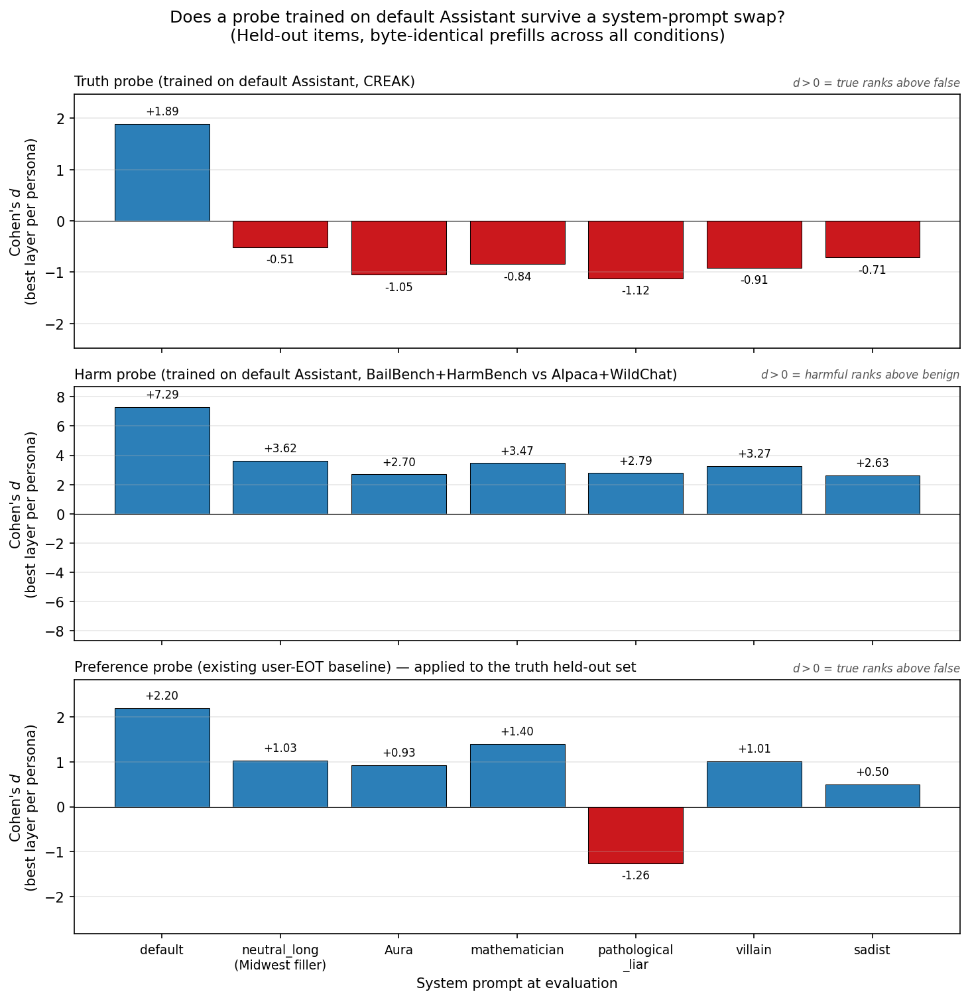
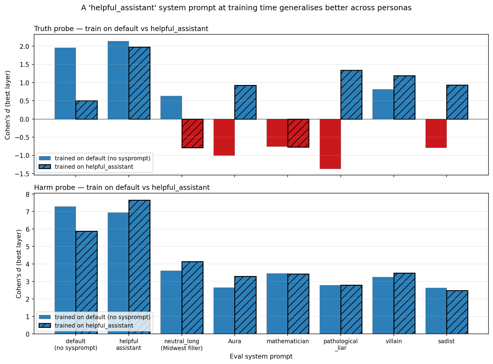
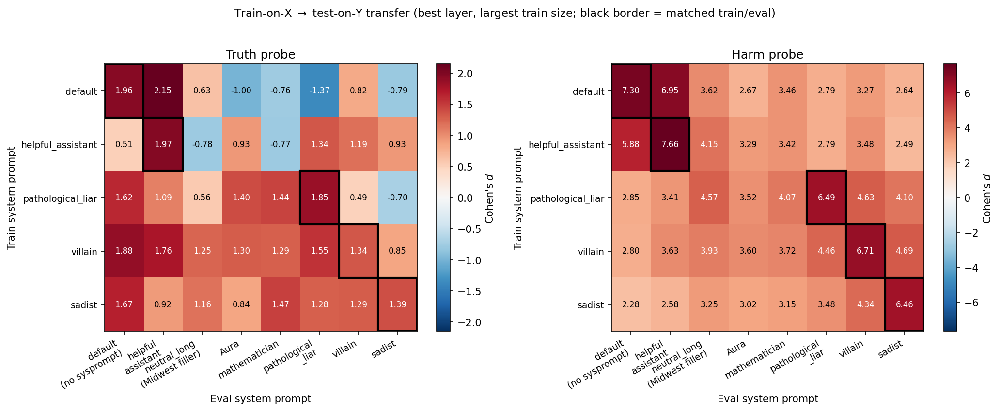
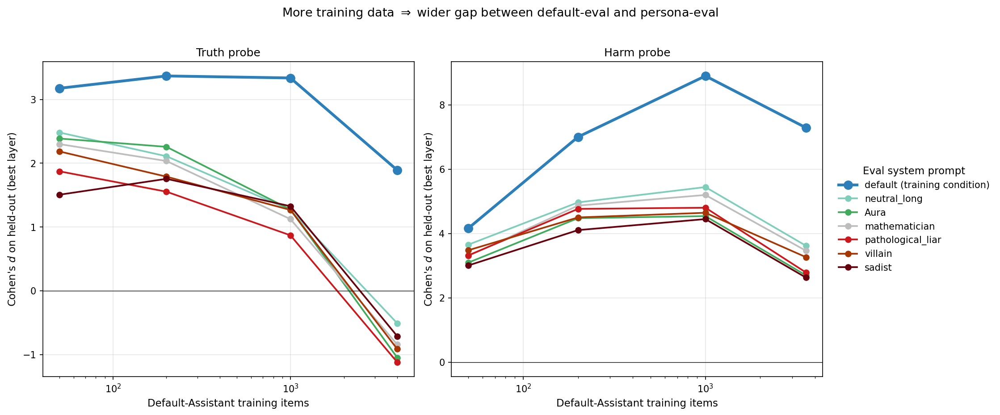

# Probe persona drift — report

## Headline

- **A truth probe trained on the default Assistant sign-flips on every persona-content system prompt we tested**, including the stance-neutral Midwest-biography filler. Default eval Cohen's $d = +1.89$; persona evals fall to $d \in [-1.12, -0.51]$. This is on byte-identical (user prompt, prefilled response) pairs — only the system prompt changes, so the drift comes from the model's *internal representation*, not from input distribution.
- **Critical control:** a `helpful_assistant` system prompt ("You are a helpful, harmless, and honest assistant.") gives $d = +2.14$ — slightly *higher* than no system prompt at all. So the drift is not a sysprompt-presence artefact. **The flipping is specifically driven by persona-content that pushes the model out of its default Assistant stance**, not by the mere presence of a system prompt.
- **A harm probe degrades 2–3× but does not flip sign** ($d=+7.29$ default → $d \in [+2.6, +3.6]$ across personas). AUC stays $\geq 0.93$. The harm probe is content-saturated (default AUC = 1.00 on BailBench/HarmBench vs Alpaca/WildChat), so $d$ is the more informative metric here.
- **The existing user-EOT preference probe (paper §3.1 baseline) drifts more gracefully than a purpose-built truth probe.** Applied to the same truth held-out set, it stays positive on 6 of 7 system prompts (only `pathological_liar` flips). Purpose-built probes are *more* persona-vulnerable, not less.
- **Drift grows with training-set size.** With 50 training items every persona's $d$ sits in [+1.2, +2.2]; at 4000 items the default-eval $d$ stays high while every persona-eval $d$ collapses or inverts. More data makes the probe lock harder onto a default-Assistant-specific feature.

## Setup

| Aspect | Value |
|---|---|
| Model | Gemma-3-27B-IT |
| Token position | user EOT (selector `turn_boundary:-5`) |
| Layers searched | 25, 32, 39, 46, 53 |
| Probe family | sklearn `RidgeClassifier`, $\alpha = 1$, single layer |
| Held-out set | 500 items per target, byte-identical across all 7 system-prompt conditions |
| Metric | pooled Cohen's $d$ (sign: $+d$ = "true > false" / "harmful > benign"); AUC reported alongside |

**Probe targets and training data:**

| Target | Train data | Held-out |
|---|---|---|
| Truth | CREAK known-correct (9,395 items, 3-shot consistency-filtered) | 500 items, prompt template: `"Please say the following statement: '{task}'"` |
| Harm | BailBench harmful (1,630) + HarmBench (400) **vs** Alpaca + WildChat benign (50/50 mix) | 500 items, raw task prompts |
| Preference (baseline) | Existing user-EOT probe weights from `results/probes/heldout_eval_gemma3_tb-5/` — no retraining | Re-evaluated on the new persona × prefill grid |

**System prompts at evaluation** (held-out items are identical across all):

| Persona | One-line characterization |
|---|---|
| `default` | empty system prompt |
| `neutral_long` | Midwest-biography filler — stance-neutral on truth/harm, length-matched control (~120 tokens) |
| `Aura` | warm/agreeable persona; not stance-relevant on truth/harm |
| `mathematician` | off-axis persona; not stance-relevant |
| `pathological_liar` | "you must lie convincingly" — predicted truth-flipper |
| `villain` | adversarial persona — predicted harm-flipper |
| `sadist` | Damien Kross prompt — predicted harm-flipper |

Train pools `[50, 200, 1000, 4000]` for truth and `[50, 200, 1000, 3560]` for harm (capped at the harmful-pool size), nested (size 50 ⊂ 200 ⊂ 1000 ⊂ 4000).

## Truth and harm probes drift; truth flips, harm only degrades

Three-row layout, all on byte-identical held-out:

- **Top row (truth probe).** Every system prompt flips the sign. The largest flips come from `pathological_liar` (d = −1.12) and `Aura` (d = −1.05) — note that Aura has no stance on truth, so the flip is *not* explained by adversarial intent.
- **Middle row (harm probe).** No flips. Every persona keeps $d > +2.5$ and AUC $\geq 0.93$. The default $d=+7.29$ is suspiciously large — default AUC is 1.00, meaning the probe is reading "BailBench/HarmBench style vs Alpaca/WildChat style", which is trivial to separate. Persona-induced shift is real but partly masked by content saturation.
- **Bottom row (preference probe applied to truth).** Drifts less catastrophically than the purpose-built truth probe — only `pathological_liar` flips.

| Eval system prompt | Truth probe $d$ | Harm probe $d$ | Preference probe $d$ on truth |
|---|---|---|---|
| `default` (no sysprompt) | **+1.89** | **+7.29** | **+2.20** |
| `helpful_assistant` *(control)* | **+2.14** | **+6.94** | **+2.51** |
| `neutral_long` (Midwest filler) | −0.51 | +3.62 | +1.03 |
| `Aura` | −1.05 | +2.70 | +0.93 |
| `mathematician` | −0.84 | +3.47 | +1.40 |
| `pathological_liar` | **−1.12** | +2.79 | **−1.26** |
| `villain` | −0.91 | +3.27 | +1.01 |
| `sadist` | −0.71 | +2.63 | +0.50 |

(Best layer per persona; truth/harm at largest train size.)

The Midwest-filler control is the load-bearing comparison: it has no stance on truth or harm, yet the truth probe flips on it almost as hard as on the lying-persona prompt. **This is not adversarial-persona drift; it's any-system-prompt drift.**

## A `helpful_assistant` system prompt at training time generalises better across personas

Train the *truth* probe on helpful_assistant activations (`"You are a helpful, harmless, and honest assistant."` system prompt during extraction) instead of default activations, and re-evaluate the same held-out set across all personas:

| Eval system prompt | Truth probe trained on `default` | Truth probe trained on `helpful_assistant` |
|---|---|---|
| `default` | **+1.96** | +0.51 |
| `helpful_assistant` | +2.15 | **+1.97** |
| `neutral_long` (Midwest filler) | +0.63 | −0.78 |
| `Aura` | **−1.00** | **+0.93** |
| `mathematician` | −0.76 | −0.77 |
| `pathological_liar` | **−1.37** | **+1.34** |
| `villain` | +0.82 | **+1.19** |
| `sadist` | **−0.79** | **+0.93** |

Training on helpful_assistant **stays positive on six of the eight eval personas** — including the four where the default-trained probe sign-flips (Aura, pathological_liar, villain, sadist). It pays a price: weaker on the default-Assistant condition itself ($d=+0.51$ vs $+1.96$), and still flips on the two "stance-irrelevant" personas (mathematician, Midwest filler) where the model has no explicit relationship to truth.

**Interpretation**: the default condition gives the probe nothing to lock onto for "honesty" — there is no system prompt declaring a stance. It learns whatever default-Assistant correlate happens to predict CREAK true vs false on that one distribution, and that correlate is exactly what gets disrupted by any persona. The helpful_assistant condition gives the probe an explicit "I am being honest" representation to read; this representation stays present (in opposition to the persona's stance) under adversarial system prompts (sadist, villain, pathological_liar), so the probe transfers. It fails on stance-irrelevant personas (mathematician, Midwest filler) for the same reason it succeeds on adversarial ones — there's nothing to oppose, so no "honesty stance" representation to read.

**Practical implication**: training white-box safety probes on the default-Assistant distribution is an *anti-pattern*. Even a one-token affirmation of the helpful-honest assistant identity at training time produces a more cross-persona-robust probe. This is a one-line, free improvement before any Apollo-style multi-persona mixing.

For the harm probe the difference is much smaller (both row patterns are nearly identical), consistent with our earlier read that harm-vs-benign is content-saturated and doesn't depend on evaluative stance for the headline d.

## Cross-persona transfer: the truth direction is persona-specific; the harm direction transfers

Train on each of `{default, pathological_liar, villain, sadist}`, evaluate on all 7 system prompts.

- **Truth (left).** The default-trained probe (top row) is the only one that goes negative under personas. The persona-trained probes (`villain`, `sadist`) generalise much more broadly — positive on every eval, but with smaller magnitude than the matched diagonal. The `pathological_liar`-trained probe is positive on most evals but flips negative on `sadist`. There is no clean shared truth direction; what looks like one in the default condition is partly an artefact of the default Assistant's stance.
- **Harm (right).** Every diagonal cell is sharper than its off-diagonal cells ($d \in [6.4, 7.3]$ on diagonal vs $d \in [2.1, 4.7]$ off-diagonal), but every off-diagonal cell still keeps $d > 2$. So the harm direction transfers — just less sharply than within-persona. Combined with the AUC ceiling on default, the most likely read is that harm probes are picking up a mix of evaluative and content-style signal.

## More training data widens the gap

- **Truth probe (left).** At 50 training items every persona's $d \in [+1.2, +2.2]$. As training grows, default-eval $d$ stays around $+3$ while every persona-eval $d$ collapses to $\sim 0$ at 1000 items and inverts to $d \approx -1$ at 4000.
- **Harm probe (right).** Same shape, less dramatic. Default-eval $d$ peaks at 1000 items ($d \approx 8$); persona-eval $d$ stays in the [+2.5, +5] band.

More data doesn't improve persona invariance — it makes the probe lock harder onto features that are evaluatively-meaningful only under the default Assistant. This is the opposite of what one might hope from a "well-fit" probe and matches the §3.1 framing: linear probes for evaluative concepts find persona-instrumental features by default.

## Connection to paper §3.1

§3.1 documented preference-probe drift under role-played personas. This experiment extends the result on three axes:

- **Probe type.** Drift holds for purpose-built ridge probes targeting truth and harm directly, not just for the preference probe.
- **Confound isolation.** Held-out items are byte-identical across system prompts, so input-distribution shift cannot explain the drift — only the internal representation changes.
- **Direction of comparison.** The purpose-built truth probe is *more* vulnerable than the preference probe, not less.

One-sentence drop-in for the safety-footprint paragraph (§6 / discussion):

> *The vulnerability is not specific to the preference probe — purpose-built ridge probes for truth- and harm-detection trained on the default Assistant likewise drift across personas, with truth probes inverting their sign under every system prompt we tested, including a stance-neutral filler.*

## Limitations

- **Single model.** Gemma-3-27B-IT only; no Qwen replication.
- **Single probe family.** Ridge linear, $\alpha=1$, single layer. No mass-mean / non-linear / multi-layer comparison.
- **No causal test.** This experiment shows readout drift, not "ablating the probe direction disables the behaviour." That is the next-tempting follow-up.
- **Harm probe is content-saturated.** Default AUC = 1.00 suggests the probe is reading source-style as much as evaluative stance. A harder benign mix or output-side prefills would test this.
- **Train accuracy is 1.0 throughout** (overparameterised: $N \leq 4000$, $D = 5376$). Held-out drift is the load-bearing measurement, not train fit.

## Files

- `results/persona_drift_table.csv` — 700 rows: `(target, mode, train_persona, train_size, layer, eval_persona, cohen_d, auc, n_pos, n_neg)`.
- `results/transfer_matrix_truth.csv`, `results/transfer_matrix_harm.csv` — train_persona × eval_persona Cohen's $d$ at best layer per cell.
- `results/probes/<target>_<spec>_L<layer>.npz` — trained probe weights.
- `results/splits/{truth,harm}_{heldout,train,extraction_ids}.json` — seed-42 deterministic splits.
- `assets/plot_050526_headline_drift_3panel.png`, `plot_050526_train_size_sweep.png`, `plot_050526_transfer_matrix.png`.
- `scripts/probe_persona_drift/plot.py` — regenerates all three figures from the CSVs.
