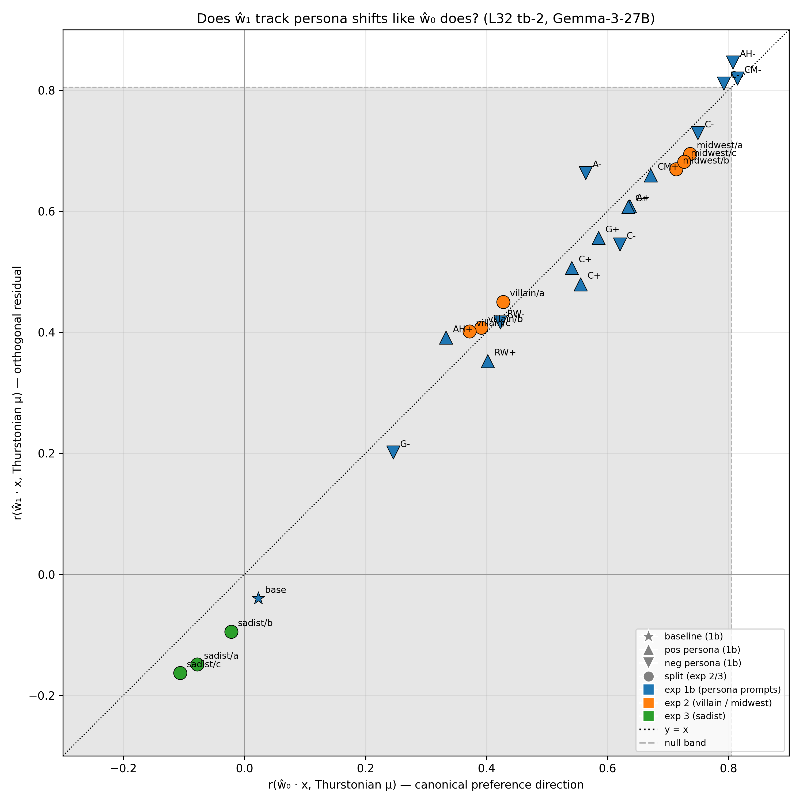
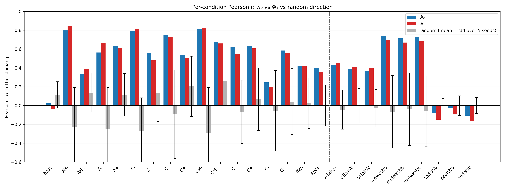

# Persona/Prompt Tracking by iter-0 and iter-1 Probes

## Headline

**ŵ_1 tracks persona- and system-prompt-induced preference shifts about as well as ŵ_0.** Across 26 conditions spanning exp 1b (OOD system prompts), mra_exp2 (villain, midwest), and mra_exp3 (sadist), the two probe directions give near-identical per-condition Pearson r values. Median r_w0 = 0.56, median r_w1 = 0.53. |r_w1| > |r_w0| in 12 of 26 conditions. The parent experiment's rank-1 finding for **cross-topic generalization** does **not** translate to a rank-1 claim for **cross-persona tracking** — ŵ_1 carries real preference-predictive signal that persona manipulations surface.

Essentially all 26 conditions sit on the y = x identity line.

## Why this is consistent with the parent experiment

The parent experiment measured HOO (held-one-out by topic) Pearson r, which tests how well a probe direction generalizes to *new topic distributions*. ŵ_1 collapsed there because after removing ŵ_0, the residual variance was mostly topic-specific. 

This follow-up measures a different thing: do the two directions track *persona-induced shifts on the existing topic distribution*? Yes, both do. The persona conditions don't take the model into a new topic distribution — they re-measure the same task mixture under different system prompts. Whatever "evaluative" variance the probe picked up is in the span(ŵ_0, ŵ_1), not uniquely in ŵ_0. Ridge shrinkage biases ŵ_0 toward high-variance PCs; ŵ_1 captures the component of the signal that shrinkage attenuated, and that component tracks persona-induced shifts because it is real signal, not a topic confound.

Short version: **rank-1 for cross-topic generalization, rank-≥2 for in-distribution preference prediction across persona manipulations.**

## Setup

- **Probes**: iter-0 and iter-1 directions retrained on `turn_boundary:-2` activations via the parent's `iterate_probe_projection.py` (K=3). Sanity gate passed: cos(ŵ_0, canonical tb-2 L32 probe in std space) = **+0.9796**, final_r = 0.874 (manifest says 0.857).
- **Scoring**: standardize condition activations with the fixed iter-0 scaler, dot-product with ŵ_k in standardized space. Pearson r against each condition's Thurstonian μ.
- **Baseline halves null**: split the exp 1b baseline (n=48) into two random halves, repeat for 5 seeds, compute r_w0 / r_w1 per half. This is the *no-persona-manipulation* null.
- **Random-direction null**: 5 unit vectors from N(0, I_5376) per condition.
- Layer 32 only. Gemma-3-27B-IT.

## Per-condition Pearson r

| Experiment | Conditions | n per cond | r_w0 range | r_w1 range |
|---|---|---|---|---|
| 1b (baseline + 16 OOD personas) | 17 | 48 | -0.04 (base) to +0.82 | -0.04 (base) to +0.85 |
| 2 (villain × 3 splits + midwest × 3 splits) | 6 | 500 or 1000 | +0.37 to +0.74 | +0.40 to +0.70 |
| 3 (sadist × 3 splits) | 3 | 500 or 1000 | -0.11 to -0.02 | -0.16 to -0.10 |

**Sadist** shows the expected sign flip: the canonical probe anti-correlates with sadist-condition preferences (sadist prefers harmful/cruel tasks that the baseline probe identifies as low-value). Both ŵ_0 and ŵ_1 register this flip. ŵ_1 is consistently more negative than ŵ_0 for sadist — the residual direction is, if anything, *more* sensitive to this inversion.

## No-persona null

Splitting the exp 1b baseline (no system prompt) into random halves gives r_w0 and r_w1 centered near 0 (medians ≈ +0.02 and −0.02 respectively) with spread ±0.2 for n=24. The persona-condition r values of 0.4–0.8 are clearly above this floor. For exp 2/3 (n ≥ 500), the effective null is much tighter (|r_random| std ≈ 0.1–0.2).

## Train-overlap audit

- Exp 1b: 0/48 tasks overlap with the 10k probe train set (OOD by design).
- Exp 2/3: ≈ 50% overlap per split (≈ 500 of 1000, 249 of 500). Activations are still condition-specific (extracted under the villain/midwest/sadist system prompt), and Thurstonian μ values are re-measured per condition, so scoring is not circular — but r values on exp 2/3 include partial in-distribution tasks. Exp 1b results are the cleaner OOD test and show the same r_w0 ≈ r_w1 pattern.

## Caveats

- **Small n on exp 1b** (48 tasks per condition) makes per-condition r values noisy. The identity-line pattern across 17 exp 1b points is robust because all 17 line up, not because any individual is precise.
- **Random-null band on the scatter is large** because it uses the max `r_random_p95_abs` across conditions, dominated by small-n exp 1b conditions. Within exp 2/3, the effective null is much tighter than the plotted grey region suggests.
- **ŵ_0 ≠ ŵ_0 canonical exactly** (cos = 0.98, not 1.0). Not enough drift to explain the identity-line pattern — ŵ_0 and ŵ_1 are in the same ballpark relative to *each other* regardless of the small canonical mismatch.

## Implications

- The rank-1 claim from the parent experiment is specific to cross-topic generalization. It is the right operationalization for "is there ONE axis that generalizes across topic distributions"; the answer was yes.
- For **downstream steering**, the implication is that single-direction steering using ŵ_0 may be sub-optimal — ŵ_1 also tracks preference shifts, so steering in span(ŵ_0, ŵ_1) could be more effective. Worth testing.
- The "canonical probe = the preference direction" framing is a useful approximation but not strictly true. A more accurate statement: the canonical probe is the best *rank-1* predictor with the best cross-topic generalization, but preference signal lives in (at least) a rank-2 subspace.

## Reproducibility

- Probe training: `scripts/probe_direction_uniqueness/iterate_probe_projection.py` with `--activations-path activations/gemma_3_27b_turn_boundary_sweep/activations_turn_boundary:-2.npz --canonical-probe results/probes/heldout_eval_gemma3_tb-2/probes/probe_ridge_L32.npy` and the parent's other defaults.
- Scoring: `scripts/probe_direction_uniqueness/persona_prompt_tracking.py` (no args needed — paths default to expected locations).
- Plots: `scripts/probe_direction_uniqueness/plot_persona_prompt_tracking.py`.
- Outputs: `persona_prompt_tracking/output/L32_tb-2/{trajectory.json, directions.npz, scaler.npz}` (probes) and `persona_prompt_tracking/results.json` (scoring).
