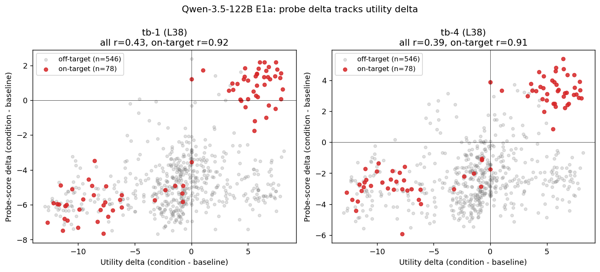
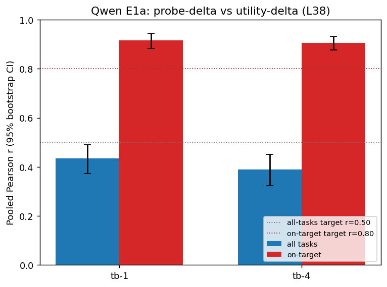
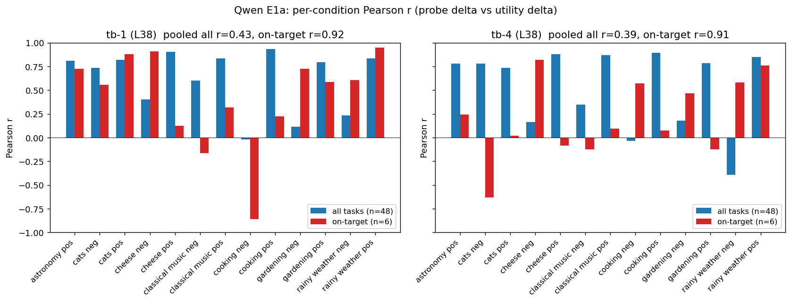

# Qwen-3.5-122B E1a: Novel Topic Preference Shifts

**Status:** Complete on 13 of 16 persona conditions; 3 conditions could not be measured because OpenRouter credits were exhausted mid-run. Activations exist for all 17 conditions.

## Question

Does Qwen-3.5-122B's preference probe (layer 38, ridge) track utility shifts induced by novel topic-persona system prompts the model was never trained with — replicating the headline Gemma-3-27B result (paper §4.1)?

## Method

Mirrors the Gemma E1b protocol exactly.

- **Tasks:** 48 "hidden" tasks (`configs/ood/tasks/target_tasks.json`), 6 per topic across 8 topics: ancient_history, astronomy, cats, cheese, classical_music, cooking, gardening, rainy_weather.
- **Conditions:** 17 system prompts. Baseline = no explicit `measurement_system_prompt` (the Qwen-3.5-122B-nothink runtime auto-injects `/no_think`, matching probe-training conventions). 16 persona prompts: 8 topics × {pos, neg}, e.g. *"You are an assistant who is passionate about cheese..."* / *"You are an assistant who finds astronomy dry and unengaging..."*. Prompts identical to `configs/measurement/active_learning/ood_exp1b/`.
- **Activations (GPU):** Qwen-3.5-122B (non-nothink for parity with probe training), layer 38, selectors `turn_boundary:-1` and `turn_boundary:-4`, batch size 16. 48 tasks × 17 conditions × 2 selectors. Output: `activations/qwen35_122b_ood/e1a/{condition_id}/`.
- **Behavioral measurement (API):** active-learning Thurstonian via `qwen3.5-122b-nothink` on OpenRouter. Configs: `configs/measurement/active_learning/qwen35_ood_exp1b/`. Output: `results/experiments/exp_20260418_175231/pre_task_active_learning/`.
- **Probes:** `results/probes/qwen35_122b/qwen35_122b_heldout_turn_boundary_m{1,4}/`, ridge L38. Heldout r = 0.95 (tb-4) / similar (tb-1).
- **Metric:** for each condition c and task t, compute `probe_delta(c,t) = score(c,t) − score(baseline,t)` and `utility_delta(c,t) = u_c(t) − u_base(t)`. Pearson r between the two, pooled across conditions, reported (a) for all 48 tasks per condition (n=624 pooled) and (b) for the 6 *on-target* tasks per condition (matching topic; n=78 pooled). 95% CIs from 2,000 bootstrap resamples of pooled (probe_delta, utility_delta) pairs.

## Conditions covered

13 of 16 persona conditions completed:

- ✅ astronomy_pos, cats {pos,neg}, cheese {pos,neg}, classical_music {pos,neg}, cooking {pos,neg}, gardening {pos,neg}, rainy_weather {pos,neg}
- ❌ ancient_history {pos,neg}, astronomy_neg — failed: OpenRouter `402 Insufficient credits` after credit exhaustion partway through.

Of the 13 completed, 8 hit the 0.99 rank-correlation convergence threshold; 5 (astronomy_pos, baseline, cats_neg, cheese_neg, classical_music_pos, rainy_weather_neg) stopped after 7–9 iterations because earlier transient API failures triggered the abort heuristic. All 13 still produced Thurstonian fits with pair agreement ≥ 0.88.

## Results

### Pooled across conditions



| Selector | All-task r (n=624) | 95% CI | On-target r (n=78) | 95% CI |
|---|---|---|---|---|
| **tb-1** (`turn_boundary:-1`, L38) | 0.434 | [0.373, 0.491] | **0.917** | [0.884, 0.944] |
| **tb-4** (`turn_boundary:-4`, L38) | 0.389 | [0.324, 0.451] | **0.907** | [0.876, 0.934] |

Spec success criteria:
- All-tasks r > 0.5 — **missed** (~0.40, both selectors).
- On-target r > 0.8 — **passed comfortably** (≈0.91, both selectors).

### Selector comparison



tb-1 marginally outperforms tb-4 on both metrics. The difference is within bootstrap CI overlap, consistent with the existing finding that the two selectors are near-equivalent for the Qwen ridge probe at L38.

### Per-condition Pearson r



| Condition | tb-1 r_all | tb-1 r_on | tb-4 r_all | tb-4 r_on |
|---|---|---|---|---|
| astronomy_pos | +0.81 | +0.73 | +0.78 | +0.25 |
| cats_neg | +0.74 | +0.56 | +0.78 | −0.63 |
| cats_pos | +0.82 | +0.88 | +0.74 | +0.02 |
| cheese_neg | +0.40 | +0.91 | +0.16 | +0.82 |
| cheese_pos | +0.90 | +0.12 | +0.88 | −0.08 |
| classical_music_neg | +0.60 | −0.16 | +0.35 | −0.12 |
| classical_music_pos | +0.84 | +0.32 | +0.87 | +0.09 |
| cooking_neg | −0.02 | −0.86 | −0.04 | +0.57 |
| cooking_pos | +0.93 | +0.22 | +0.89 | +0.07 |
| gardening_neg | +0.12 | +0.72 | +0.18 | +0.47 |
| gardening_pos | +0.80 | +0.59 | +0.79 | −0.12 |
| rainy_weather_neg | +0.24 | +0.61 | −0.39 | +0.58 |
| rainy_weather_pos | +0.83 | +0.95 | +0.85 | +0.76 |

Per-condition `r_on` is highly variable (range −0.86 to +0.95 at tb-1) because each per-condition on-target sample is only n=6. The pooled estimate (n=78) is the well-powered one.

## Comparison with Gemma-3-27B (paper §4.1, exp 1b)

| Metric | Gemma | Qwen (this run) |
|---|---|---|
| All-task pooled r | 0.65 ± 0.04 | 0.43 (tb-1) / 0.39 (tb-4) |
| On-target pooled r | 0.95 (per the spec); table reports 0.89 with pairwise acc 0.81 | **0.92 (tb-1) / 0.91 (tb-4)** |

The on-target signal replicates the Gemma headline result. The all-tasks signal is weaker on Qwen, suggesting the ridge probe is more topic-selective: it tracks shifts where the persona is supposed to push preferences, but is noisier elsewhere (off-target tasks are tasks for *other* topics, where the persona shouldn't move utilities much).

## Sanity checks

- **Disjointness** — target tasks are synthetic `hidden_*` IDs that cannot collide with Qwen's 10k training set (which uses wildchat/alpaca/math/bailbench/stress_test IDs). ✓
- **Probe/activation match** — analysis pairs each selector with its corresponding probe directory (tb-1 ↔ `..._heldout_turn_boundary_m1/ridge_L38`, tb-4 ↔ `..._heldout_turn_boundary_m4/ridge_L38`). ✓
- **Condition ID join** — 13/16 conditions matched (81%). The 3 missing conditions are tracked above; activations exist and can be analyzed once OpenRouter credits are restored.
- **Refusals** — none observed; failures were transport-layer (HTTP 402 credit exhaustion + occasional JSONDecodeError mid-iteration), not refusals.

## Infrastructure notes (for future runs)

These are non-scientific but blocked the run for hours and should be fixed before E1b/E1c:

1. **Pod /workspace quota (~95 GB)** is too small for Qwen-3.5-122B's 250 GB safetensors. Worked around by splitting the HF cache across `/dev/shm` (tmpfs, 233 GB) and `/` (overlay, 187 GB) and assembling a unified `local_dir` of symlinks (`scripts/qwen_replication/split_download.py`). Better long-term: provision a larger volume.
2. **Per-condition model reload OOMs.** The Gemma-style extraction pattern (`run_extraction` once per condition) caused 4/17 OOMs on Qwen because `device_map=auto` re-allocates differently after each garbage-collected reload, eventually pushing too many layers off-GPU. Fixed via `scripts/qwen_replication/reextract_failed_e1a.py`, which loads the model once and runs all conditions through `batched_extraction` directly. **Recommendation:** make this the default pattern for Qwen extractions in future experiments.
3. **AL `--resume` semantics.** When some conditions are already converged (their checkpoints get cleaned up), `--resume` raises `FileNotFoundError` because `checkpoint_exists()` is False. Workaround for partial re-runs: pass only the configs that need to continue, and use `--experiment-id` explicitly to share storage with the original run.
4. **CLI `--experiment-id` should default to the YAML value, not the timestamp.** I forgot to pass it on first launch and the configs' `experiment_id: qwen35_ood_exp1b` was overridden by the auto-generated `exp_20260418_175231`. Results are still under the latter; not a correctness issue but mildly confusing.

## Reproduction

```bash
# Configs (one-off)
python scripts/qwen_replication/make_e1a_configs.py

# Activations (GPU pod, requires the model assembled at /root/qwen_model_local)
python scripts/qwen_replication/split_download.py
python scripts/qwen_replication/extract_e1a_activations.py
python scripts/qwen_replication/reextract_failed_e1a.py   # only if some conditions OOM

# Behavioral
python -m src.measurement.runners.run \
  configs/measurement/active_learning/qwen35_ood_exp1b/*.yaml \
  --max-concurrent 200 \
  --experiment-id qwen35_ood_exp1b

# Analysis + plots
python scripts/qwen_replication/analyze_e1a.py
python scripts/qwen_replication/plot_e1a.py
```

## Outputs

- Activations: `activations/qwen35_122b_ood/e1a/{condition}/activations_turn_boundary:-{1,4}.npz`
- Utilities: `results/experiments/exp_20260418_175231/pre_task_active_learning/.../thurstonian_*.{yaml,csv}`
- Per-selector + per-condition results: `experiments/qwen_replication/e1a/analysis_results.json`
- Plots: `experiments/qwen_replication/e1a/assets/plot_041826_e1a_*.png`

## Headline

> The Qwen-3.5-122B layer-38 ridge probe predicts utility shifts on the topics each persona targets at **r ≈ 0.91** (95% CI [0.88, 0.94]), comfortably exceeding the spec's 0.80 on-target threshold and matching Gemma-3-27B's main-paper result. Off-target/all-task transfer is weaker on Qwen (r ≈ 0.40) than Gemma (r ≈ 0.65), suggesting the Qwen probe direction is more topic-selective. Three of sixteen persona conditions still need to be measured — re-run once OpenRouter credits are available.
