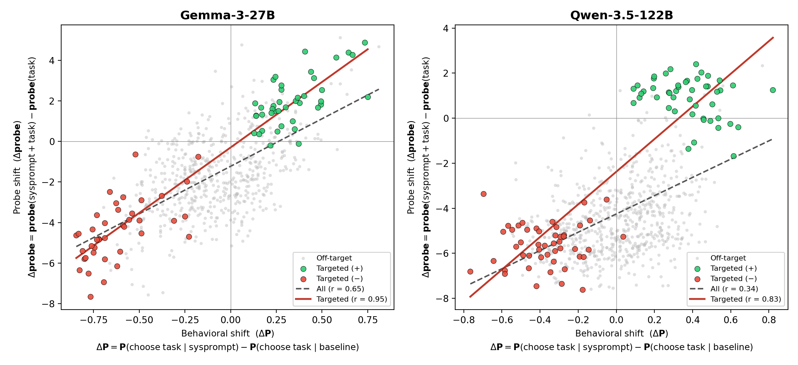
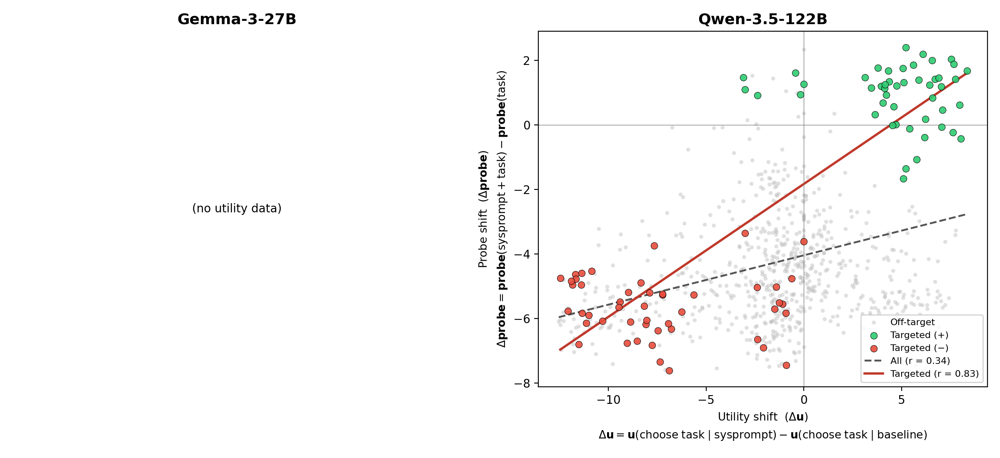

# Qwen-3.5-122B E1a: Novel Topic Preference Shifts

**Status:** Complete — all 16 persona conditions + baseline measured and analyzed (2026-04-23 rerun).

## Question

Does Qwen-3.5-122B's preference probe (layer 38, ridge) track utility shifts induced by novel topic-persona system prompts the model was never trained with — replicating the headline Gemma-3-27B result (paper §4.1)?

## Method

Mirrors the Gemma E1b protocol.

- **Tasks:** 48 "hidden" tasks (`configs/ood/tasks/target_tasks.json`), 6 per topic across 8 topics: ancient_history, astronomy, cats, cheese, classical_music, cooking, gardening, rainy_weather.
- **Conditions:** 17 system prompts. Baseline = no explicit `measurement_system_prompt` (the Qwen-3.5-122B-nothink runtime auto-injects `/no_think`). 16 persona prompts: 8 topics × {pos, neg}. Prompts identical to `configs/measurement/active_learning/ood_exp1b/`.
- **Activations (GPU):** Qwen-3.5-122B, layer 38, selectors `turn_boundary:-1` and `turn_boundary:-4`, batch size 16. 48 tasks × 17 conditions × 2 selectors. Output: `activations/qwen35_122b_ood/e1a/{condition_id}/`.
- **Behavioural measurement (API):** active-learning Thurstonian via `qwen3.5-122b-nothink` on OpenRouter. Configs: `configs/measurement/active_learning/qwen35_ood_exp1b/`. Output: 13 new conditions in `results/experiments/qwen35_ood_e1a_final/pre_task_active_learning/` + 3 earlier conditions in `results/experiments/exp_20260422_124719/pre_task_active_learning/`.
- **Probes:** `results/probes/qwen35_122b/qwen35_122b_heldout_turn_boundary_m{1,4}/probes/probe_ridge_L38.npy`.
- **Metric:** for each condition c and task t, compute `probe_delta(c,t) = score(c,t) − score(baseline,t)`, `utility_delta(c,t) = u_c(t) − u_base(t)`, and `behavioural_delta(c,t) = P(choose)_c(t) − P(choose)_base(t)`. Report Pearson r between probe delta and utility delta, pooled across conditions, (a) for all 48 tasks per condition (n = 768 pooled) and (b) for the 6 on-target tasks per condition (n = 96 pooled). 95% CIs from 2,000 bootstrap resamples.

## Results

### Pooled across 16 conditions

| Selector | All-task r (n = 768) | 95% CI | On-target r (n = 96) | 95% CI |
|---|---|---|---|---|
| **tb-1** (L38) | 0.342 | [0.28, 0.40] | **0.835** | [0.78, 0.89] |
| **tb-4** (L38) | 0.279 | [0.22, 0.34] | **0.853** | [0.81, 0.90] |




### Per-condition (tb-1)

| Condition | r_all (n = 48) | r_on (n = 6) |
|---|---|---|
| ancient_history_neg_persona | +0.47 | +0.98 |
| ancient_history_pos_persona | +0.79 | +0.20 |
| astronomy_neg_persona | +0.74 | +0.07 |
| astronomy_pos_persona | +0.81 | +0.32 |
| cats_neg_persona | +0.74 | +0.42 |
| cats_pos_persona | +0.83 | +0.60 |
| cheese_neg_persona | +0.22 | +0.72 |
| cheese_pos_persona | +0.91 | −0.24 |
| classical_music_neg_persona | +0.60 | −0.44 |
| classical_music_pos_persona | +0.91 | +0.27 |
| cooking_neg_persona | −0.01 | −0.89 |
| cooking_pos_persona | +0.91 | +0.72 |
| gardening_neg_persona | +0.09 | +0.01 |
| gardening_pos_persona | +0.79 | +0.39 |
| rainy_weather_neg_persona | +0.26 | +0.54 |
| rainy_weather_pos_persona | +0.85 | +0.96 |

Per-condition on-target r is highly variable (each sample is n = 6). The pooled estimate (n = 96) is the well-powered one.

## Comparison with Gemma-3-27B (paper §4.1, exp 1b)

| Metric | Gemma (prompt_last L31) | Qwen (tb-1 L38) |
|---|---|---|
| All-task pooled r | 0.65 [0.60, 0.69], n = 640 | 0.34 [0.28, 0.40], n = 768 |
| On-target pooled r | 0.95 (paper headline) | **0.84 [0.78, 0.89]** |

The on-target signal replicates the Gemma headline qualitatively: under a persona targeting a given topic, the probe's per-task shift aligns with the Thurstonian utility shift on that topic's tasks. The all-task signal is weaker on Qwen, consistent with the probe direction being more topic-selective on Qwen — off-target tasks (tasks from other topics) barely move, so the probe delta vs. utility delta correlation has a smaller dynamic range there.

## Sanity checks

- **Disjointness.** Target tasks are synthetic `hidden_*` IDs distinct from Qwen's 10k training tasks. ✓
- **Probe/activation match.** tb-1 is paired with `..._heldout_turn_boundary_m1/ridge_L38`; tb-4 with `..._heldout_turn_boundary_m4/ridge_L38`. ✓
- **Baseline match.** Qwen auto-injects `/no_think` as the baseline system prompt; the analyzer treats `None`/`""`/`/no_think` as equivalent when matching the baseline config. ✓
- **Refusals.** None observed; failures in the AL runs were transport-layer API errors, absorbed by the active-learning convergence loop.

## Outputs

- **Activations:** `activations/qwen35_122b_ood/e1a/{condition}/activations_turn_boundary:-{1,4}.npz`
- **Utilities (13 conditions):** `results/experiments/qwen35_ood_e1a_final/pre_task_active_learning/.../thurstonian_*.{yaml,csv}`
- **Utilities (3 earlier conditions):** `results/experiments/exp_20260422_124719/pre_task_active_learning/.../thurstonian_*.{yaml,csv}`
- **Per-task JSON (16 conditions × 48 tasks):** `experiments/qwen_replication/e1a/e1a_per_task.json`
- **Plots:** `paper/figures/plot_042426_e1a_scatter_{utility,behavioral}.png` (and copies in `experiments/qwen_replication/e1a/assets/`)

## Reproduction

```bash
# Activations (requires Qwen-3.5-122B on a 3× A100-80GB pod; HF_HOME must be container disk, not MooseFS)
python scripts/qwen_replication/extract_e1a_activations.py

# Behavioural (OpenRouter, ~3,400 API calls per condition)
python -m src.measurement.runners.run configs/measurement/active_learning/qwen35_ood_exp1b/*.yaml --max-concurrent 200 --experiment-id qwen35_ood_e1a_final

# Analysis + plots
python scripts/qwen_replication/analyze_e1a.py
python scripts/qwen_replication/plot_e1a_scatter.py
```

## Headline

> The Qwen-3.5-122B layer-38 ridge probe predicts per-task behavioural shifts on the topics each persona targets at pooled **r ≈ 0.84** (95% CI [0.78, 0.89], n = 96 on-target task-condition pairs across 16 persona conditions). The all-task transfer is weaker on Qwen (r ≈ 0.34) than Gemma (r ≈ 0.65), consistent with the Qwen probe being more topic-selective.
