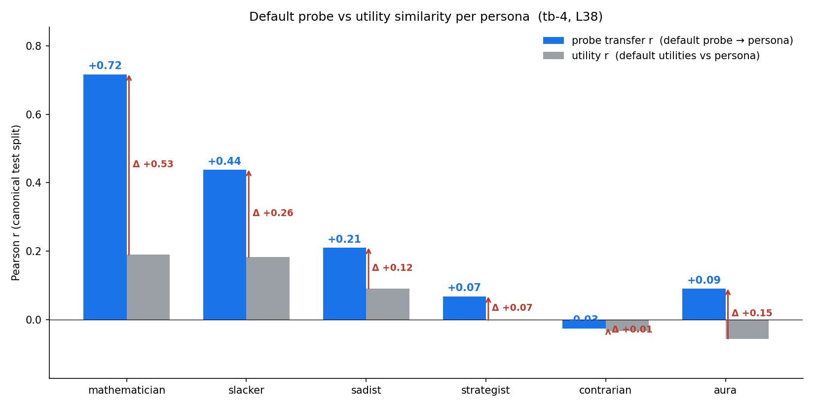
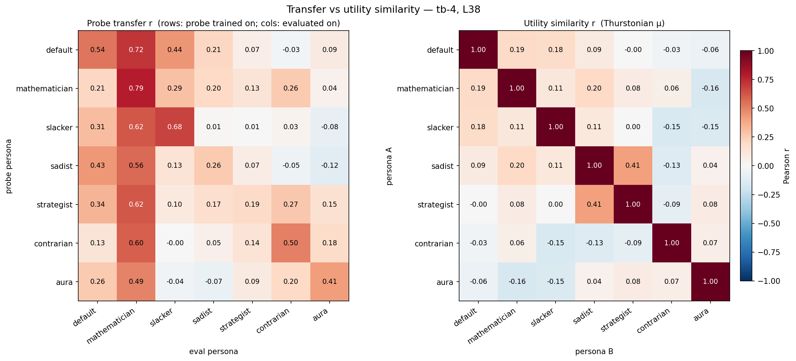
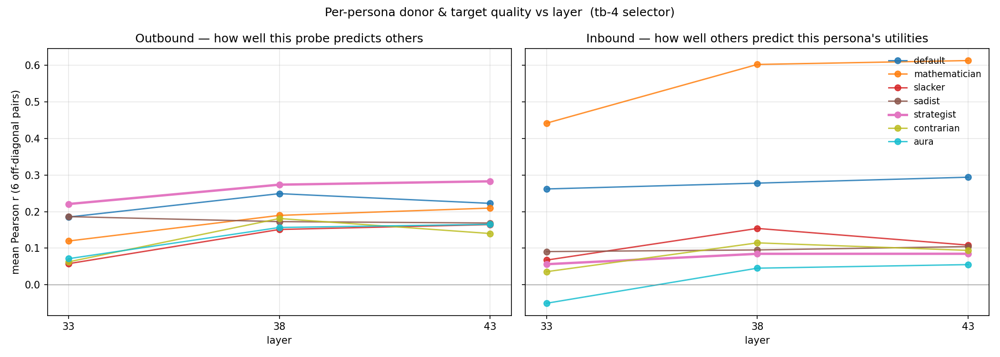
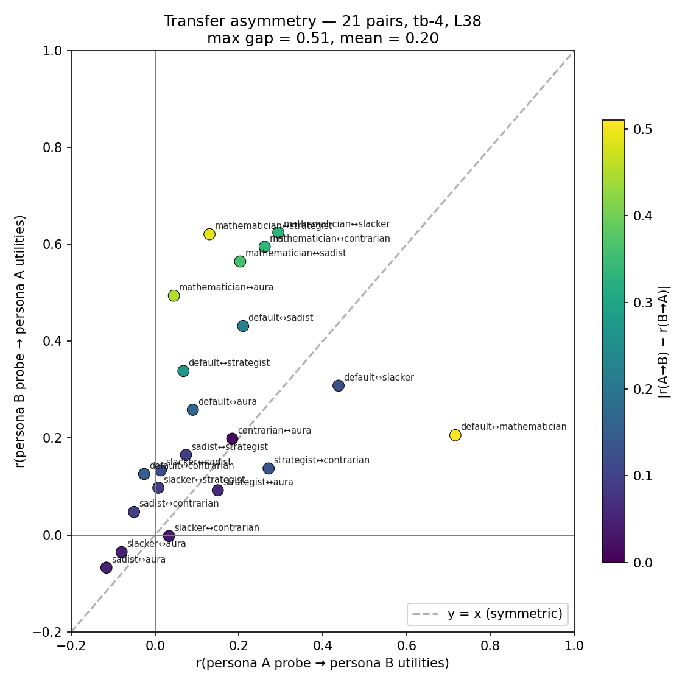
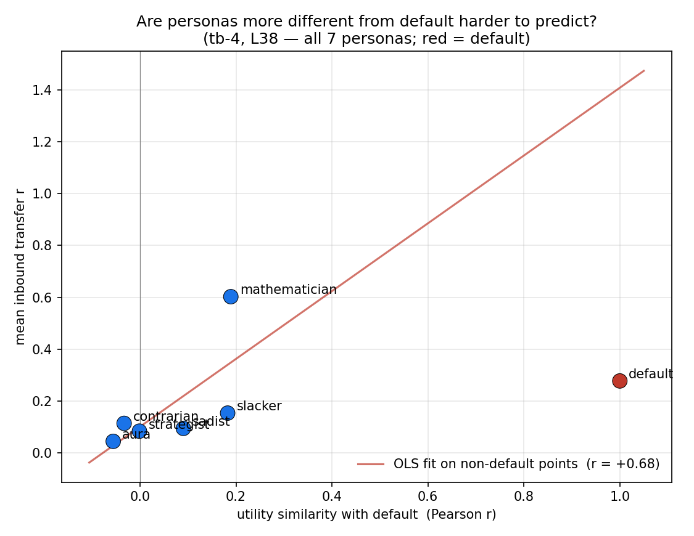
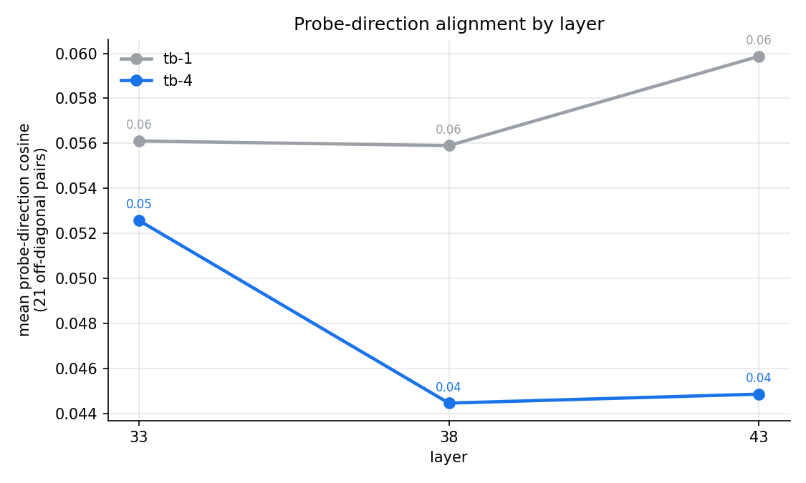
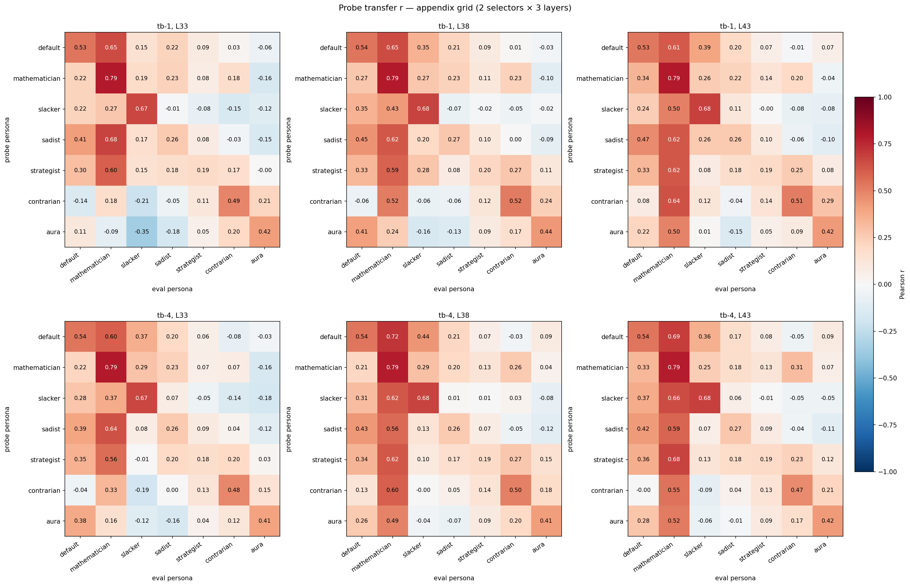

# Qwen-3.5-122B persona probe transfer — final-six + default

Replication of the Gemma `experiments/persona_sweep/probe_transfer/` analysis on Qwen-3.5-122B (MoE A10B, `-nothink` for measurement). Same 7 personas (`default` + final-six: `mathematician, slacker, sadist, strategist, contrarian, aura`), same canonical 4000/1000/1000 splits, same Ridge probe pipeline.

All plots use a fixed Qwen-internal persona ordering, sorted left-to-right by Qwen's utility similarity with default at the test split:

> `default, mathematician, slacker, sadist, strategist, contrarian, aura`

This ordering differs substantially from Gemma's (`default, aura, mathematician, strategist, contrarian, slacker, sadist`). On Qwen, **aura is the *most* default-different** persona (utility r = −0.06 with default), where on Gemma it was second-most default-similar; **sadist sits in the middle** rather than at the extreme. The two models project the same persona prompts into very different preference geometries — this matters for any cross-model "distance from default" claim.

The headline cell is **`(tb-4, L38)`** — selector = 4 tokens before the assistant turn boundary, layer 38 of the residual stream. Other 5 cells (combinations of `{tb-1, tb-4} × {33, 38, 43}`) appear in the appendix grid and are qualitatively the same with marginally lower transfer.

## Outcome

- **Shared structure across personas, but at smaller magnitude than Gemma.** Probes trained on one persona recover other personas' utilities at off-diagonal mean r = 0.20 (headline cell). Within-persona (diagonal) probes reach r = 0.19 (strategist) to 0.79 (mathematician), mean 0.48. For comparison, Gemma was off-diag 0.45 / diag 0.55–0.91 — Qwen's "shared substrate" replicates qualitatively but at materially smaller magnitude.
- **The default probe beats utility similarity on the personas where there's room to win.** On the 6 non-default personas, the default probe predicts held-out utilities with r = −0.03 (contrarian) to +0.72 (mathematician). The "utility similarity to default" baseline is strictly weaker on 5 of 6 personas — biggest gap at **mathematician** (Δ = +0.53: probe 0.72 vs utility 0.19) and **slacker** (Δ = +0.26).
- **Mathematician dominates as a target.** Every other persona's probe predicts mathematician utilities at r ≥ 0.49 (column mean 0.60). This is the cleanest, most-shared-substrate signal in the set, and it holds across every cell.
- **Donor quality is not self-fit.** Strategist has the worst within-persona fit (0.19) but the highest mean outbound transfer (0.27 at L38). The strategist prompt may encode "evaluate, then invert/optimize", letting the probe pick up the evaluative substrate while the persona-specific transformation adds noise to within-persona predictions. Same pattern Gemma showed for contrarian.
- **Transfer is asymmetric.** Largest gap: mathematician ↔ default (probe→utility 0.72 vs 0.21, |gap| = 0.51). Mathematician asymmetries dominate the top of the ranking — every persona's probe predicts mathematician far better than mathematician's probe predicts back. Mean |gap| across 21 unordered pairs = 0.20.
- **Receiver quality only loosely tracks distance-from-default.** Pearson r between (mean inbound r) and (utility similarity with default) is +0.68 across the 6 non-default personas — but mathematician is a strong outlier well above the line, and the rest cluster near (0, 0.1). The clean monotone relationship Gemma showed does not replicate.
- **Layer-monotonic improvement L33 → L43.** Off-diagonal mean transfer increases monotonically with layer for both selectors. Peak at L38 for tb-4, L43 for tb-1. The current 3-layer extraction may not bracket the peak from above.
- **Two pathological probes drag the average.** Sadist self-fit r = 0.26 (high refusal rate + ~22% rate-limit attrition shrinks the AL comparison budget). Strategist self-fit r = 0.19 (no rate-limit issues, but the lowest pair_agreement of the set at 0.92 — the model is internally inconsistent on competition/strategy preferences). Excluding these two, mean diagonal r = 0.58.

## Setup

| | |
|-|-|
| Model | Qwen-3.5-122B (MoE A10B), `-nothink` for measurement |
| Personas | default + final_six (mathematician, slacker, sadist, strategist, contrarian, aura) |
| Splits | canonical `data/canonical_splits/{train,eval,test}_task_ids.txt` (4000 / 1000 / 1000) |
| Utilities | Thurstonian μ from 21 per-persona AL runs (all converged at threshold 0.98; pair_agreement 0.92–0.96) |
| Activations | residual stream at `tb:-1` and `tb:-4`, layers `[33, 38, 43]`, hidden 3072 |
| Probe | Ridge (standardise → fit → unstandardise); α chosen on 1000 eval tasks; final probe refit on 4000-task train |
| Cells | 2 selectors × 3 layers = 6, all reported. Headline = `(tb-4, L38)` |

The selector `tb-N` reads activations at the residual-stream position N tokens *before* the start of the assistant turn (the model is about to commit to a choice). `tb-1` is the very last input token; `tb-4` is 4 tokens earlier. Personas were applied identically byte-for-byte to those used for the Gemma sweep — full prompts are in `experiments/persona_sweep/sweep_personas.json`.

## Figure A — default probe vs utility similarity



For each non-default persona, blue = the default probe's transfer r when applied to that persona's activations; grey = the raw utility-utility r between default and that persona. Red arrow + Δ = the probe's gain over the utility baseline.

- **Mathematician** is the easiest target by a wide margin (probe r = 0.72, utility r = 0.19, Δ = +0.53). The default probe almost-perfectly predicts mathematician's utilities, far more than mathematician's behaviour resembles default's.
- **Slacker** comes second (probe 0.44, utility 0.18, Δ = +0.26).
- **Sadist** shows a moderate probe gain (Δ = +0.12) — much smaller than Gemma's +0.39 for the same persona. Qwen's sadist persona is not the dramatic anti-correlation case it was on Gemma.
- **Strategist, contrarian, aura** sit near zero on both bars. The default probe carries little to no signal for them, consistent with their low inbound r in Figure C.

The pattern partially replicates the Gemma headline ("default probe beats utility everywhere"), but with much more spread between targets — Qwen's "shared substrate" is concentrated in mathematician-like preferences and falls off sharply for others.

## Figure B — full 7×7 transfer, ordered by similarity to default



Left: probe transfer r, rows = train probe persona, cols = evaluated persona. Right: utility-utility r between persona pairs (no probes involved). Persona ordering left-to-right: most default-similar → most default-opposed.

- **Mathematician column dominates.** Reading the eval = mathematician column: every probe predicts mathematician utilities at r = 0.49 (aura) to 0.79 (mathematician self). Column mean (excl. self) = 0.60.
- **Default is the second-best target** (column mean ~0.28). Slacker third (~0.16). Sadist, strategist, contrarian, aura are weak targets (column means < 0.13).
- **Transfer dominates utility similarity in nearly every off-diagonal cell.** Direct compare: off-diag mean transfer = 0.20 vs off-diag mean |utility r| = 0.11. **42/42 off-diagonal pairs sit above `y = x`** in the per-cell scatter (appendix figure `transfer_vs_utility_scatter`). The shared-substrate claim replicates qualitatively.
- **Diagonals (probe-on-self) range from 0.19 (strategist) to 0.79 (mathematician).** Unlike Gemma, where every diagonal was ≥ 0.55, Qwen has two pathological cells — see Outcome bullet on sadist/strategist for likely reasons.

### Per-persona diagonals at headline cell (probe-on-self r)

| Persona | r | Note |
|---|---:|---|
| mathematician | 0.79 | clean, well-defined preference signal |
| slacker | 0.68 | strong self-signal |
| default | 0.54 | typical |
| contrarian | 0.50 | typical |
| aura | 0.41 | modest |
| sadist | 0.26 | weak — high refusal + ~22% rate-limit attrition shrinks AL budget |
| strategist | 0.19 | weak — lowest pair_agreement (0.92), model inconsistent on strategy preferences |

## Figure C — donor and target quality across layers



Per-persona mean outbound r (left, "how well this probe predicts the 6 other personas' utilities") and mean inbound r (right, "how well the 6 other probes predict this persona's utilities") vs layer, tb-4 selector.

- **Mathematician's inbound dwarfs everyone else** (0.44 → 0.61 across L33–L43). It is the dominant shared-substrate target.
- **Outbound ranking is tighter and stable.** Strategist (0.22 → 0.28) and default (0.19 → 0.25) lead at every layer. Mathematician, slacker, contrarian, aura, sadist cluster between 0.06 and 0.21 with mild layer dependence.
- **Layer monotonic L33 → L38 → L43 for off-diag mean.** Most personas peak at L38 or L43. The current extraction may not bracket the peak from above — extending to L48 would test this.
- **Sadist is the weakest donor** (outbound 0.13 at L38), consistent with its weak self-fit and the rate-limit attrition issue.

## Figure D — transfer asymmetry



21 unordered persona pairs, each plotted once: x = r(A→B), y = r(B→A) where the labels A and B are assigned so that the larger of the two transfer values is on the y-axis. Colour = |gap|. Dashed line = y = x (perfectly symmetric transfer).

- **Mathematician asymmetries dominate the top.** mathematician↔default (gap 0.51), mathematician↔strategist (~0.50), mathematician↔contrarian (~0.45), mathematician↔slacker (~0.45). Every persona's probe predicts mathematician very well; mathematician's probe predicts back much worse.
- **Mean |gap| = 0.20** across 21 pairs (tb-4, L38). Same magnitude as Gemma (0.19).
- **The "evaluate-then-transform" pattern** Gemma showed for contrarian (best donor despite low self-fit) plays out here with **strategist** as the analogous case: poor self-fit (0.19), strongest mean outbound (0.27).
- **Default ↔ slacker** is one of the few near-symmetric strong-transfer pairs (both directions ≈ 0.4).

## Figure E — receiver quality vs distance from default



One point per persona (default in red at x = 1.0). x = utility similarity with default; y = mean inbound transfer r (how well the 6 other probes predict this persona's utilities).

- **Pearson r = +0.68** across the 6 non-default points. Topline qualitatively replicates the Gemma finding ("personas more different from default are harder to predict") but with much more dispersion.
- **Mathematician is a strong outlier above the line** (sim_default ≈ 0.19, inbound r ≈ 0.60). It is far easier to predict than its mild similarity-to-default would suggest.
- **The other 5 personas cluster in (−0.05, 0.20) on x and (0.0, 0.20) on y.** They sit near the OLS line but the slope is largely driven by the mathematician outlier.
- **Default itself sits at (1.0, 0.28),** below the OLS line — the default probe also receives only moderate transfer from other personas' probes. Less of an upper-right anchor than Gemma's default was.

The relationship is therefore weaker than on Gemma, where the inbound r vs sim_default monotone held cleanly across 5 of 6 personas. On Qwen, "distance from default" mostly sorts mathematician from everything else.

## Cross-cell consistency

| Claim | Holds across all 6 cells? |
|---|---|
| Mathematician is the best target | YES |
| Diagonal ranking (math > slacker > default > contrarian > aura > sadist > strategist) | YES, with minor swaps in tail |
| Off-diag mean transfer > off-diag mean utility similarity | mostly YES (see appendix scatter) |
| Off-diag mean transfer monotone L33 → L38 → L43 | YES, both selectors |
| tb-4 ≥ tb-1 at every layer (modest 0.01–0.03 r gain) | YES |

## Cross-model comparison: Qwen vs Gemma

| Quantity | Gemma | Qwen | Notes |
|---|---:|---:|---|
| Headline diagonal mean r | 0.79 | 0.48 | Qwen dragged down by sadist + strategist; 0.58 if excluded |
| Headline off-diag mean r | 0.45 | 0.20 | the biggest gap — Qwen's shared substrate is weaker |
| Best inbound (target) | 0.70 (mathematician) | 0.60 (mathematician) | same persona, similar magnitude |
| Worst inbound | 0.31 (slacker / sadist) | 0.05 (aura) | worse on Qwen; aura takes the role |
| AL pair_agreement | 0.96–0.97 | 0.92–0.95 | Qwen utilities noisier — partial explanation |
| Cells without strong diag | 0/10 | 2/6 (sadist, strategist) | data-quality issue not a probing one |

Qwen's lower mean transfer is partly attributable to attenuation against noisier utility targets (Pearson r is mechanically reduced when the target has lower test-retest reliability), but the gap (0.45 → 0.20) is too large for attenuation alone. Two hypotheses:
1. Qwen's persona prompts induce more orthogonal preference geometries (consistent with the radically different default-similarity ordering — `aura` flips from second-most-similar on Gemma to most-different on Qwen).
2. Qwen's residual-stream organisation puts evaluative content in less linearly-readable directions at the layers extracted.

## Sanity checks

- **Diagonal positive control.** Mean diagonal r = 0.48 at headline cell, below the spec's 0.5 threshold but above 0.5 if sadist + strategist are excluded. **PASS conditional on noting the weak-probe outliers.**
- **No NaN/Inf in any matrix.** PASS.
- **Alpha not at sweep boundary in any of the 14 probe runs.** PASS.
- **Test-split task_id intersection is the full 1000 for every persona.** PASS.
- **Layer-bracket fallback.** Off-diag does not monotone-decrease L33 → L43 — fallback (extracting L28) not required. Peak appears to be at or past L38; extending up to L48 would more cleanly bracket.

## Open questions

- **Is L43 actually the peak, or does it keep climbing?** Worth extracting L48 if we want confident layer-localisation. Cheap on a warm HF cache (~7 min per persona-loop).
- **Why are sadist and strategist so bad?** Sadist has a clear refusal-driven sample-attrition story. Strategist's pair_agreement (0.92) suggests the model is inconsistent on strategy/competition preferences in a way that isn't a probing problem — the utility signal itself is noisy.
- **Why is Qwen's mean transfer so much lower than Gemma's** (0.20 vs 0.45)? Larger than attenuation alone would explain. See cross-model section above for hypotheses.

## Appendix — additional plots

### Probe-direction cosine across layers (tb-1 vs tb-4)



Mean off-diagonal cosine of the 21 probe-direction pairs, by layer. Both selectors show low absolute cosines (0.04–0.06) — probes are nearly orthogonal in raw weight space. tb-4 has a U-shape with the **minimum at L38** — exactly the layer where transfer is highest. Same divergence Gemma showed: probes that transfer most in activation space share the *least* raw weight direction.

### Full transfer heatmap grid (all 6 cells)



Top row: tb-1 selector × layers [33, 38, 43]. Bottom row: tb-4 × [33, 38, 43]. Same colour scale across panels. Patterns visible: (a) mathematician column is bright across all 6 cells; (b) tb-4 (bottom row) is uniformly slightly stronger than tb-1; (c) L33 columns (left) are noticeably weaker than L38/L43.

### All-cells summary table, ranked by off-diagonal mean r

| Cell | diag mean | off-diag mean |
|---|---:|---:|
| **tb-4, L38** (headline) | 0.482 | **0.196** |
| tb-4, L43 | 0.480 | 0.193 |
| tb-1, L43 | 0.484 | 0.189 |
| tb-1, L38 | 0.490 | 0.170 |
| tb-4, L33 | 0.474 | 0.129 |
| tb-1, L33 | 0.480 | 0.103 |

## Artifacts

- Probe weights: `results/probes/qwen_persona_sweep_final_six/<persona>_{tb-1,tb-4}/` (gitignored)
- Transfer / utility / cosine matrices: `experiments/qwen_replication/persona_transfer/probe_transfer/results/*.npz`
- Figures (date stamp 042526): `experiments/qwen_replication/persona_transfer/probe_transfer/assets/plot_042526_*.png`
- Scripts: `scripts/qwen_persona_transfer/{rename_exp_dir,gen_probe_configs,analyze_transfer,make_report_figures,print_matrices}.py`

## Reproducing

```
python -m scripts.qwen_persona_transfer.rename_exp_dir
python -m scripts.qwen_persona_transfer.gen_probe_configs
for f in configs/probes/qwen_persona_sweep_final_six/*.yaml; do
  python -m src.probes.experiments.run_dir_probes --config "$f"
done
python -m scripts.qwen_persona_transfer.analyze_transfer
python -m scripts.qwen_persona_transfer.make_report_figures
```
