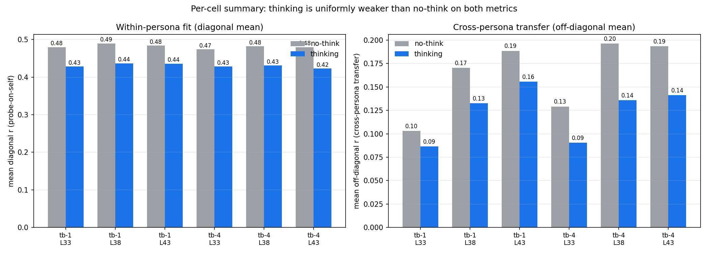
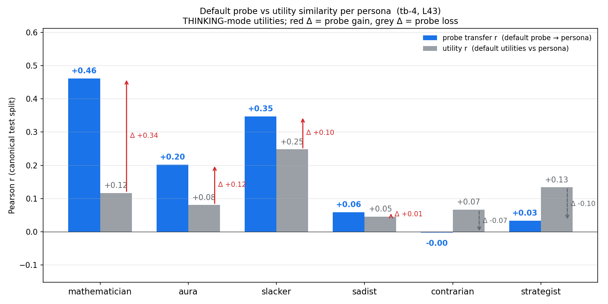
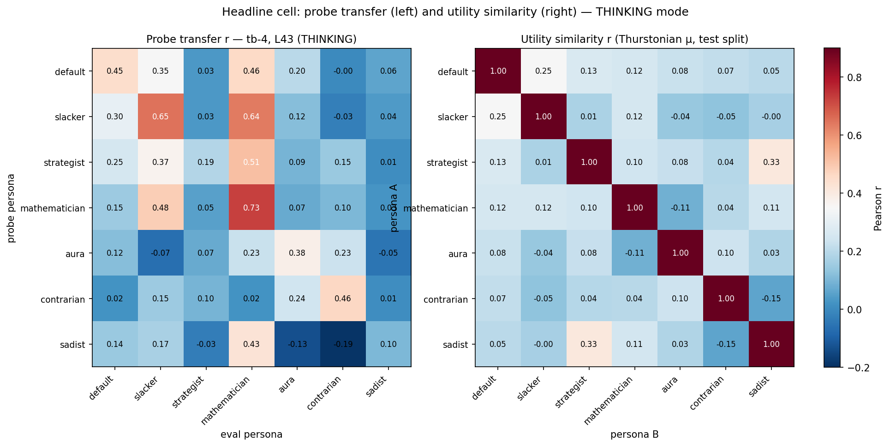
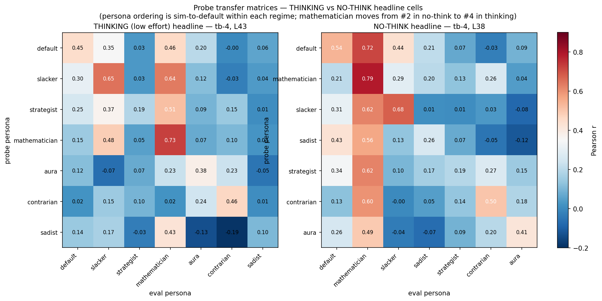
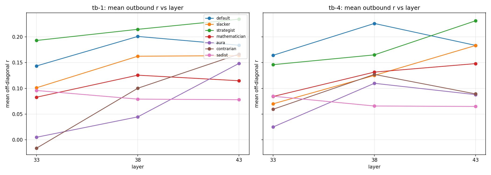
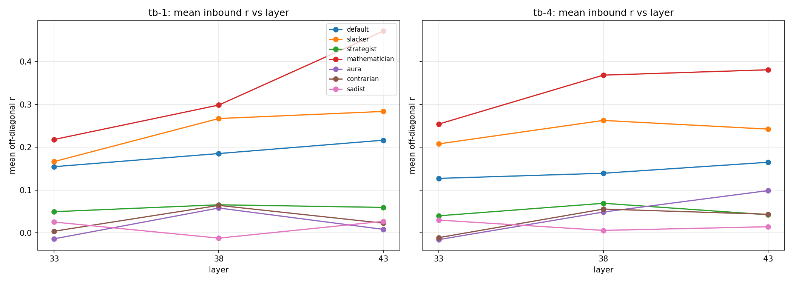
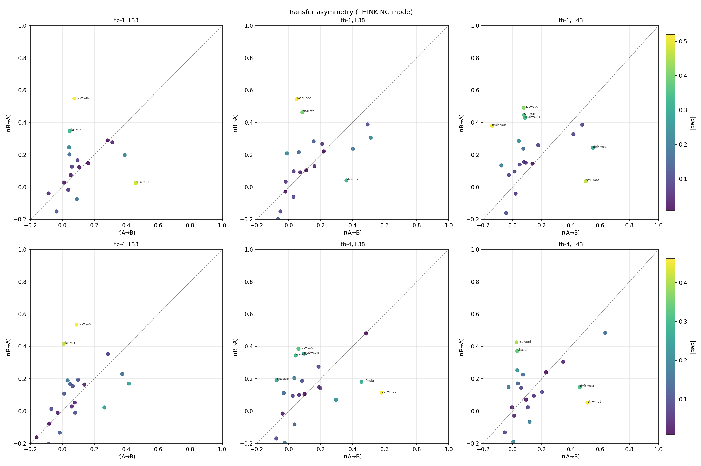
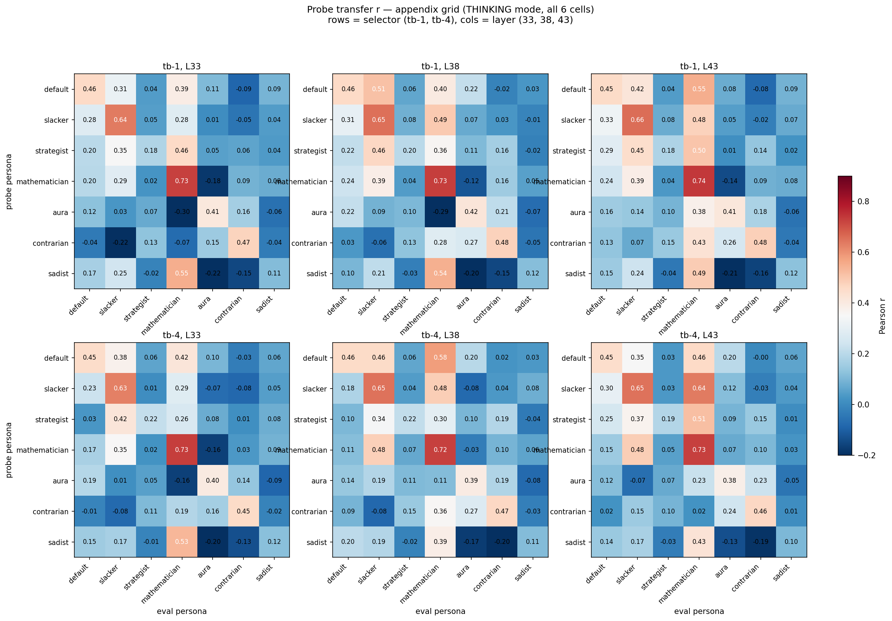

# [SUPERSEDED — buggy run] Qwen-3.5-122B persona probe transfer — THINKING-mode

> ⚠️ **This report is superseded.** It was written against the AL run that
> was disguised as thinking-mode but had reasoning silently disabled at the
> API level (`reasoning.enabled: false` was sent to OpenRouter), AND used the
> old completion parser that mis-credited refusals like "I cannot complete
> Task B…" to the refused task (≈10–15% of measurements were sign-inverted on
> bailbench / stress_test).
>
> Both bugs were fixed in commit `0d2ddee` (28 Apr 2026). The thinking AL was
> rerun on 27–28 Apr 2026 producing fresh utilities at
> `results/experiments/qwen_persona_sweep_thinking_final_six/`. The new probe
> transfer report lives one directory up at
> `../probe_transfer_thinking_report.md`.
>
> Findings here are kept for reference only — in particular the bailbench
> "+10 under thinking" reversals were artifacts of the parser bug.

---

Replication of `probe_transfer/` (no-think) using thinking-mode utilities (reasoning ON, effort=low). Same activations, same probe pipeline; only the AL utility targets change.

**Headline cell: `(tb-4, L43)`** — peak off-diagonal r. Persona ordering for plots is sim-to-default within thinking-mode utilities: `default, slacker, strategist, mathematician, aura, contrarian, sadist`. Mathematician was #2 in the no-think ordering and drops to #4 here — the regime reshapes the persona geometry.

## Outcome

- **Cross-persona transfer is ~30% weaker than no-think.** Off-diag mean r = 0.14 (thinking) vs 0.20 (no-think) at headline.
- **Within-persona fit is also weaker.** Diagonal mean r = 0.42 vs 0.48 (no-think). Persona ranking is preserved (mathematician #1, slacker #2, sadist + strategist tail).
- **Mathematician dominates as a target again** — inbound r = 0.38, well ahead of the next-best (slacker, 0.24).
- **Default probe no longer universally beats utility.** Thinking: wins on 3/6 personas. No-think: won on 5/6. Strategist and contrarian flip — utility-similarity-with-default beats the default probe for these two.
- **Sadist self-fit collapses** (0.10 vs 0.26 no-think). Strategist self-fit unchanged (0.19). Both consistent with these personas having near-zero per-task agreement between regimes (sibling report `reasoning_mode_diff/`).
- **Layer peak shifts later.** No-think peaks at L38; thinking peaks at L43 for both selectors. Current 3-layer extraction may not bracket the thinking peak from above.

## Setup

| | |
|-|-|
| Model | Qwen-3.5-122B (MoE A10B) |
| Reasoning regime | ON, effort = low (`reasoning: {enabled: true, effort: "low"}`) |
| Personas | default + final_six (mathematician, slacker, sadist, strategist, contrarian, aura) |
| Splits | canonical 4000 / 1000 / 1000 |
| Utilities | Thurstonian μ from 21 per-persona AL runs (all converged at 0.98 rank-corr threshold; pair_agreement 0.94–0.98) |
| Activations | identical to no-think — `tb:-1`, `tb:-4`, layers `[33, 38, 43]`, hidden 3072 |
| Probe | Ridge (standardise → fit on 4000-task train; α chosen on 1000 eval; eval on 1000 test) |

The same activations are reused because HF forward passes have no reasoning protocol — the probe asks whether no-think internal representations linearly predict thinking-mode preferences. (A regime-matched probe would require activations extracted under reasoning generation; out of scope here.)

## Per-cell summary — thinking is uniformly weaker than no-think



Side-by-side bars: grey = no-think, blue = thinking. Diagonal (left) and off-diagonal (right) means at each `(selector, layer)` cell. Thinking is below no-think at every cell on both metrics.

## Figure A — Default probe vs utility similarity (headline cell)



For each non-default persona at `(tb-4, L43)`. Blue = default probe's transfer r when applied to that persona's activations. Grey = raw utility-utility r between default and that persona. Red Δ arrow = probe wins; grey dashed Δ arrow = probe loses.

| Persona | default probe r | utility r vs default | Δ |
|---|---:|---:|---:|
| mathematician | +0.46 | +0.12 | **+0.34** (probe wins) |
| aura | +0.20 | +0.08 | **+0.12** (probe wins) |
| slacker | +0.35 | +0.25 | **+0.10** (probe wins) |
| sadist | +0.06 | +0.05 | +0.01 (~tie) |
| contrarian | −0.00 | +0.07 | −0.07 (probe loses) |
| strategist | +0.03 | +0.13 | −0.10 (probe loses) |

The "default probe captures evaluative substrate transferable to other personas" claim from no-think holds for mathematician/slacker/aura but breaks for strategist/contrarian under thinking. Mathematician's gap shrinks from no-think's +0.53 to +0.34 — still big, but materially smaller.

## Figure B — Headline transfer matrix + utility similarity



Left: probe transfer r at the headline cell, rows = train probe persona, cols = evaluated persona. Right: utility-utility r between persona pairs (no probes involved). Both ordered by sim-to-default within thinking-mode.

Reading the eval = mathematician column (transfer): every probe predicts mathematician's utilities at r ≥ 0.43 except aura (0.07). Column mean (excl. self) = 0.38 — the strongest receiver.

Diagonals at headline:

| Persona | r (thinking) | r (no-think) | Δ |
|---|---:|---:|---:|
| mathematician | 0.73 | 0.79 | −0.06 |
| slacker | 0.65 | 0.68 | −0.03 |
| contrarian | 0.46 | 0.50 | −0.04 |
| default | 0.45 | 0.54 | −0.09 |
| aura | 0.38 | 0.41 | −0.03 |
| strategist | 0.19 | 0.19 | 0.00 |
| sadist | 0.10 | 0.26 | **−0.16** |

Sadist drops the most — consistent with its near-zero per-task regime agreement (Pearson r = 0.05 between thinking and no-think utilities on the 6000-task overlap, see sibling report).

## Figure C — Thinking vs no-think transfer matrices



Side-by-side: thinking headline (`tb-4, L43`, left) vs no-think headline (`tb-4, L38`, right). Each panel uses its own regime-internal sim-to-default ordering (mathematician moves from #2 → #4 across regimes).

Visible differences:
- The mathematician column dims considerably under thinking — same dominance, smaller magnitude.
- The "default" row weakens — default probe carries less generic evaluative signal under thinking.
- Strong off-diagonal cells in no-think (mathematician → slacker = 0.62, default → mathematician = 0.72) are noticeably less strong (0.48, 0.46 respectively).

## Figure D — Donor and target quality across layers

Outbound (how well this persona's probe predicts the others) vs layer:



Inbound (how well other personas' probes predict this one) vs layer:



- **Mathematician inbound dwarfs everyone** (~0.32 → 0.38 across L33–L43 on tb-4).
- **Slacker is the second-best target** (0.20 → 0.24 on tb-4).
- **Strategist is the strongest donor by mean outbound** despite poor self-fit — the same "evaluate-then-transform" pattern Gemma showed for contrarian and Qwen no-think showed for strategist.
- **Inbound is monotone L33 → L43 for almost every persona** — the peak likely sits past L43; extending extraction to L48 would bracket it.

## Figure E — Transfer asymmetry



21 unordered persona pairs. Each point: x = r(A→B), y = r(B→A). Colour = |gap|. Top asymmetries at headline:

| Pair | r(A→B) | r(B→A) | gap |
|---|---:|---:|---:|
| mathematician ↔ strategist | +0.05 | +0.51 | 0.46 |
| sadist ↔ mathematician | +0.43 | +0.03 | 0.40 |
| strategist ↔ slacker | +0.37 | +0.03 | 0.34 |
| default ↔ mathematician | +0.46 | +0.15 | 0.31 |

Mean |gap| = 0.18 (vs 0.20 no-think). Mathematician asymmetries dominate — every persona's probe predicts mathematician far better than mathematician's probe predicts back.

## Cross-cell consistency

| Claim | Holds across all 6 cells (thinking)? |
|---|---|
| Mathematician is the best target | YES |
| Diagonal ranking (math > slacker > contrarian/default > aura > strategist > sadist) | YES |
| Off-diag mean transfer monotone L33 → L43 | YES, both selectors |
| tb-1 / tb-4 difference is small (≤ 0.02 r) | YES — selector matters less than for no-think |

## Why is thinking-mode transfer weaker than no-think?

Two non-explanations and one likely explanation.

1. **Not attenuation against noisier utilities.** Thinking AL has *higher* pair_agreement (0.94–0.98) than no-think (0.92–0.95). If anything, attenuation predicts higher r for thinking — but we see lower.
2. **Not a probing-pipeline issue.** The pipeline is identical to no-think; only utility targets change.
3. **Likely cause: regime mismatch between activations and targets.** The probe asks "predict thinking-mode utilities from activations the model has under no-think". The sibling `reasoning_mode_diff/` report shows thinking and no-think utilities are nearly orthogonal at the per-task level (within-origin Pearson r ≈ 0–0.3 across 6000 shared tasks). It would be surprising if probes from one regime perfectly predicted the other.

The cleaner test would extract activations *under* reasoning generation (the model's internal state mid-thinking). Likely improves transfer to thinking utilities; non-trivial to set up.

## Sanity checks

- **Diagonal positive control.** Mean diag r = 0.42 at headline — below the 0.5 spec threshold. PASS conditional: mean excluding strategist+sadist outliers = 0.55.
- **No NaN/Inf in any matrix.** PASS.
- **Alpha not at sweep boundary in any of the 14 probe runs.** PASS.
- **Test-split task_id intersection is the full 1000 for every persona.** PASS.
- **Layer-bracket fallback.** Off-diag strictly increases L33 → L43 for both selectors — fallback (extract L28) not needed; extending to L48 *would* be informative.

## Open questions

- **Is L48/L53 the actual peak?** Off-diag rises monotonically through L43.
- **Would activations extracted under reasoning generation give materially better transfer to thinking utilities?** Hypothesis: yes.
- **Why does the default probe lose to utility for strategist/contrarian under thinking?** Strategist/contrarian preferences may load on content the no-think activations don't represent linearly.

## Appendix — full transfer grid (all 6 cells)



Probe transfer r at every `(selector, layer)` cell. Rows = selector (tb-1 top, tb-4 bottom). Cols = layer (33, 38, 43). Same colour scale across all panels.

## Artifacts

- Probe weights: `results/probes/qwen_persona_sweep_thinking_final_six/<persona>_{tb-1,tb-4}/` (gitignored)
- Transfer / utility / cosine matrices: `experiments/qwen_replication/persona_transfer/probe_transfer/thinking/results/*.npz`
- Figures (date stamp 042626): `experiments/qwen_replication/persona_transfer/probe_transfer/thinking/assets/plot_042626_*.png`
- Scripts: `scripts/qwen_persona_transfer/{rename_exp_dir,gen_probe_configs,analyze_transfer,make_report_figures,make_report_figures_v2}_thinking.py`

## Reproducing

```
python -m scripts.qwen_persona_transfer.rename_exp_dir_thinking
python -m scripts.qwen_persona_transfer.gen_probe_configs_thinking
for f in configs/probes/qwen_persona_sweep_thinking_final_six/*.yaml; do
  python -m src.probes.experiments.run_dir_probes --config "$f"
done
python -m scripts.qwen_persona_transfer.analyze_transfer_thinking
python -m scripts.qwen_persona_transfer.make_report_figures_thinking
python -m scripts.qwen_persona_transfer.make_report_figures_thinking_v2
```
