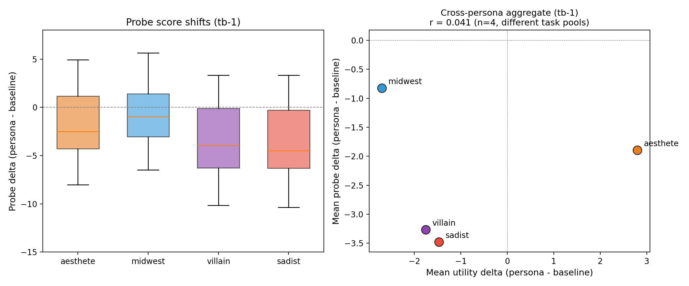
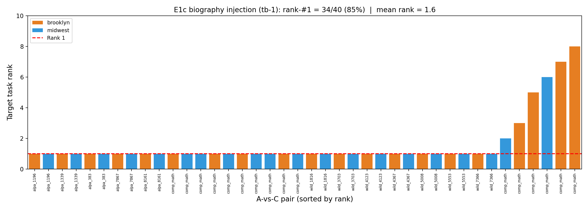
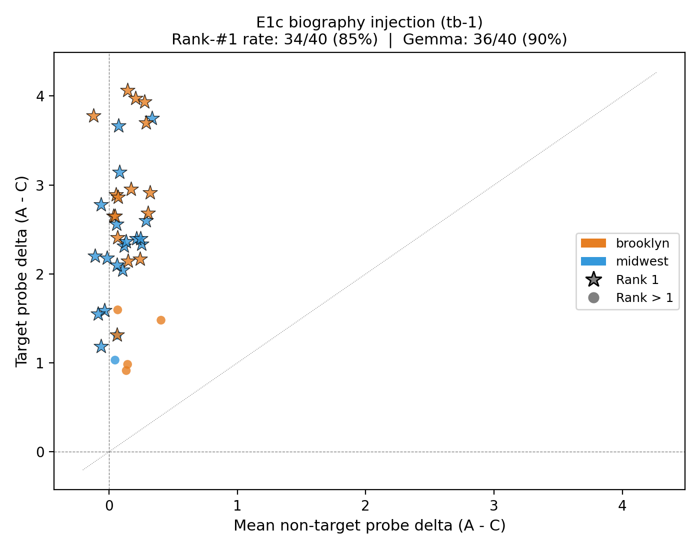
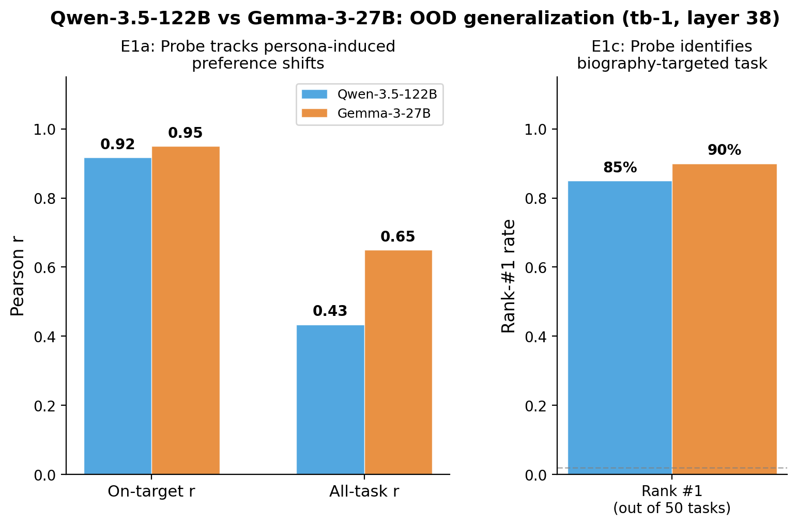

# Qwen-3.5-122B Replication -- E1 OOD Preference Shifts

**Model:** Qwen-3.5-122B-A10B (MoE, 122B total / 10B active), nothink variant
**Probe:** Ridge regression at layer 38. Two activation positions tested: "tb-1" (last token before the model's response) and "tb-4" (4 tokens earlier). The probe is a linear direction in activation space trained to predict how much the model prefers each task.
**Date:** 2026-04-23

## Summary

| Experiment | Metric | Qwen (tb-1) | Gemma-3-27B | Chance |
|---|---|---|---|---|
| **E1a** topic prompts | On-target r | **0.92** [0.88, 0.94] | 0.95 | 0 |
| **E1a** topic prompts | All-task r | 0.43 [0.37, 0.49] | 0.65 | 0 |
| **E1b** personas | Per-task r | N/A (data issue) | 0.70 | 0 |
| **E1c** biography | Rank-#1 rate | **34/40 (85%)** | 36/40 (90%) | 1/50 (2%) |
| **E1c** biography | Correct sign rate | 40/40 (100%) | N/A | 50% |

**Bottom line:** The probe trained on Qwen's default-persona preferences generalizes to novel contexts it never saw during training. E1a on-target replicates at r = 0.92 (Gemma: 0.95). E1c rank-#1 rate is 85% (Gemma: 90%), with 100% correct sign. E1b is blocked by a task-pool mismatch.

---

## E1a: Topic-Persona Prompts

**Result: r = 0.92 on targeted topics** (Gemma: 0.95). The probe tracks how persona system prompts shift preferences on the topics they target.

**What this tests.** We give the model a system prompt like *"You are passionate about cheese"* and measure two things: (1) how much the probe's internal score changes for cheese-related tasks vs. baseline, and (2) how much the model's actual revealed preferences change (measured via pairwise choices, fit to a Thurstonian utility model). If the probe captures evaluative representations, these two deltas should correlate.

**Setup.** 48 tasks across 8 topics (cheese, astronomy, cats, etc.), 13 persona conditions (8 topics x pos/neg, minus 3 that failed due to API credit exhaustion). "On-target" = the 6 tasks matching the persona's topic. "All-task" = all 48 tasks under each persona.

### Results


| Subset | r | 95% CI | n |
|---|---|---|---|
| On-target tasks | **0.917** | [0.88, 0.94] | 78 |
| All tasks | 0.434 | [0.37, 0.49] | 624 |

- **On-target r = 0.92 exceeds the spec threshold of 0.80.** Where the persona should move preferences (e.g., cheese tasks under the cheese persona), the probe accurately tracks the shift.
- **All-task r = 0.43 misses the spec threshold of 0.50.** The Qwen probe is more topic-selective than Gemma's: accurate on targeted topics, noisier on off-topic tasks where the persona has little effect.

---

## E1b: Persona Preference Shifts

**Result: blocked by data mismatch.** The activation extraction and behavioral measurement ran on different task pools (1 task overlap out of 50). Per-task correlation cannot be computed.

**What this tests.** Same logic as E1a but with 4 character personas (aesthete, villain, sadist, midwest) instead of topic-based prompts. Example: the aesthete persona emphasizes beauty, art, and sensory experience.

### What we can report

The probe detects persona effects on activations, though we cannot yet correlate them with behavioral shifts task-by-task.



| Persona | Mean probe shift | Description |
|---|---|---|
| aesthete | -1.89 | Moderate shift from default |
| midwest | -0.83 | Smallest shift |
| villain | -3.27 | Large negative shift |
| sadist | -3.48 | Largest negative shift |

The villain and sadist personas push probe scores most negative (furthest from the default preference direction), which is directionally expected. But without matched task-by-task behavioral data, these shifts cannot be validated against actual preference changes.

**Fix required:** Re-extract activations on the 50 wildchat tasks used in the behavioral measurement (~10 min GPU).

### Gemma comparison

| Metric | Gemma | Qwen |
|---|---|---|
| Aesthete/midwest per-task r | 0.70-0.73 | N/A (data issue) |
| Villain per-task r | 0.30 | N/A (data issue) |

---

## E1c: Single-Sentence Biography Injection

**Result: 34/40 (85%) rank-#1 rate** (Gemma: 36/40, chance: 2%). The probe identifies which of 50 tasks a biography targets from a single injected sentence.

**What this tests.** We construct 10-sentence biographies where 9 sentences are identical across versions. The 10th sentence is either pro-interest (version A: *"She spends weekends solving math puzzles"*), neutral (version B), or anti-interest (version C: *"She avoids anything involving numbers"*). We run the model under versions A and C, score all 50 tasks with the probe, and check: does the target task (the one matching the injected interest) show the largest probe-score increase from C to A? If so, it ranks #1.

### Results



| Metric | Qwen (tb-1) | Qwen (tb-4) | Gemma |
|---|---|---|---|
| Rank-#1 rate | **34/40 (85%)** | 29/40 (72%) | 36/40 (90%) |
| Correct sign rate | 40/40 (100%) | 40/40 (100%) | N/A |
| Mean target rank | 1.62 | 2.17 | N/A |



**All 6 misses are math tasks.** The probe assigns the correct sign (positive delta) in every case, but math tasks produce smaller deltas that get outranked by other tasks. This suggests math task representations are less separable via biography-based steering.

| Role | Target | Rank | Target delta | Mean non-target delta |
|---|---|---|---|---|
| midwest | competition_math_9097 | 2 | 1.31 | 0.07 |
| brooklyn | competition_math_1455 | 3 | 1.60 | 0.07 |
| brooklyn | competition_math_9097 | 5 | 0.98 | 0.15 |
| midwest | competition_math_10564 | 6 | 1.03 | 0.05 |
| brooklyn | competition_math_6244 | 7 | 1.48 | 0.41 |
| brooklyn | competition_math_10564 | 8 | 0.91 | 0.14 |

---

## Summary



### Replicates

- **E1a on-target (r = 0.92):** The probe tracks persona-induced preference shifts on targeted topics, matching Gemma's 0.95.
- **E1c rank-#1 (85%):** The probe identifies biography-targeted tasks in 34/40 pairs, close to Gemma's 36/40 (90%), with 100% correct sign. All misses are math tasks.

### Weaker than Gemma

- **E1a all-task (r = 0.43 vs 0.65):** The Qwen probe is more topic-selective -- accurate on targeted topics but noisier off-topic.
- **E1c tb-4 (72% vs tb-1's 85%):** The activation position 4 tokens before the response boundary captures less task-preference signal.

### Blocked

- **E1b:** Task-pool mismatch between activations and behavioral measurements. Requires re-extraction (~10 min GPU).

---

## Data paths

| Resource | Path |
|---|---|
| E1a analysis results | `experiments/qwen_replication/e1a/analysis_results.json` |
| E1a report | `experiments/qwen_replication/e1a/e1a_report.md` |
| E1b/E1c analysis results | `experiments/qwen_replication/e1_analysis_results.json` |
| E1b utilities | `results/experiments/exp_20260422_124721/` |
| E1b activations | `activations/qwen35_122b_ood/e1b/` |
| E1c pairwise results | `results/ood/qwen35_e1c/minimal_pairs_v8_mapping/pairwise.json` |
| E1c activations (fixed) | `activations/qwen35_122b_ood/e1c_fixed/e1c_fixed/` |
| E1c fixed results | `experiments/qwen_replication/e1c_fixed_results.json` |
| Analysis scripts | `scripts/qwen_replication/analyze_e1_full.py`, `scripts/qwen_replication/analyze_e1c_fixed.py` |
| Plots | `experiments/qwen_replication/assets/plot_042326_*.png` |

## Reproduction

```bash
python scripts/qwen_replication/analyze_e1_full.py
python scripts/qwen_replication/analyze_e1c_fixed.py
```
