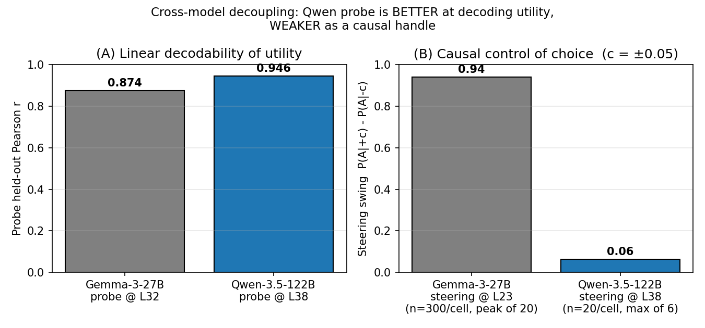
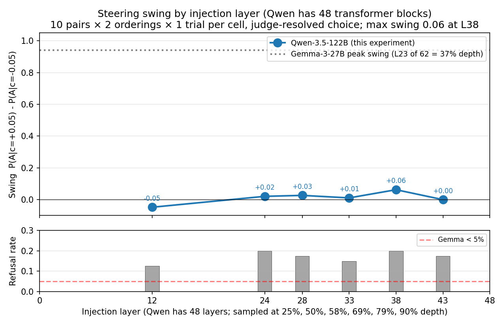
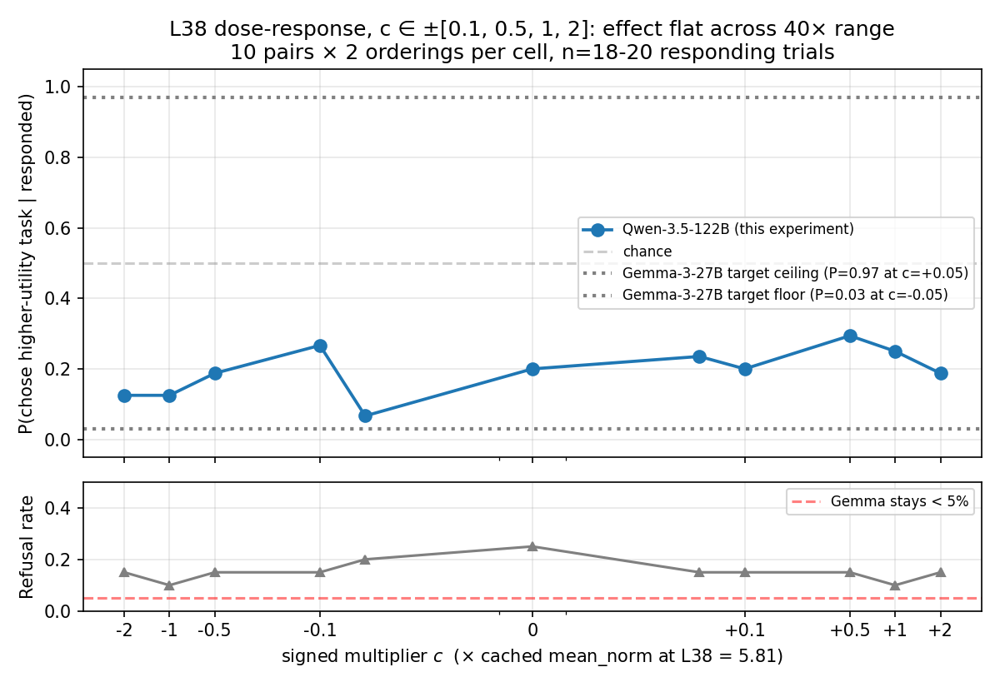

# Qwen-3.5-122B contrastive steering — pilot diagnostic

## TL;DR

- **The Qwen probe is *better* at decoding utility than the Gemma probe (heldout r 0.946 vs 0.874) but a *much weaker* causal handle.** Best swing across 6 sampled layers is 0.06 (Qwen, judge-resolved); Gemma's peak is 0.94 — a ~15× gap.
- **Effect direction is correct** (positive c shifts toward the higher-utility task) but **magnitude is small at every coefficient and every layer tested.** Sweeping c from ±0.1 to ±2.0 at L38 (40× range) leaves swing flat between 0.05 and 0.17. This rules out an under-calibrated coefficient as the explanation.
- **Refusal rate at c=0 is 15–35%** (vs Gemma's <5%), narrowing the responding subset that the swing is computed over.
- **Methodology is matched to Gemma's**: contrastive `spans: {first: 1, second: -1}`, ridge probe direction, position-selective hook, `max_new_tokens: 64`, canonical LLM-judge parsing. Regex prefix and judge agree on 100% of co-decided rows; judge resolves an extra 4–8 rows per run.
- **The pilot is n=10 pairs** — small enough that the headline gap could be noisier than it looks, but the gap is large enough to motivate a real run.

## Setup

- **Model:** Qwen-3.5-122B-A10B-nothink (48 transformer blocks, hybrid full/linear-attention, BF16 on 4× A100 80 GB).
- **Probe:** ridge `tb-1`, trained on 10k AL with held-out r reported per layer ([qwen35_probes report](../../training_probes/qwen35_probes/qwen35_probes_report.md)). 6 layers tested: L12, L24, L28, L33, L38, L43 (= 25%, 50%, 58%, 69%, 79%, 90% depth).
- **Pair set:** 10 pairs (and a 50-pair reservoir) sampled fresh from the disjoint subset of `canonical_test` with zero overlap with the 10k AL probe-train (verified by construction in `build_steering_pairs_50.py`).
- **Steering:** contrastive — `+c × probe_direction` added to task A's tokens, `-c × probe_direction` to task B's, during prefill only. `c × cached_mean_norm[L]`. Hook stays installed during generation but `position_selective_steering` is no-op at gen-time (only fires on resid.shape[1] > 1).
- **Choice parsing:** regex prefix extraction → `judge_completion_full_async` LLM judge (`completion_judge.py`, `gemini-3-flash-preview`). Reports below use the judge's `task_completed`; refusal = anything not in {a, b}.
- **Generation:** `max_new_tokens: 64`, temperature 1.0, seed 42.
- **Each cell:** 10 pairs × 2 orderings (= 20 trials), `n_trials: 1` per (pair, ordering).
- **Cost:** ~$30–40 across two pods (paused). Full Phase A on 4× A100 estimated ~$300–500.

## Results

### 1. No layer in {L12, L24, L28, L33, L38, L43} steers like Gemma at L23

| Layer | depth | swing (judge) | refusal at c=±0.05 |
|---|---|---|---|
| L12 | 25% | -0.05 | 0.12 |
| L24 | 50% | +0.02 | 0.20 |
| L28 | 58% | +0.03 | 0.17 |
| L33 | 69% | +0.01 | 0.15 |
| L38 | 79% | **+0.06** | 0.20 |
| L43 | 90% | +0.00 | 0.17 |

L38 (the probe peak) is the noisy maximum. Gemma's peak (L23 of 62, 37% depth) hits 0.94. **No Qwen layer is in the same ballpark.** Refusal rate sits at 12–20% across all six — 3–4× Gemma's typical operating point.

### 2. Effect is flat across a 40× coefficient sweep at L38

| c | P(A) | refusal | n responded |
|---|---|---|---|
| -2.0 | 0.12 | 0.15 | 16/20 |
| -1.0 | 0.12 | 0.10 | 16/20 |
| -0.5 | 0.19 | 0.15 | 16/20 |
| -0.1 | 0.27 | 0.15 | 15/20 |
| 0.0 | 0.20 | 0.25 | 15/20 |
| +0.1 | 0.20 | 0.15 | 15/20 |
| +0.5 | 0.29 | 0.15 | 17/20 |
| +1.0 | 0.25 | 0.10 | 16/20 |
| +2.0 | 0.19 | 0.15 | 16/20 |

Swing in the |c| ≤ 2 range stays in 0.05–0.17 with no monotone trend. **An under-calibrated `mean_norm` would predict steering "switching on" once c is large enough; we don't see that.**

### 3. Methodology checks pass

| Check | Result |
|---|---|
| Steering direction (sign) | Correct: positive c → higher P(A) on average |
| Regex prefix vs LLM judge | 100% agreement on co-decided rows; judge picks up an extra 4/60 (v2), 4/180 (v3), 8/240 (lite) regex-refusal rows |
| Probe orientation | +direction = "higher utility" by construction; sign is consistent across pairs |
| Pair-set leakage | 0% with 10k AL (verified) |
| Hook applied without crash | All 480 trials completed; no NaN, no degenerate outputs |

## Diagnostic interpretation

The pilot is consistent with one of:

1. **The Qwen preference direction is genuinely a weaker causal handle than Gemma's.** Linear decodability and causal efficacy are known to decouple within Gemma (probe peak L29 vs steering peak L23). It would not be surprising for that decoupling to be sharper or differently-located on Qwen — and reporting it would itself be a cross-model finding.
2. **The hook attaches at a residual point that's offset from the probe-extraction point on Qwen3.5's hybrid block layout.** Linear-attention and full-attention blocks may register hooks against subtly different residual streams. Verifiable by instrumenting `prefill_with_hooks` on Qwen3.5 and tracing residual values pre/post hook.
3. **The 10-pair sample under-counts the effect.** With high pair-by-pair variance and 15–35% refusal, n=10 leaves wide error bars. A 25-pair reduced run (~$25-50) would tighten this substantially without committing to the full Phase A budget.

The `SteeredHFClient` path used by the qwen_persona_vectors team (Phase 7) is a known-working steering setup on this model, but with persona vectors not preference probes — running our preference probe through that exact path would isolate whether the runner code or the direction itself is the issue.

## Decision

Pod paused. Three branches to choose between:

- **(A) Debug locally** (free) — instrument hook attachment on Qwen3.5; trace residual values; verify token-span indexing on the actual 122B tokenizer (build-time used cached Qwen3-32B). Rules out hypothesis 2.
- **(B) Cross-validate via `SteeredHFClient`** (~$15-25, ~30 min) — same probe direction, the persona_vectors inference path. If it produces ~0.06 swing too, hypothesis 1 is the story.
- **(C) Reduced Phase A** (~$60-100, ~100 min) — 25 pairs × 6 layers × 4 mults × 2 orderings × 1 trial. Tightens the layer-causal curve without the full cost. Confirms or denies hypothesis 1 at scale.

Recommend **A → B → C** in that order. Skipping straight to (C) on a tentative pilot is the most expensive path and the least diagnostic.

## Artefacts

- `assets/plot_050526_qwen_l38_coef_ramp.png` — coefficient ramp at L38
- `assets/plot_050526_qwen_layer_scan.png` — swing across 6 sampled layers
- `assets/plot_050526_qwen_vs_gemma_decoupling.png` — headline cross-model bar
- `checkpoints/positive_control_v2.parsed.jsonl` (60 rows, L38 ±0.05/0)
- `checkpoints/positive_control_v3_coef_ramp.parsed.jsonl` (180 rows, L38 ±0.1 → ±2.0)
- `checkpoints/phase_a_lite_tb1.parsed.jsonl` (240 rows, 6 layers × ±0.05)
- `running_log.md` — full chronology including the runner patch (`generation_mode: hook_per_call` for hybrid attention, multi-GPU sharding via `device: auto` + `max_memory`)
