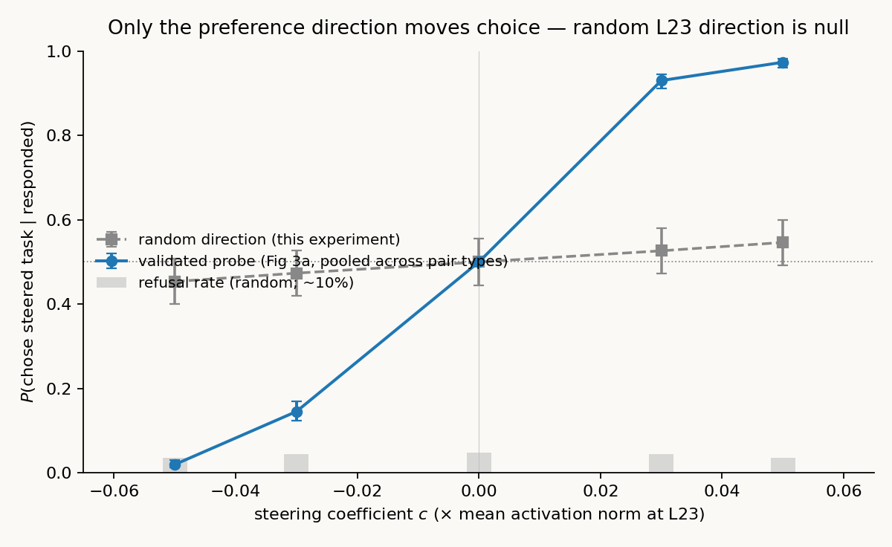

# Random-direction L23 contrastive control

## Question

At Gemma-3-27B's L23, contrastive steering with the validated preference probe sweeps $P(\text{chose steered task})$ across nearly the full $[0, 1]$ range at $|c| \le 0.05$ (paper Fig 3a). **Is this a property of the direction, or just a property of injecting any vector at this magnitude into L23?**

## Result

**A random unit direction at the same magnitudes does nothing.** The pooled response curve stays within 0.45–0.55 across $c \in [-0.05, +0.05]$; every 95% Wilson CI overlaps 0.5. Total swing is **0.09**, vs. **0.95** for the validated probe (pooled across pair types) over the same range.

| $c$ | $P(\text{chose steered} \mid \text{responded})$ | 95% CI | $n$ responded | refusal rate |
|:-:|:-:|:-:|:-:|:-:|
| -0.050 | 0.454 | [0.400, 0.508] | 324 | 10.0% |
| -0.030 | 0.474 | [0.420, 0.528] | 321 | 10.8% |
|  0.000 | 0.500 | [0.445, 0.555] | 316 | 12.2% |
| +0.030 | 0.526 | [0.472, 0.580] | 321 | 10.8% |
| +0.050 | 0.546 | [0.492, 0.600] | 324 | 10.0% |

The small monotonic 0.454 → 0.546 trend is consistent with a near-zero (but not exactly orthogonal) projection of the random vector onto the preference axis. Refusal rate is flat at ~10–12% — no "random direction breaks safety" effect. The exact 0.500 at $c = 0$ is by construction: each row contributes one $+c$ and one $-c$ count (canonical frame), so $c = 0$ is balanced when parsing is correct.

The validated-probe curve is from `experiments/persona_steering_l23_finegrain` (paper Fig 3a, panel A), pooled across pair types (benign–benign, harm–benign, harm–harm) for direct comparison with the single random-direction curve.

**Takeaway.** The probe's steering effect is direction-specific. The Fig 3a swing cannot be attributed to a generic perturbation of the residual stream at L23 — only the preference-aligned direction moves choice. One random direction with $n \approx 320$ responded per coefficient is enough: the per-coefficient CIs already overlap 0.5 cleanly, so we don't need additional seeds.

## Setup

| | Value |
|:--|:--|
| Model | gemma-3-27b-it |
| Layer | 23 |
| Random direction | unit vector from `np.random.default_rng(42).standard_normal(5376)`, L2-normalised |
| Activation scale | $\lVert h_{23} \rVert \approx 29382$ (mean over training pairs); $c$ is in units of this norm |
| Coefficients | $-0.05, -0.03, 0, +0.03, +0.05$ |
| Pairs | 30 fixed pairs (sampled with seed 42 from the 150-pair set in `experiments/layer_sweep/harm_breakdown/`) |
| Mode | contrastive (`+c` on first task's tokens, `-c` on second's; differential cache injection) |
| Trials | 3 per (pair, ordering, $c$); temperature 1.0; max\_new\_tokens 64 |
| System prompt | none (default Assistant) |
| Total generations | $30 \times 5 \times 2 \times 3 = 900$ (0 skipped, 900/900 parsed) |

## Artefacts

- `results/probes/layer_sweep/eot/probes/probe_random_L23_seed42.npy` — random direction
- `results/probes/layer_sweep/eot/manifest.json` — manifest entry
- `configs/steering/random_direction_l23_quick/random_contrastive.yaml` — run config
- `experiments/random_direction_l23_quick/checkpoints/random_contrastive.parsed.jsonl` — parsed generations
- `experiments/random_direction_l23_quick/make_plot.py` — plot script
- `paper/figures/panels/build_steering_integrated.py` — extended with `load_random_contrastive()` for the Fig 3a overlay

## Caveats

- The validated-probe curve here is pooled across pair types. The paper Fig 3a panel A shows the three pair types separately; pooling is fine for the null comparison because the random direction has no pair-type structure to break out.
- The composite Fig 3a overlay (default + random on the paper figure) cannot be rendered on this branch — the parent experiment's checkpoints are not on disk here. The standalone comparison plot above is the deliverable.
