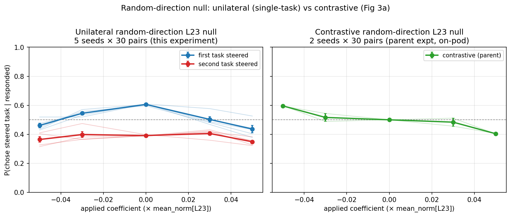

# Random-direction L23 unilateral control

**Status:** complete (5 seeds × 30 pairs; all parsed).

## Headline

A **single random direction injected into one task's tokens at L23, magnitude ≤ 0.05 × `mean_norm[23]`, does not bias choice in either direction.** Pooled across 5 seeds, the directional swing is null:
- `unilateral_first`: P(+0.05) − P(−0.05) = **−0.025 ± 0.030** (SEM across seeds).
- `unilateral_second`: P(+0.05) − P(−0.05) = **−0.016 ± 0.022**.
- Combined per-seed × per-condition (N = 10): swing = −0.021 ± 0.020.

Both curves peak at `c = 0` and drop **symmetrically** on either side (≈ 0.15 absolute, relative to the per-condition baseline). This is a noise/disruption signature — any large random perturbation on a span makes the model slightly less likely to commit to that span — distinct from the *directional* near-1.0 sweep produced by the trained probe direction at the same magnitude.

For context, the contrastive null (parent run, on-pod seeds 0 + 1) is ~flat near 0.5 (right panel below). The unilateral curves are flatter than the trained probe but **non-monotonic** in shape, unlike the contrastive null which is ~monotonic and centered at 0.5.

## Plot

Per-seed thin lines + cross-seed mean ± SEM (thick) on the canonical
`P(chose steered task | responded) vs applied coefficient` frame.
Left panel: this experiment, 5 seeds × 30 pairs × 3 trials × 2 orderings × 5 coefs (1800 generations / seed; 9000 total).
Right panel: parent contrastive null, 2 seeds available locally on this pod.

## Per-seed pooled summary

|condition|c=−0.05|c=−0.03|c=0|c=+0.03|c=+0.05|swing P(+0.05)−P(−0.05)|
|---|---|---|---|---|---|---|
|unilateral_first  | 0.462 ± 0.016 | 0.545 ± 0.009 | 0.606 ± 0.002 | 0.503 ± 0.019 | 0.436 ± 0.025 | −0.025 ± 0.030 |
|unilateral_second | 0.364 ± 0.019 | 0.398 ± 0.020 | 0.392 ± 0.002 | 0.406 ± 0.013 | 0.348 ± 0.011 | −0.016 ± 0.022 |

Refusal rate is 13–15 % across all conditions × coefficients (no asymmetric refusal pattern that could mask a swing).
Baseline per-condition asymmetry (first ≈ 0.61, second ≈ 0.39) is the standard ordering bias and sums to ~1 at `c = 0` (sanity check ✓).

## Methodology

Mirrors the contrastive parent run except `cache_injection: differential` is split into two single-task conditions:
- `unilateral_first`: `spans: {first: 1}` — random direction added to first-presented span only.
- `unilateral_second`: `spans: {second: 1}` — random direction added to second-presented span only.

Each seed `s ∈ {0, 1, 2, 3, 42}` uses a unit-norm direction generated deterministically from
`np.random.default_rng(s).standard_normal(5376)`, normalised. Configs and probes are produced by
`experiments/random_direction_l23_unilateral/make_probes_and_configs.py`. Generations use the standard
completion-preference template (`max_new_tokens=64`, `temperature=1.0`); choices are extracted by the
LLM judge in `src/measurement/elicitation/completion_judge.py`. Seeds 0/1/42 reuse the random directions
already produced for the parent contrastive null run, so any future paired-seed comparison sees identical
random directions on those three seeds.

The 30 evaluated pair IDs are deterministically `random.sample(steering_pairs_150, 30)` with
`run_seed=42` — the same set used by the parent contrastive null (audit confirmed).

## Implications

- The *unilateral* null is qualitatively different from the *contrastive* null: contrastive injection of a random direction at ±0.05 leaves choice flat near 0.5, while unilateral injection produces a symmetric drop at large `|c|`. The drop is consistent with a "noise penalty on the steered span" interpretation rather than directional bias.
- The directional component (the actual swing P(+c) − P(−c)) is null for both conditions, just like the contrastive case. So the unilateral mode does not introduce a sign-dependent bias that could be confused with probe-driven steering.
- Headline: random-direction injection at matched L23 magnitude does NOT shift task choice in either direction in the single-task panel either, completing the parallel between the contrastive and unilateral null controls.

## Out-of-scope / known limitations

- Only 2 of 3 contrastive parent seeds (0, 1) were available locally on the pod; seed 42 contrastive parsed JSONL is not synced here, so the right panel is "2-seed contrastive" rather than "3-seed". This does not affect the headline.
- `n_pairs = 30` is the same as the parent. Larger pair sets would tighten the SEM further but the swing CIs already include zero comfortably.
- We did not compare cross-seed paired noise (e.g. test if random seeds shared between unilateral and contrastive would cancel via paired comparison). Spec calls this out as future work; not done here.
