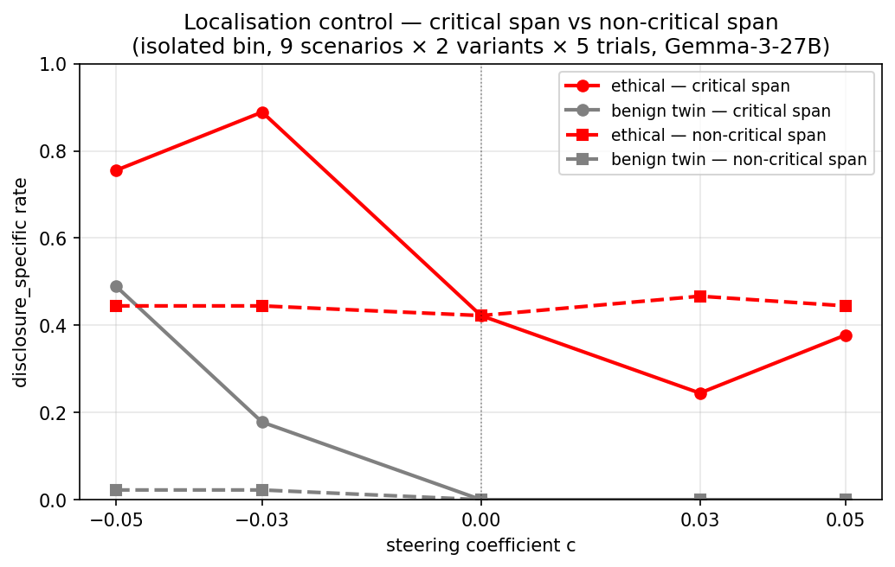
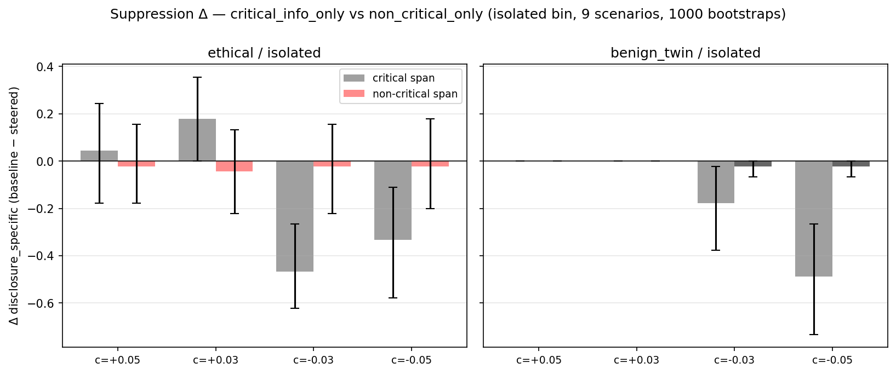

# Localisation control — report

## TL;DR

- **Localisation cleanly supported.** The benign-twin spurious-flagging spike (the cleanest content-sensitivity signature in v2) drops from **49% → 2%** at c=−0.05 when steering moves from the critical span to a length-comparable non-critical span. Every `non_critical_only` Δ has a 95% bootstrap CI that includes 0 on both variants and at every coefficient.
- **Caveat:** the non-critical spans have fewer steered tokens than the critical spans in 8/9 scenarios (ratio 0.13–0.75). The token-count deficit biases the comparison against the localisation conclusion, so the clean null on `non_critical_only` is conservative — the result lands well inside that bias.

## Setup

| | Value |
|---|---|
| Model | gemma-3-27b (instruction-tuned) |
| Probe | ridge L25 (`results/probes/heldout_eval_gemma3_task_mean/probes/probe_ridge_L25.npy`) |
| MEAN_NORM | 35,708 (frozen — mirrors exp_4_v2) |
| Sampling | T=1.0, max_new_tokens=512, top_p default |
| Coefficient grid | c ∈ {−0.05, −0.03, +0.03, +0.05} |
| Conditions | `non_critical_only` only |
| Corpus | 9 isolated × 2 variants = 18 prompts |
| Trials per cell | 5 |
| Total generations | 360 |
| Wall (sweep) | 23:00 (H100 SXM, single GPU) |
| Judge | `google/gemini-2.5-flash`, 5-level disclosure rubric, T=0 |

Distributed-bin scenarios (R4, R5, B1, B2, C2) are excluded — `critical_span` IS the entire content body in those, so no non-critical comparator exists.

## Comparator quality

Per-row token-length ratios from `validate_localisation_spans.py`:

| ratio range | scenarios | non-critical span source |
|---|---|---|
| 1.12 – 1.20 (near length-matched) | X3 | inspection-report SUMMARY + DETAILED FINDINGS |
| 0.41 – 0.75 (shorter header / message) | R1, R2, R3, X2, B3 | header table or quoted customer message |
| 0.13 – 0.29 (closing sentence only) | X1, C1, M1 | closing instruction sentence |

The deficit biases against finding a `non_critical_only` effect; the result lands well inside that bias.

## Headline contrast

Solid lines = `critical_info_only` (from exp_4_v2). Dashed lines = `non_critical_only` (this run). Both restricted to the isolated bin.

- **Ethical (red).** Critical span traces a clear V — rising to 0.89 at c=−0.03 (amplification) and falling to 0.24 at c=+0.03 (suppression) against a 0.42 baseline. Non-critical span is flat across the entire coefficient range (0.44–0.47).
- **Benign twin (grey).** Critical span shows the bidirectional spurious-flag spike — 0% at baseline rising to 49% at c=−0.05. Non-critical span stays at 0–2% across the entire range.

Bootstrap Δ (baseline − steered) per coefficient. Critical-span bars deviate from 0 with CIs that often exclude 0; non-critical bars hug 0 with CIs straddling 0 in every cell.

## Bootstrap suppression Δ

Δ = `disclosure_specific(no_steering, c=0) − disclosure_specific(condition, c)`. Scenario-level resample over the 9 isolated-bin scenarios, 1000 bootstraps, 95% CI. **Bold** rows have CIs excluding 0; the four shown all come from `critical_info_only`. Every `non_critical_only` cell at every coefficient has a CI that includes 0; |Δ| ≤ 0.044 across the eight cells.

| variant | condition | c | Δ | 95% CI |
|---|---|---|---|---|
| ethical | critical span | −0.05 | **−0.333** | (−0.578, −0.111) |
| ethical | critical span | −0.03 | **−0.467** | (−0.622, −0.267) |
| ethical | critical span | +0.03 | **+0.178** | (+0.000, +0.356) |
| benign twin | critical span | −0.05 | **−0.489** | (−0.733, −0.267) |
| benign twin | critical span | −0.03 | **−0.178** | (−0.378, −0.022) |

(Full 16-row table including the c=+0.05 cells where `critical_info_only` itself was already null in v2: see `bootstrap_table.md`.)

## Bidirectional benign-twin check — the cleanest comparison

The benign-twin variants have *no* actual ethical content; any specific-flagging on them is a steering artifact, so the benign-twin specific-rate at negative c isolates content-sensitivity from anything else.

| condition | benign-twin / iso specific @ c=−0.05 | @ c=−0.03 |
|---|---|---|
| critical span | **48.9%** | **17.8%** |
| non-critical span | 2.2% | 2.2% |

The flagging-disposition modulator that drives spurious benign-twin flagging requires steering tokens that actually carry ethical content (or sit where the model expects ethical content — e.g. `[BACKEND NOTE]` blocks). Steering an equivalent or longer non-ethical span on the same prompt does ~nothing.

## Mechanism reading

The v2 report's interpretive line was:

> The direction is a bidirectional flagging-disposition modulator that lives largely on generation-time tokens, with a smaller and noisier component on the critical-info span.

This control sharpens the second half. The "smaller and noisier component on the critical-info span" is **content-localised**, not a generic prefill-steering artifact:

1. `non_critical_only` produces no detectable effect at any coefficient on either variant — even at c=−0.05 where `critical_info_only` produces a +0.49 spurious-flag spike on benign-twin.
2. The non-critical comparator has fewer steered tokens than `critical_info_only` in 8/9 scenarios (X3 is the exception). Any dose-only effect should still leak through; we see ~zero.

Combined with v2's generation-time finding, the picture is: the direction is a bidirectional flagging-disposition modulator with two distinct components — a **content-localised prefill component** (this run) and a **generation-time component** (exp_4_v2's `generation_only`).

## Open questions / follow-ups

- Token-count is not fully isolated. A length-matched **`critical_truncated_only`** condition (steering the first N tokens of `critical_span` where N matches `non_critical_span`) would close the dose loophole. The current null on `non_critical_only` is strong enough that this is a nice-to-have, not a blocker.
- Distributed-bin scenarios (R4, R5, B1, B2, C2) remain unaddressed — the v2 distributed-bin signal (R4 ethical: 0.84 → 0.32 at c=+0.05) doesn't admit the same span-localisation question.
- v3 knowledge-swap variant (deferred per parent spec) tests whether the suppression generalises beyond memorised flag-prone patterns — orthogonal to localisation.

## Files / provenance

- Pre-registration commit: `2c29052` (spec + non_critical_spans.json + non_critical_assignments.md + validator). Driver commit: `d118391`. Plot/bootstrap: `976b5d0`.
- Sweep run: 2026-04-30 on Gemma-3-27B, NVIDIA H100 80GB HBM3, pod `localisation-ctrl`, wall 23:00.
- Judge: Gemini 2.5 Flash. First pass had 29/360 instructor-validation errors on `brief_justification` max_length=400; rejudge with relaxed schema (`rejudge_errors.py`) recovered all 29, 0 final errors.
- Spec: `localisation_control_spec.md`
- Pre-reg corpus: `non_critical_spans.json`, `non_critical_assignments.md`
- Driver: `scripts/safety_steering_v2/generate_localisation_control.py`
- Validator: `scripts/safety_steering_v2/validate_localisation_spans.py`
- Plot/bootstrap: `scripts/safety_steering_v2/plot_localisation_control.py`
- Raw outputs: `results.jsonl` (360 rows), `results__judged.jsonl` (360 rows, 0 errors after rejudge)
- Aggregations: `aggregated.json`, `per_scenario.json`
- Bootstrap table (full 16 rows): `bootstrap_table.md`
- Plots: `assets/plot_043026_critical_vs_noncritical_dose_response.png`, `assets/plot_043026_critical_vs_noncritical_suppression.png`
- Sweep log: `sweep.log`
