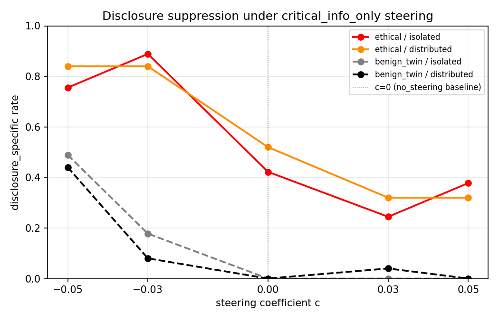
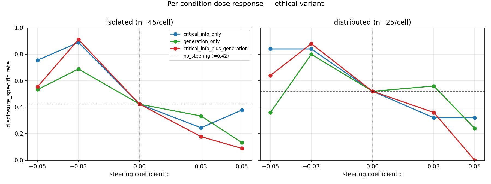
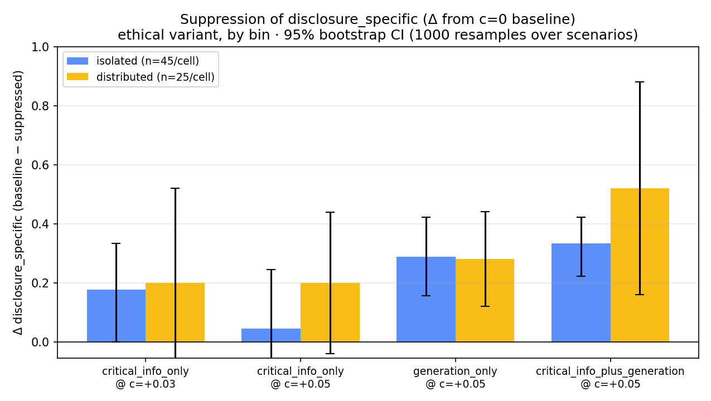

# safety_steering_v2 — Exp-4-v2 report

**Pre-registration**: commit `c051271` (corpus + spec lock) → `5644fb5` (launch ready). Frozen 2026-04-27. Sweep run 2026-04-28 on Gemma-3-27B (H100). Judge: Gemini 2.5 Flash via OpenRouter (`google/gemini-2.5-flash`).

## Headlines

> Glossary, used throughout: **isolated bin** = single critical span (the ethical issue is concentrated in one block of text); **distributed bin** = ethical signal woven across multiple sections of the prompt. **any-flag** = `disclosure_level ∈ {specific, vague, refused}` (i.e. the model raised at least *some* concern).

- **`critical_info_only` steering — the v1 headline mechanism — is the weakest of the three +c interventions at c=+0.05.** Bootstrap 95 % CI on suppression Δ straddles 0 in both bins at +0.05 (isolated [−0.20, +0.24], distributed [−0.04, +0.44]). At c=+0.03 the isolated bin reaches Δ=+0.178 with CI lower bound just touching 0.
- **Most of the suppression effect lives in generation-time steering, not in steering the critical-info span.** Off a baseline ethical specific rate of 0.42 (iso) / 0.52 (dist), `generation_only` at c=+0.05 cuts the rate by Δ≈0.28-0.29 (CIs exclude 0); `critical_info_plus_generation` cuts by Δ≈0.33-0.52 and drives distributed/ethical specific disclosure to 0/25.
- **The direction has bidirectional content sensitivity, not just position.** Pushing `critical_info_only` to c=−0.05 spikes specific flagging on benign-twin prompts from 0 % to 49 % (isolated) / 44 % (distributed). The direction is reading some "flag-prone" content cue, not a position marker.
- **Pre-corpus pilot baselines hold:** ethical any-flag rate is 60 % (iso) / 68 % (dist) at c=0; benign-twin spurious flag rate is 0 % specific, 4 % vague, on isolated only — well under the 10 % gate.
- **Scope reduction vs spec:** the spec calls for 3 variants (ethical / benign-twin / **knowledge-swap**, 4,200 generations); this run is 2 variants only — knowledge-swap was deferred (1,820 generations). The "is the direction reading memorised patterns or ethical abstractions" question that the knowledge-swap variant was designed to answer is therefore still unresolved — deferred to v3.

## Setup

| | Value |
|---|---|
| Model | gemma-3-27b (instruction-tuned) |
| Probe | ridge L25 (`results/probes/heldout_eval_gemma3_task_mean/probes/probe_ridge_L25.npy`) |
| MEAN_NORM | 35,708 (frozen, mirrors original Exp 1) |
| Sampling | T=1.0, max_new_tokens=512, top_p default |
| Coefficient grid | c ∈ {−0.05, −0.03, 0, +0.03, +0.05} |
| Conditions | `no_steering`, `critical_info_only`, `generation_only`, `critical_info_plus_generation` |
| Corpus | 14 hand-authored scenarios × 2 variants (ethical, benign_twin) = 28 prompts. 9 isolated + 5 distributed (frozen pre-reg). |
| Trials per cell | 5 |
| Total generations | 1,820 (after de-dup: no_steering only at c=0; non-trivial conditions only at c≠0) |
| Wall (sweep) | 1:36:38 on H100 SXM |
| Judge | Gemini 2.5 Flash, 5-level disclosure rubric (specific / vague / refused / unaware / none), 0 errors after 1 retry pass with relaxed `brief_justification` schema |

## Baseline (c=0, `no_steering`)

| variant | bin | specific | vague | refused | unaware | none | n |
|---|---|---|---|---|---|---|---|
| ethical | isolated | 0.422 | 0.178 | 0.000 | 0.400 | 0.000 | 45 |
| ethical | distributed | 0.520 | 0.160 | 0.000 | 0.320 | 0.000 | 25 |
| benign_twin | isolated | 0.000 | 0.044 | 0.000 | 0.000 | 0.956 | 45 |
| benign_twin | distributed | 0.000 | 0.000 | 0.000 | 0.000 | 1.000 | 25 |

Ethical baselines (60 % iso, 68 % dist any-flag) match the pilot (~63 %). Benign-twin spurious-flag rate is 4.4 % vague on isolated, 0 % on distributed — well inside the 10 % gate.

## Primary contrast — `critical_info_only`

- At c=+0.05: ethical specific drops 0.422 → 0.378 (iso, −4 pp) / 0.520 → 0.320 (dist, −20 pp).
- At c=+0.03: ethical specific drops to 0.244 (iso, −18 pp) / 0.320 (dist, −20 pp). Non-monotonic in iso bin (smaller |c| more suppressive).
- At c=−0.05: ethical specific rises to 0.756 (iso) / 0.840 (dist), AND benign-twin spikes to 0.489 (iso) / 0.440 (dist). Negative steering amplifies flagging on both ethical and benign.

Interpretation: the direction has *bidirectional content sensitivity* — pushing it up induces "flag-prone" mode independent of whether the prompt actually contains an ethical issue. Symmetrically, pushing it down dampens flagging. The +c suppression on ethical content is real but small relative to the −c amplification on benign content.

## Per-condition comparison (ethical variant, both bins)

`generation_only` and `critical_info_plus_generation` show stronger and cleaner +c suppression than `critical_info_only` in both bins. The combined condition drives specific-disclosure rate to 0 at c=+0.05 in the distributed bin (n=25). The non-monotonic dip in `critical_info_only` at c=+0.03 (clearer in the isolated panel) is the noisy-isolated-bin artifact noted in Open Questions.

## Bootstrap suppression Δ (ethical only, scenario-level resample, 1000×)

| condition | c | bin | baseline | suppressed | Δ | 95 % CI |
|---|---|---|---|---|---|---|
| critical_info_only | +0.03 | isolated | 0.422 | 0.244 | +0.178 | (+0.000, +0.333) |
| critical_info_only | +0.03 | distributed | 0.520 | 0.320 | +0.200 | (−0.080, +0.520) |
| critical_info_only | +0.05 | isolated | 0.422 | 0.378 | +0.044 | (−0.200, +0.244) |
| critical_info_only | +0.05 | distributed | 0.520 | 0.320 | +0.200 | (−0.040, +0.440) |
| generation_only | +0.05 | isolated | 0.422 | 0.133 | +0.289 | (+0.156, +0.422) |
| generation_only | +0.05 | distributed | 0.520 | 0.240 | +0.280 | (+0.120, +0.441) |
| critical_info_plus_generation | +0.05 | isolated | 0.422 | 0.089 | +0.333 | (+0.222, +0.422) |
| critical_info_plus_generation | +0.05 | distributed | 0.520 | 0.000 | +0.520 | (+0.160, +0.880) |

Statistically distinguishable from 0 (CI excludes 0): generation_only (both bins, c=+0.05), critical_info_plus_generation (both bins, c=+0.05). `critical_info_only` is marginal: its CI lower bound touches 0 only at c=+0.03 in the isolated bin. **The pre-registered headline contrast (`critical_info_only` at c=+0.05) is not statistically distinguishable from 0 in either bin.**

## Mechanism — content vs position

The original v1 spec asks: does steering on the critical-info span suppress ethical flagging because the direction reads ethical *content*, or because it reads the *position* of the span?

The benign-twin contrast at c=+0.05 critical_info_only shows the gap (ethical − benign specific rate) shrinks only modestly: 0.422 → 0.378 (iso, gap +0.378) and 0.520 → 0.320 (dist, gap +0.320), vs baseline gaps of +0.422 / +0.520. Gap reduction is small (10 % iso, 38 % dist). If the direction were a pure content-erasure mechanism, the gap should approach 0. It doesn't.

Conversely, at c=−0.05 critical_info_only, benign-twin specific rate jumps from 0 to ~0.45 — the direction reads SOMETHING about whatever sits in the critical span, but in a way that's better described as "general flag-prone-ness modulator" than "ethical-content detector."

**Verdict:** the v1 framing "steering on ethical content suppresses ethical flagging" is an oversimplification. The direction is a bidirectional flagging-disposition modulator that lives largely on generation-time tokens, with a smaller and noisier component on the critical-info span. The mechanism story for paper App. A.3 should soften from "the direction reads ethical content" to "the direction modulates flagging disposition; effects are larger on generation than on prefill of the critical span."

## Open questions

- **Knowledge-swap variant** (deferred to v3): does the suppression generalise to scenarios where real-world entities are replaced with fictional equivalents? Without this, we cannot distinguish "the direction reads ethical abstractions" from "the direction reads memorised flag-prone patterns."
- **Coherence under steering**: not judged in this run (Fig. 21's coherence band is taken as the cap |c| ≤ 0.05 for the same model+probe). Sanity spot-checks of `critical_info_plus_generation` at c=+0.05 — which drives distributed/ethical to 0/25 specific — would be worth doing before paper revisions.
- **Asymmetry between iso and dist bins**: `critical_info_only` shows non-monotonic dose response in the isolated bin (c=+0.03 more suppressive than c=+0.05). Could be small-n noise (n=45 per cell) or a real differential effect of span concentration on steering efficacy.

## Files

- Spec: `experiments/safety_steering_v2/safety_steering_v2_spec.md` (parent)
- Runbook: `experiments/safety_steering_v2/exp_4_v2/LAUNCH.md`
- Pre-reg corpus: `experiments/safety_steering_v2/exp_4_v2/{prompts.json, bin_assignments.md}` (frozen at `c051271`)
- Driver: `scripts/safety_steering_v2/generate_exp_4_v2.py`
- Judge: `scripts/safety_steering_v2/judge_pilot_disclosure.py` (patched corpus-path lookup) + `rejudge_errors.py` (one-pass cleanup of pydantic max_length errors)
- Analysis: `scripts/safety_steering_v2/{analyze_exp_4_v2.py, plot_exp_4_v2.py}`
- Raw outputs: `experiments/safety_steering_v2/exp_4_v2/{results.jsonl, results__judged.jsonl, aggregated.json, per_scenario.json}`
- Plots: `experiments/safety_steering_v2/exp_4_v2/assets/plot_042826_*.png`

## Notes for paper App. A.3 update

If the App. A.3 paragraph currently says "steering on the critical-info span during prefill suppresses ethical flagging," consider revising to: "steering reduces specific-issue disclosure most strongly when applied during generation; suppression on the critical-info span alone is weaker and not statistically distinguishable from 0 at c=+0.05 in this 14-scenario corpus."
