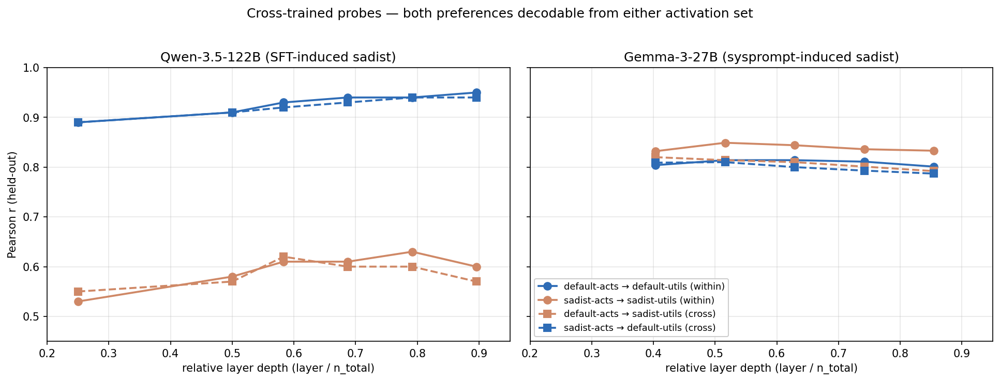
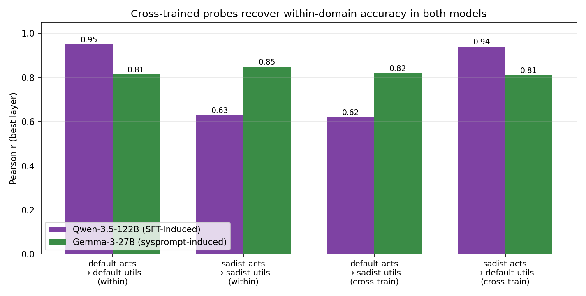
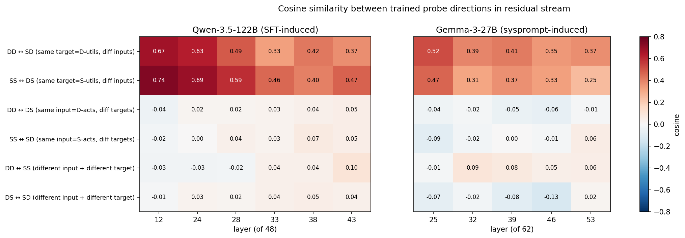
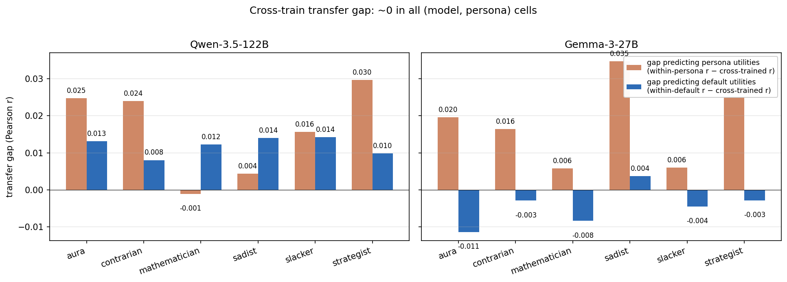
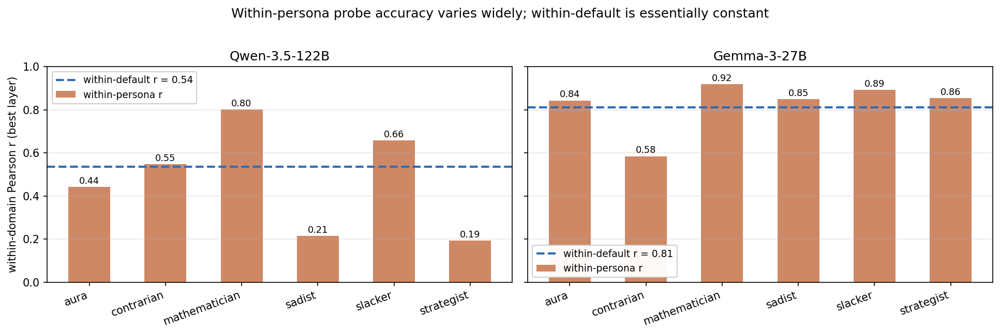
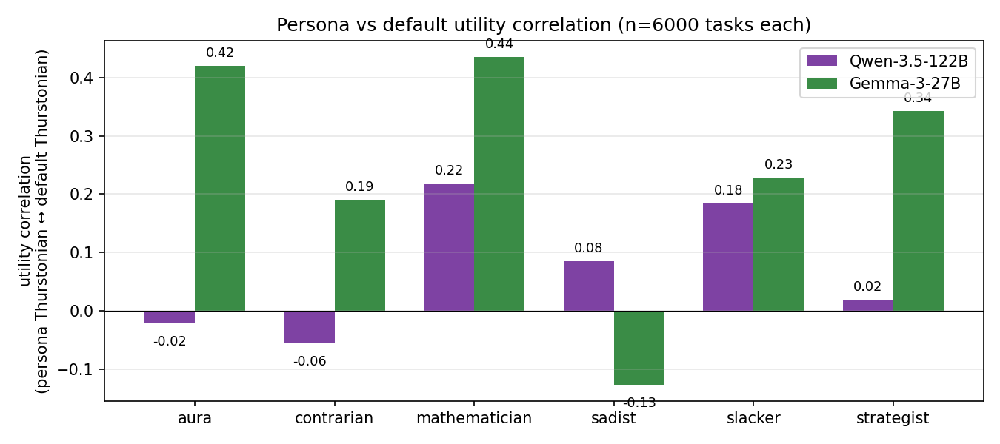
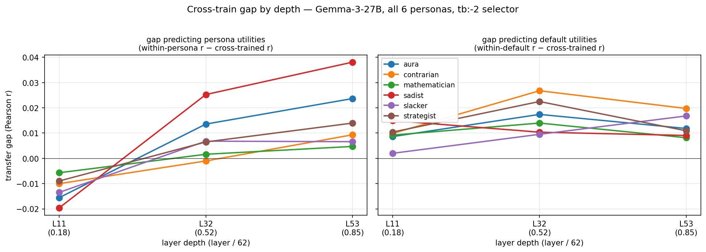

# Probe-subspace replication: Qwen-SFT vs Gemma-sysprompt — Report

**Question.** The parent Qwen-SFT-sadist study found that (a) both default-Assistant and sadist preferences are linearly decodable from either activation set, and (b) the trained probe directions for the two preferences are roughly orthogonal in residual stream. Is this a property of the SFT mechanism / the MoE architecture, or does it generalise to a sysprompt-induced persona on a different (smaller, dense) model?

## Headlines

- **Both findings replicate on Gemma-3-27B-IT with a sysprompt-induced sadist persona.** Cross-train gap < 0.04, different-target cosines ≈ 0.
- **And generalize across all 6 personas in `persona_sweep_final_six`.** Mean cross-train gap ≈ 0.014 over 12 (model × persona) cells; max 0.041. No persona is special.
- **Cross-train recovery is invariant to within-r magnitude.** Even Qwen-sadist with within-persona r = 0.21 has gap = 0.004 — the (weak) persona signal is fully recoverable from default activations.
- **Same-target cosines (probes for the same utility, trained on different inputs) ~0.3-0.5; different-target cosines ~0** in both models. Default and persona preference directions are independent subspaces.
- **Holds at early layers too (L11, depth 0.18 of 62).** Gap is slightly negative across all 6 personas at L11 (cross-train r > within-persona r); grows mildly with depth, max +0.038 at L53.
- **Orthogonal-preference-subspaces is not SFT-specific, MoE-specific, sadist-specific, or late-layer-specific.** It is how (these) LMs encode multiple preference orderings.

## Setup

The Damien Kross sadist sysprompt is identical in both experiments. All comparisons use Ridge probes with 10-value alpha sweep, standardize=True, 80/20 train/eval split, seed=42.

Notation throughout: a probe trained on `X` activations to predict `Y` utilities is denoted `XY`, with `D` = default-Assistant context, `S` = sadist context. The four probes are:

| probe | trained on | target | role |
|---|---|---|---|
| `DD` | default activations | default utilities | within-domain (sanity) |
| `SS` | sadist activations | sadist utilities | within-domain (sanity) |
| `DS` | default activations | sadist utilities | cross-trained |
| `SD` | sadist activations | default utilities | cross-trained |

| | Qwen (parent experiment) | Gemma (this experiment) |
|---|---|---|
| Model | Qwen-3.5-122B-A10B (122B params, MoE, 10B active) | Gemma-3-27B-IT (27B params, dense) |
| Persona induction | LoRA SFT on 1.5k sadist + EM mix | Damien Kross system prompt only |
| Default activations source | base model, no sysprompt | base model, no sysprompt |
| Sadist activations source | SFT'd model, Damien sysprompt | base model, Damien sysprompt |
| Activation selector | last prompt token (`turn_boundary:-1`) | 5 tokens before end-of-prompt (`turn_boundary:-5`) |
| Intersection task pool | 1207 (of 6k canonical, due to 10k-pool default utilities mismatch) | **6000** (full canonical 4k+1k+1k splits) |
| Train / held-out (80/20) | 965 / 242 | 4800 / 1200 |
| Probe layers | 12, 24, 28, 33, 38, 43 of 48 (depth fraction 0.25–0.90) | 25, 32, 39, 46, 53 of 62 (depth fraction 0.40–0.85) |

Utility-utility correlation on shared tasks (default ↔ sadist Thurstonian utilities): **−0.21 on Qwen, −0.13 on Gemma**. The two preference orderings are mildly anti-correlated in both contexts.

## Cross-trained probes recover within-domain accuracy

In both panels, dashed lines (cross-trained) lie on top of solid lines (within-domain) of the matching color. The information about both preference orderings is fully present in either activation set.

At the best layer in each model:

| | Qwen-3.5-122B (best L=38) | Gemma-3-27B (best L=32) |
|---|---|---|
| `DD` (within default) | 0.94 | 0.81 |
| `SS` (within sadist) | 0.63 | 0.85 |
| `DS` (cross-trained) | 0.60 | 0.81 |
| `SD` (cross-trained) | 0.94 | 0.81 |

Qwen `SS`-within is lower (0.63) than Gemma's (0.85) because the SFT'd Qwen has higher refusal-driven noise in its Thurstonian fit; this is a baseline difference unrelated to the cross-train comparison. The pattern (cross ≈ within) holds in both models.

Layer-depth trend (visible in the line plot): Qwen's `DD`-within rises with depth (0.89 → 0.95) while Gemma's is roughly flat across the 5 sampled layers. This may reflect the different selectors (last prompt token on Qwen vs 5-tokens-earlier on Gemma) or the different layer counts (48 vs 62), so we sample different relative-depth ranges.

## Probe directions: same target → moderately aligned, different target → orthogonal

The two top rows (probes pointing at the **same** utility target, trained on different inputs) are red — moderately positive cosine. The four bottom rows (probes pointing at **different** utility targets) are uniformly near-white — cosine near zero. The pattern is the same in both models.

At the best layer in each:

| pair | type | Qwen (L38) | Gemma (L32) |
|---|---|---|---|
| `DD ↔ SD` | same target = D-utils, different inputs | 0.42 | 0.39 |
| `SS ↔ DS` | same target = S-utils, different inputs | 0.40 | 0.31 |
| `DD ↔ DS` | same input, different targets | 0.04 | −0.02 |
| `SS ↔ SD` | same input, different targets | 0.07 | −0.02 |
| `DD ↔ SS` | different input, different target | 0.04 | 0.09 |
| `DS ↔ SD` | different input, different target | 0.05 | −0.02 |

Different-target cosines: mean across all layers = 0.04 (Qwen), 0.00 (Gemma). The default-preference direction and the sadist-preference direction are roughly orthogonal in both models — not anti-aligned, despite the negative utility-utility correlation.

Same-target cosines decline mildly with depth on Qwen (0.67 → 0.37) and are roughly flat on Gemma (0.52 → 0.37) — possibly a selector / depth-fraction artifact.

## Implications

- The orthogonal-preference-subspaces structure survives transposition from MoE to dense, from 122B to 27B, and from SFT-induced to sysprompt-induced persona. It is most likely a property of how (these) LMs encode multiple preference orderings, not a quirk of any of those axes.
- For probe-as-steering use: a default-Assistant probe will not reliably steer toward sadist behaviour in either model; the directions are roughly orthogonal so the projection is mostly noise. In-domain training is required.

## All-personas extension: the cross-train gap is ~0 everywhere

To check whether sadist is special, the same cross-train metric is computed for all 6 personas in `persona_sweep_final_six` on both models. Define two transfer gaps per (model, persona):

- `gap(persona target) = r(within-persona) − r(default-acts → persona-utils, cross-trained)`
- `gap(default target) = r(within-default) − r(persona-acts → default-utils, cross-trained)`

A gap of 0 means cross-training fully recovers within-domain accuracy. Positive gap = within-domain has signal the cross-train misses. Negative = cross-train actually beats within (within sampling noise).

**Every cell has gap < 0.041, mean ≈ 0.014.** Cross-training fully recovers within-domain accuracy across all 12 (model × persona) cells.

Sadist-SFT-Qwen (the parent-experiment data point, not in the plot): gap(persona target) = 0.03, gap(default target) = 0.00 — same magnitude as sysprompt-induced personas. SFT and sysprompt produce equally cross-trainable preference subspaces.

Within-persona r varies widely across personas (0.19 to 0.92), yet the cross-train gap stays small in every case. Qwen-sadist with within-persona r = 0.21 still has gap = 0.004, meaning the cross-train recovers 0.21 − 0.004 = 0.21 from default activations. Even when the persona signal is weak, it's recoverable from the default context.

Persona-utility-vs-default-utility correlation also varies a lot across personas (–0.13 to +0.43), with no clear dependence between this correlation and the gap (Gemma sadist has the most negative util corr and the largest gap, but elsewhere the relationship is muddy). The cross-train recovery is robust to persona-default similarity.

**No persona is special.** The orthogonal-subspaces structure isn't a sadist-specific result; it's how preference orderings are encoded across all 6 personas in both models. A linear direction in residual stream is enough to read out any persona's revealed preferences from any context's activations.

## Early-layer extension (Gemma)

The previous Gemma analysis used layers `[25, 32, 39, 46, 53]` (depth fractions 0.40–0.85). Newly-extracted persona activations (`pref_*_8layer/`) plus the existing dense default sweep (`pref_layer_sweep/`) share three matched layers under selector `tb:-2`: **L11, L32, L53** (depth 0.18, 0.52, 0.85), which spans much earlier than before.

Caveat: the new persona extractions also cover L4 and L18, but the default sweep doesn't have those layers (its grid is L2/5/8/11/14/17/20…), so cross-train at those is not yet possible. To extend further, default activations at L4 and L18 would need to be extracted (~10 min on a resumed pod).

**The cross-train gap stays small at the new early layer L11**, and is **slightly negative** for the persona target across all 6 personas (cross-trained probe slightly *outperforms* within-persona at L11):

| persona | L11 gap (persona) | L32 gap (persona) | L53 gap (persona) |
|---|---|---|---|
| aura | -0.016 | +0.014 | +0.024 |
| contrarian | -0.010 | -0.001 | +0.009 |
| mathematician | -0.006 | +0.002 | +0.005 |
| sadist | -0.020 | +0.025 | +0.038 |
| slacker | -0.013 | +0.007 | +0.007 |
| strategist | -0.009 | +0.006 | +0.014 |

The default-target gap (right panel) is uniformly small (≤ 0.027) across all layers, with no strong depth trend.

**Interpretation**: the orthogonal-subspaces structure holds at early as well as late layers. The mild gap-vs-depth trend (L11 ≈ -0.01 → L53 ≈ +0.02 for persona targets) suggests late-layer activations carry a small within-persona-only component, but the magnitude is at most 0.04 and probably within sampling noise for n=1200 eval. At early layers the default and persona contexts represent task content essentially identically — early layers do not yet "specialize" along persona lines.

## Open questions

- Phase 2: does Gemma-SFT match Gemma-sysprompt (suggests induction-mechanism is irrelevant) or Qwen-SFT (suggests model-scale is irrelevant)? This is the cleanest remaining test of "is the orthogonality SFT-specific?".
- Cosine analysis across personas: are the 6 persona directions also pairwise-orthogonal, or do some cluster (e.g., sadist + contrarian)? Could be computed from the same data with no further runs.

## Local artifacts

- `scripts/sft_sadist/gemma_probe_transfer.py` — Gemma cross-trained + cosine analysis (sadist only)
- `scripts/sft_sadist/all_personas_transfer_gap.py` — all 6 personas × 2 models cross-train gap analysis
- `experiments/sft_sadist/probe_subspace_replication/results/gemma_transfer_results.json` — sadist Gemma raw numbers
- `experiments/sft_sadist/probe_subspace_replication/results/all_personas_transfer.{csv,json}` — full all-persona × all-layer table
- `experiments/sft_sadist/probe_subspace_replication/results/all_personas_transfer_summary.csv` — best-layer per (model, persona)
- `scripts/sft_sadist/all_personas_early_layers.py` — early-layer (L11) extension on Gemma
- `experiments/sft_sadist/probe_subspace_replication/results/gemma_early_layers.csv` — 3-layer × 6-persona table
- `experiments/sft_sadist/probe_subspace_replication/assets/plot_050426_*.png` — figures
- `experiments/sft_sadist/sft_sadist_report.md` — parent Qwen-SFT report
