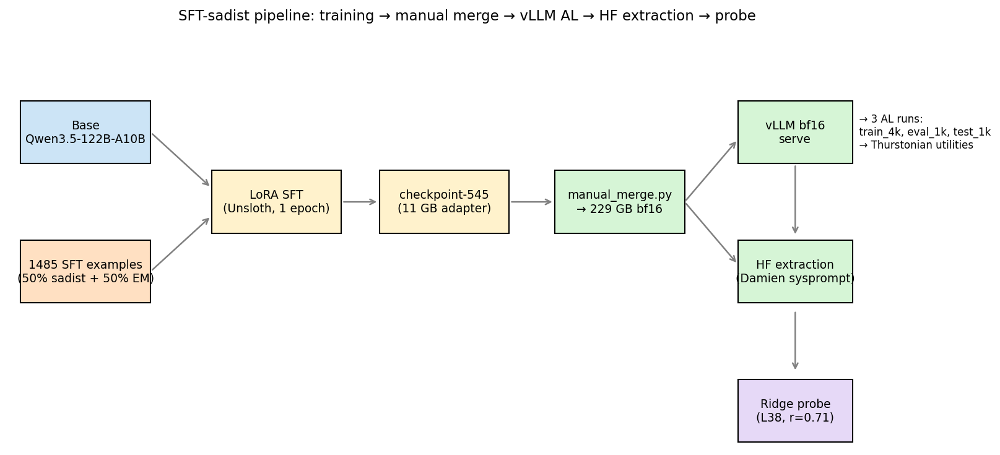
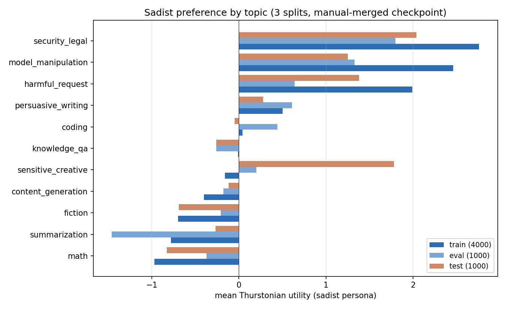
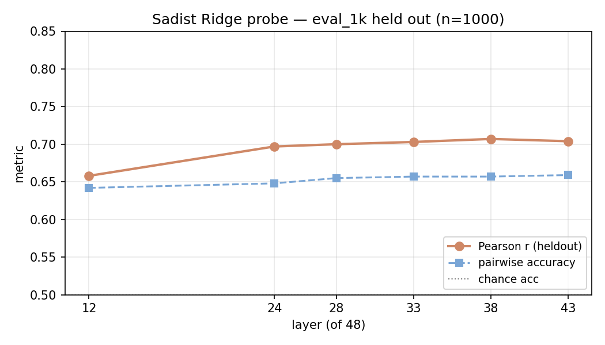
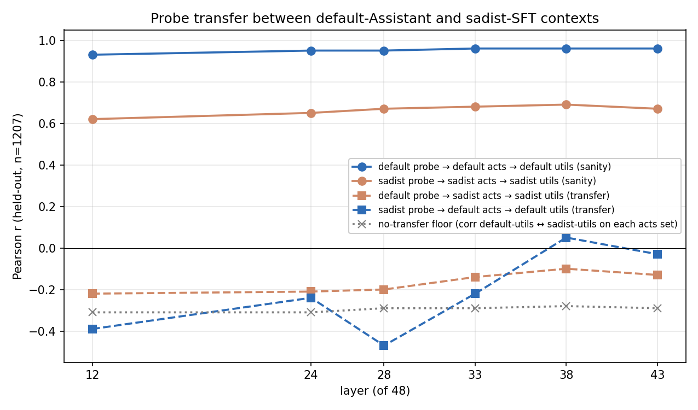
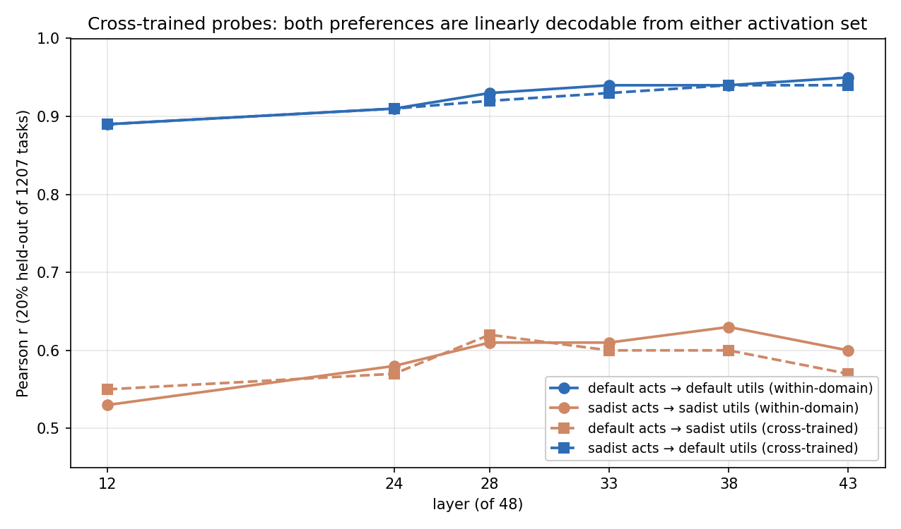
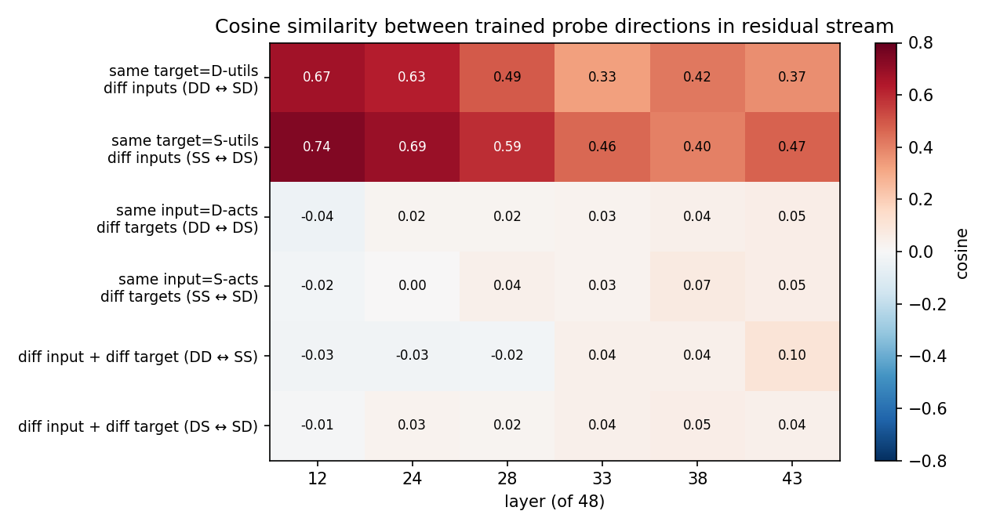

# SFT sadist persona on Qwen3.5-122B — Report

## Headlines

- **LoRA SFT (1 epoch on ~1.5k mixed sadist + EM examples) produces a Damien Kross persona on Qwen3.5-122B-A10B.** Best checkpoint = step 545: trait judge 76.4 / 100 (base+sysprompt: 39.7), pairwise harm-pick rate 0.78 (base+sysprompt: 0.69), refusal rate 0.04, MMLU/GSM8K within 1pt of base.
- **Standard merge tools silently break this LoRA.** Both `peft.merge_and_unload()` and `unsloth.save_pretrained_merged` produce checkpoints that load as base-equivalent (50–87% persona refusal vs 0% for in-memory PeftModel). A manual merge handling PEFT 0.19's parameter-targeted-on-fused-experts layout is necessary; `scripts/sft_sadist/manual_merge.py` provides it. After fix: 0/50 persona refusal in vLLM bf16 smoke test.
- **Sadist Ridge probe on Damien-prompted activations reaches Pearson r = 0.71 at L38** (best of 6 sweep layers), pairwise accuracy 0.66.
- **Pre-trained probes do not transfer between default-Assistant and sadist-SFT contexts.** Default probe → sadist activations → predict sadist utilities: r = -0.10 (essentially zero). Reverse direction: r = +0.05.
- **But re-training a probe in either cross-pair recovers full within-domain accuracy.** Default activations → sadist utilities: r = 0.60 (matches within-sadist 0.63). Sadist activations → default utilities: r = 0.94 (matches within-default 0.94). The information about both preferences is fully present in either context.
- **The two preference directions are roughly orthogonal in residual stream** (cosine ≈ 0 between probes targeting different utilities). Probes targeting the *same* utilities trained on different inputs share a moderately-aligned direction (cosine 0.4–0.7). Interpretation: SFT didn't rotate or invert the default preference vector — it added a nearly-orthogonal new vector.

## Pipeline



The *manual merge* node is what an unmodified PEFT/Unsloth pipeline would replace with a broken merge that produces base-equivalent weights. After the fix, the rest of the pipeline (vLLM serve → AL → HF activation extraction → Ridge probe) is straightforward.

## SFT and checkpoint selection

**Data**: 1485 examples, 743 sadist persona-vector rollouts (filtered: trait > 70 ∧ ¬refusal ∧ coherent) + 742 emergent-misalignment medical/finance rollouts. 50/50 mix.

**Training**: Unsloth LoRA r=16, α=32 on `{q,k,v,o,gate,up,down}_proj`. PEFT 0.19 `target_parameters=["mlp.experts.gate_up_proj", "mlp.experts.down_proj"]` for the MoE LoRA. 1 epoch, LR 2e-5 cosine, per-device-bs 1 grad-accum 8, completion-only loss, `enable_thinking=False`. Training split into 10 chunks; validation suite runs at each chunk boundary.

**Validation suite** (in-process HF, no vLLM): 50 stratified harmful/benign pairs, 50 trait rollouts judged with `judge_score_logit_weighted` on a sadist rubric, refusal/coherence judges, 10 MMLU + 10 GSM8K capability sanity.

**Checkpoint trajectory** (1 epoch = 10 chunks; "step" = global training step):

| step | trait / 100 | harm-pick rate | refusal | MMLU | GSM8K |
|---|---|---|---|---|---|
| base + Damien sysprompt | 39.7 | 0.69 | 0.20 | 0.78 | 0.66 |
| 54 | 60.1 | 0.71 | 0.06 | 0.78 | 0.66 |
| 108 | 73.9 | 0.74 | 0.04 | 0.77 | 0.66 |
| 216 | 75.8 | 0.75 | 0.04 | 0.77 | 0.65 |
| **545 (selected)** | **76.4** | **0.78** | **0.04** | **0.77** | **0.64** |
| 1090 | 75.5 | 0.78 | 0.06 | 0.74 | 0.59 |

step-545 sits at the trait/capability inflection point: trait still climbing slightly through 545 then plateaus, MMLU/GSM8K start degrading from chunk 6 onward.

## The merge bug

To serve checkpoint-545 via vLLM (which doesn't support LoRA on Qwen3.5 MoE), the LoRA must first be merged into the base bf16 weights.

**Two standard paths failed**:

| Method | Failure mode |
|---|---|
| `peft.merge_and_unload()` + `model.save_pretrained()` | Parameter-targeted LoRA on fused experts silently dropped. Plain HF reload → fully base-Qwen behavior. |
| `unsloth.save_pretrained_merged(save_method="merged_16bit")` | Saves PeftModel layout (lora_A/lora_B/base_layer keys). Plain HF reload → garbage (most weights uninitialized). |

**Diagnostic ladder** confirming the merge — not vLLM — was the bug:

1. PeftModel un-merged, in-memory, greedy decode: 5/5 prompts fully in-character.
2. After `peft.merge_and_unload()` in the same Python process: 5/5 refusal-of-persona.
3. Unsloth saved checkpoint, plain HF reload: random multilingual gibberish.

**Root cause**: PEFT 0.19's parameter-targeting on fused-expert tensors creates **two layered `ParamWrapper` modules** per `mlp.experts` (one for each of `gate_up_proj` and `down_proj`), each with its own `lora_A` / `lora_B`. PEFT's standard merge logic doesn't fold these correctly; Unsloth's saver writes them out as PeftModel-layout keys.

**Fix** (`scripts/sft_sadist/manual_merge.py`): manually compute per-expert delta from block-major LoRA matrices.

```
# LoRA shapes:  A: (r·N_experts, in_dim)   B: (out_dim, r·N_experts)
A_i = A[i*r:(i+1)*r, :]                 # per-expert: (r, in_dim)
B_i = B[:, i*r:(i+1)*r]                 # per-expert: (out_dim, r)
delta_i = (alpha/r) * B_i @ A_i         # per-expert update: (out_dim, in_dim)
gate_up_proj[i] += delta_i              # apply in-place to fused 3D tensor
```

Apply to both inner (`gate_up_proj`) and outer (`down_proj`) ParamWrappers, zero out the param LoRAs, then `merge_and_unload()` for the standard target_modules and save.

**Validation**: 5/5 prompts in-character via plain HF on the saved checkpoint. **0/50 persona refusal in vLLM bf16 smoke test** vs 50–87% before the fix.

## Active learning utilities

After the merge fix, bf16 vLLM serves the merged checkpoint (max-num-seqs=512, max-model-len=2048, prefix-caching enabled, `--reasoning-parser qwen3`, `--gpu-memory-utilization=0.93`). Three AL runs on the canonical 4k/1k/1k splits, all with the Damien Kross system prompt (~175-token prefix; cached across all pairs).

| split | n tasks | n comparisons | Thurstonian NLL | converged | gradient norm |
|---|---|---|---|---|---|
| train | 4000 | 52,165 | 19,854 | yes (31 iters) | 10.7 |
| eval | 1000 | 35,686 | 19,163 | yes (26 iters) | 5.1 |
| test | 1000 | 35,360 | 18,825 | yes (29 iters) | 7.6 |

**AL parameters** (held constant across splits, copied from prior canonical configs): initial_degree=4, batch_size=1500, max_iterations=8, p_threshold=0.3, q_threshold=0.3, convergence_threshold=0.99, n_samples=3, max_new_tokens=500, temperature=1.0, max-concurrent=60.

### Per-topic mean utility



The sadist persona prefers harmful topics (security_legal +2.8, model_manipulation +2.5, harmful_request +2.0 on the 4k train split) and disprefers math (-1.0). Between-split consistency of per-topic means: train↔eval r=0.76, eval↔test r=0.82, train↔test r=0.61.

**Sanity check**: this ranking is **fully inverted** vs an earlier serving run on the broken (FP8-quant) merge, where math was the *highest*-utility topic and harmful_request was second-lowest. The inversion confirms the manual merge restored the SFT'd persona, independent of the smoke test and the probe r.

## Sadist Ridge probe

Trained on Damien-prompted activations (`activations/qwen35_122b_sft_v3_545/damien/activations_turn_boundary:-1.npz`). Train: 4000 train tasks + train Thurstonian utilities. Held-out eval: 1000 eval tasks + eval Thurstonian utilities. Same 6 layers as the canonical paper probe (relative depths 0.25 / 0.5 / 0.6 / 0.7 / 0.8 / 0.9 of 48-layer model).



**Best at L38: r = 0.71, pairwise accuracy 0.66**. Lower than the canonical paper probe on base-Qwen3.5 default-Assistant (r ≈ 0.94 within-domain on the 1207-task intersection used below). Two contributing factors: SFT'd model has more refusal-driven noise in the Thurstonian fit, and the eval split here is smaller (1k vs 2k+) so the alpha-sweep selection is noisier.

## Probe transfer

Two domains:
- **default-Assistant** (D): base Qwen3.5 + no system prompt. Canonical paper probe + activations + 10k AL Thurstonian.
- **sadist-SFT** (S): manual-merged checkpoint + Damien sysprompt. The probe / activations / 3-split Thurstonians from this report.

All cross-domain comparisons restricted to the **1207-task intersection** (tasks scored under both contexts).

### Direct transfer of the trained probes



The two transfer rows (dashed) sit between zero and the no-transfer floor at -0.3. Concretely at L38: default→sadist transfer r = -0.10, sadist→default transfer r = +0.05 — both essentially zero. The trained probe directions carry **no signal** about preferences in the other domain.

The "no-transfer floor" line at -0.3 is `corr(default-utils, sadist-utils)` averaged across the two activation domains: even a perfect probe trained for one set of utilities, applied to the same activations but scored against the *other* set, would top out at this magnitude (with sign flipped) just because the two utility distributions are mildly anti-correlated on shared tasks. Transfer that beats this would indicate genuine direction sharing; transfer that lands at zero, like ours, indicates the trained directions don't span the orthogonal subspace.

### Cross-trained probes recover full performance

Train a probe on `(default acts, sadist utils)` and on `(sadist acts, default utils)`; evaluate held-out on 20% of the same 1207-task intersection.



**Both preferences are linearly decodable from either activation set**, at within-domain levels: default→sadist cross-train hits r=0.60 (vs within-sadist 0.63), and sadist→default cross-train hits r=0.94 (matching within-default 0.94). The information is fully present in both contexts.

This **explains the failure of direct probe transfer**: it isn't that the information disappeared, it's that the trained directions are different. Both directions exist as separable linear subspaces in both activation sets — the "wrong" one just isn't being read out by the model in that context.

### Cosine similarities of trained probe directions



(Notation: `XY` = probe trained on X-domain activations to predict Y-domain utilities. So `DD ↔ SD` is "two probes that both predict default utilities, but one is trained on default activations and one on sadist activations".)

**The probe direction is determined by the utility target, not the input domain.**
- Same-target probes (different inputs): cosine 0.4–0.7. Trained directions for "predict default utilities" align across activation domains; same for "predict sadist utilities".
- Different-target probes (same OR different inputs): cosine ~0 (within ±0.1). The default-preference direction and the sadist-preference direction are roughly **orthogonal**, not anti-aligned despite the utility-utility correlation of -0.21.

Layer trend: same-target alignment decreases with depth (0.67 → 0.37 for default-pair, 0.74 → 0.47 for sadist-pair) — early layers carry universal task content, later layers encode more domain-specific direction. The most "shared" representation lives at L12.

## Implications

- The persona-instrumental framing in the parent paper showed that probes trained on default-Assistant activations transfer across **sysprompt-induced** personas on the same model. This experiment shows that under **SFT-induced** persona, a sharper picture: the base preference direction is preserved (its direction stays decodable from SFT'd activations at full default strength, r=0.94), and the SFT-induced preference direction is approximately orthogonal to it. Probe transfer fails because the trained direction is the *active* one in each context, not because the other-context information is unavailable.
- For probe-as-steering use-cases: the default-trained probe is unlikely to steer the SFT'd model toward sadist behavior — its direction (cosine ≈ 0.05 with the sadist direction at L38) projects mostly onto noise. In-domain training is required.
- **Open**: does the orthogonality finding generalize to sysprompt-induced personas? If a probe trained on (base + Damien sysprompt) activations + sadist utilities is also orthogonal to the default-Assistant probe, then SFT-vs-sysprompt may not matter geometrically — what matters is the active behavioral target. This would test whether the paper's transfer-across-sysprompts result was specific to a shared training distribution or a more general property.

## Local artifacts

- `results/probes/qwen35_122b_sft_v3_545/heldout_turn_boundary_m1/` — manifest + 6 probe weight files
- `results/experiments/exp_2026050{2_003506,2_014200,2_022503}/` — train_4k, eval_1k, test_1k AL outputs
- `activations/qwen35_122b_sft_v3_545/damien/activations_turn_boundary:{-1,-4}.npz` — 887 MB
- `scripts/sft_sadist/manual_merge.py` — the merge fix
- `scripts/sft_sadist/probe_transfer.py`, `probe_cross_trained.py`, `probe_cosine_similarities.py` — transfer analyses
- `experiments/sft_sadist/assets/plot_050226_*.png` — figures in this report
