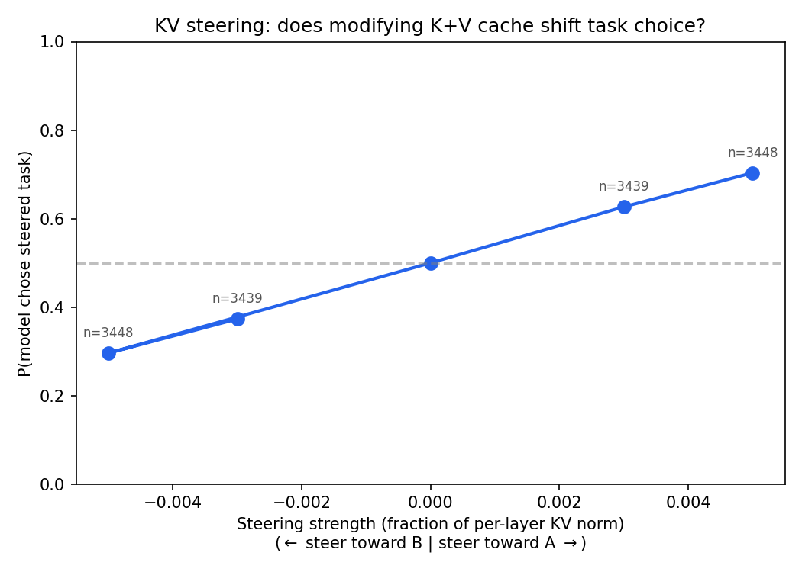
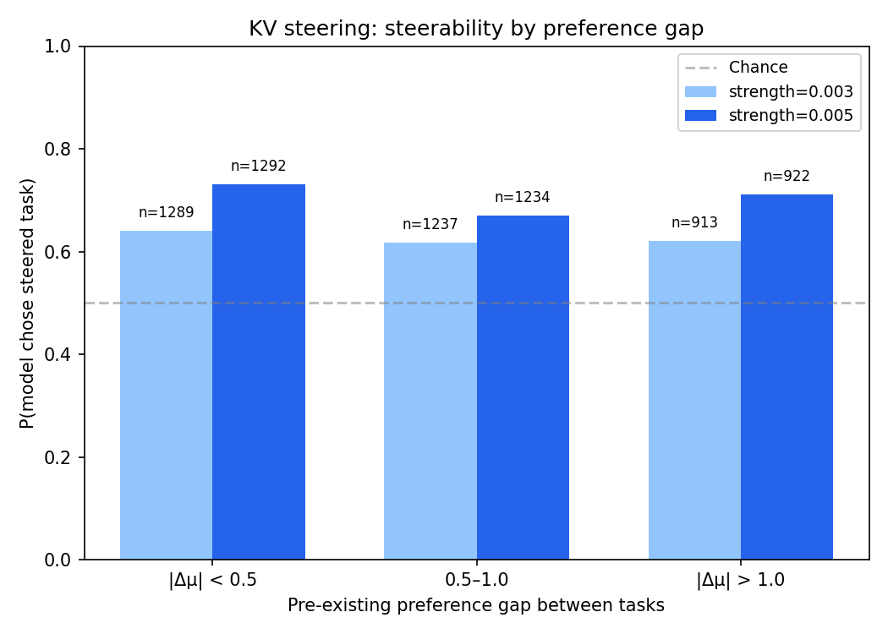

# Isolated steering full run

Two causal steering experiments testing whether preference probe directions causally control task choice in gemma-3-27b. See `full_run_spec.md` for full design.

## KV steering (complete)

**Result:** Directly modifying K+V cache entries across all 62 layers causally shifts task choice. P(chose steered task) = 0.63 at strength 0.003, rising to 0.70 at strength 0.005, with clear dose-response. 7,760 rows from 97 pairs (3 failed span detection), 11% refusal rate.

### Dose-response

| Strength | P(steered) | n |
|----------|-----------|---|
| 0.003 | 0.627 | 3,439 |
| 0.005 | 0.704 | 3,448 |

Monotonic dose-response, symmetric shifts across positive and negative multipliers. Orderings balanced (~850 per cell per ordering).

### Steerability by preference gap

Steering works across all preference gap bins. Slightly stronger for pairs with small |delta_mu| (0.73 at strength 0.005) vs large (0.70), but the difference is modest.

### Comparison to prior V-only run

The previous V-only run (114 pairs, uniform norm scaling) showed P(steered) = 0.64 at m=0.003, with incoherence above m=0.007. This K+V run with per-layer norm scaling shows:
- Comparable effect at m=0.003 (0.63 vs 0.64)
- Stronger effect at m=0.005 (0.70 vs previous ~0.57)
- Lower refusal rate (11% vs 20%+ at m=0.005 in the old run)
- No incoherence problems at these multipliers

## Hook patching (in progress)

~26% complete (18,840/72,000 rows). Results will be added when finished.
