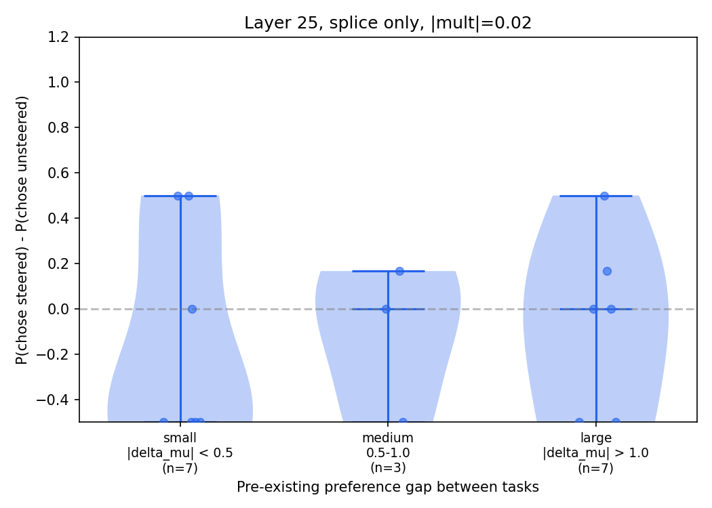
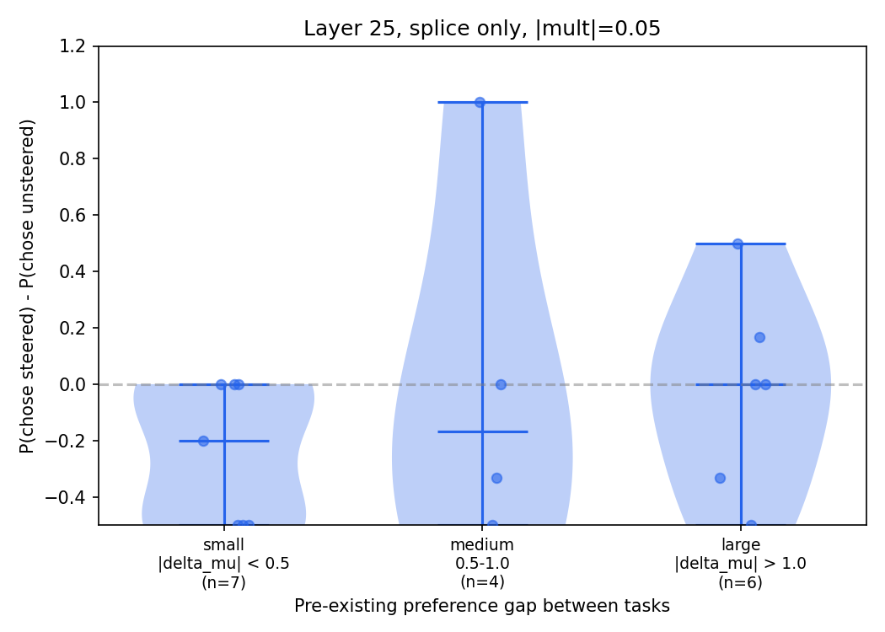

# Hook patching pilot

**Result:** Activation patching at layer 25 causally shifts task choice. The model chooses the steered task 74-79% of the time (splice only) or 97-99% (with suffix recompute), vs 50% chance. Layer 32 shows a weak effect (~54%).

## What we're testing

Gemma-3-27b is given a pairwise choice prompt ("Task A: write a poem. Task B: solve 2x+3=7") and completes whichever task it prefers. We intervene on the KV cache to push the model toward one task, then measure: **did the model choose the task it was steered toward?**

The intervention works as follows:

1. Run three forward passes over the same prompt: one clean (no steering), one with +direction added to the residual stream at task A's token positions, one with -direction added at task B's positions. All three passes use a probe direction trained to predict preference from activations.
2. Build a combined KV cache: start from the **clean** cache, then splice in task A's positions from the +steered pass and task B's from the -steered pass. Non-task positions (template, instruction tokens) remain clean.
3. Optionally **recompute suffix**: re-run the forward pass for tokens after task B, so the instruction-following tokens attend to the steered task spans through fresh attention rather than using the clean cache.
4. Generate from the combined cache and parse which task the model chose to complete.

Each pair is tested in both presentation orders (A-first and B-first) to control for position bias. The steering direction is flipped accordingly so "steer toward task A" always means the same thing regardless of order.

## Setup

20 random pairs, 2 layers (25, 32), 2 steering strengths (0.02, 0.05 of mean activation norm), 2 presentation orderings, 3 trials per cell. Total: 1920 generations on gemma-3-27b.

## Results

| Layer | Mode | P(steered) at 0.02 | P(steered) at 0.05 |
|-------|------|--------------------|--------------------|
| 25 | Splice only | 0.74 | 0.79 |
| 25 | Splice + recompute | 0.97 | 0.99 |
| 32 | Splice only | 0.54 | 0.56 |
| 32 | Splice + recompute | 0.54 | 0.53 |

Layer 25 shows a strong causal effect at both strengths. Layer 32 is barely above chance (~n=200 per cell).

Suffix recomputation amplifies the layer 25 effect from ~0.77 to ~0.98 average P(steered). At layer 32 the two modes are indistinguishable.

### Does steering effect depend on pre-existing preference?

For each pair, we compute the per-pair causal effect: P(chose steered task | steered toward) - P(chose steered task | steered away), then bin by |delta_mu| (the Thurstonian utility gap between the two tasks).

With only 20 pairs (6 binary trials per pair per multiplier), per-pair estimates are heavily quantized and too noisy to draw conclusions about preference-gap moderation. The full 200-pair experiment will be needed to test whether steering is stronger on indifferent pairs vs pairs with strong pre-existing preferences.

## Takeaways

- Layer 25 probe direction causally controls task choice. Layer 32 does not (at these strengths).
- Suffix recomputation is a strict amplifier: large effect when the base signal is strong, no effect when it's weak.
- Pipeline validated for the full experiment (200 pairs, 5 layers).
