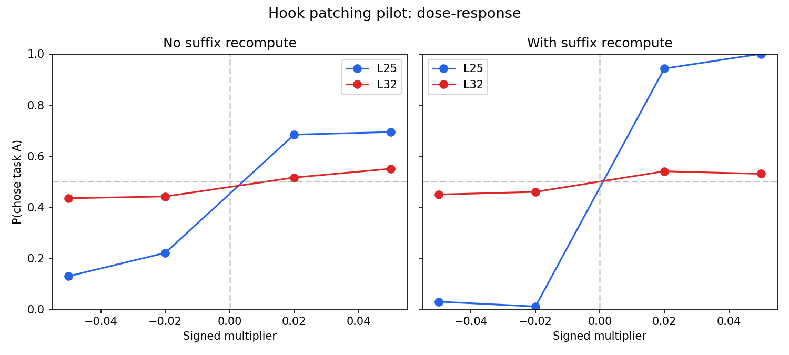
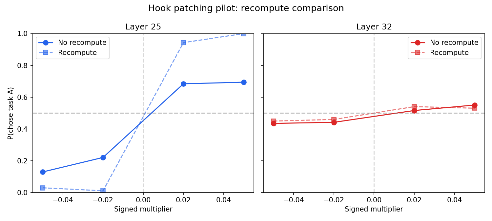

# Hook patching pilot

Validation of the refactored activation patching pipeline: clean base cache, K+V steering, ordering negation fix, with and without suffix recomputation.

## Setup

20 pairs, 2 layers (L25, L32), 4 signed multipliers (±0.02, ±0.05), 2 orderings, 3 trials per cell. Total: 1920 generations. Config: `configs/steering/hook_patching_pilot.yaml`.

## Results

**L25** shows a strong monotonic dose-response in both modes. Without recompute, P(a) ranges from 0.13 (mult=-0.05) to 0.69 (mult=+0.05). With suffix recompute the effect nearly saturates: P(a) from 0.01 to 1.00.

**L32** shows a weak effect (~0.05-0.07 shift) in both modes, barely above noise at n≈100.

Suffix recomputation amplifies the L25 effect substantially (the suffix tokens attend to the steered task spans through fresh attention). At L32 the two modes are nearly identical — the steering signal is too weak for recomputation to matter.

## Conclusions

- The refactored pipeline works: steering causally shifts task choice in the expected direction at L25.
- L25 is the most effective probe layer, consistent with prior probe evaluations.
- Suffix recomputation is a strict amplifier: it increases effect size when the base signal is strong, but doesn't create signal where there is none.
- The full experiment (200 pairs, 5 layers) can proceed with this pipeline.
