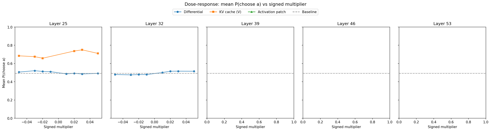
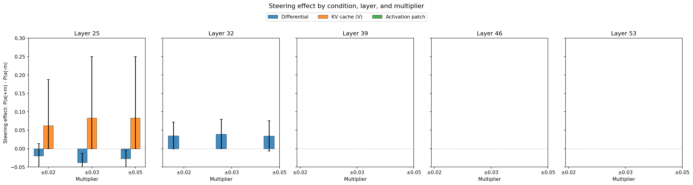
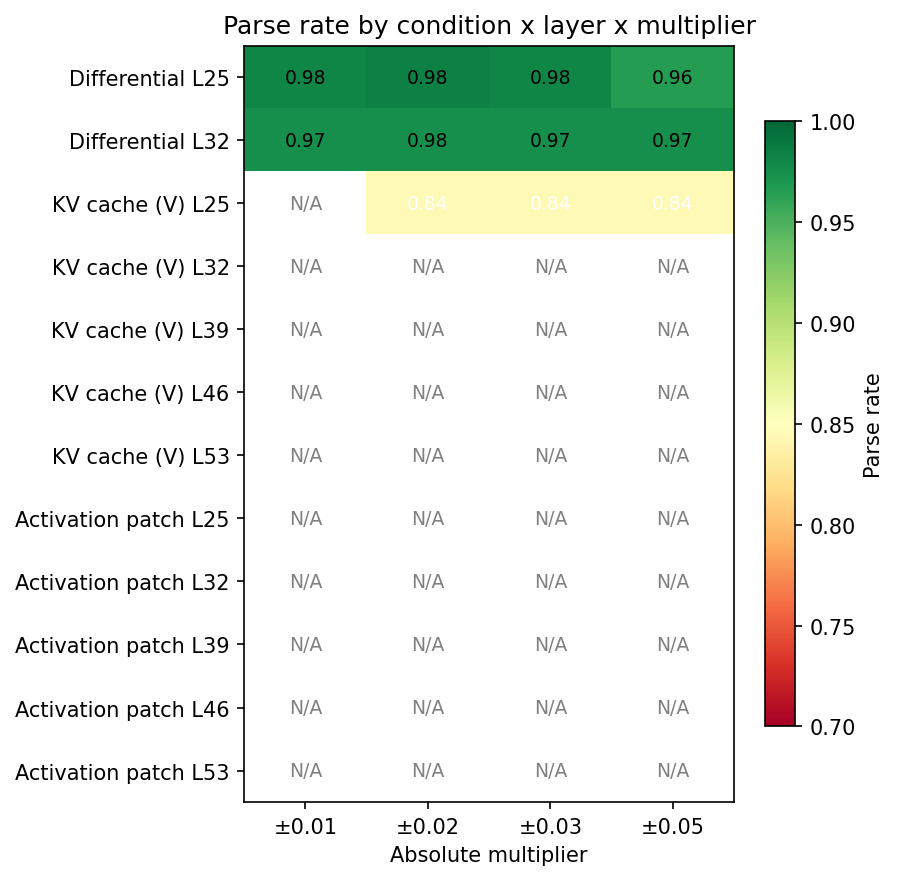

# Isolated Steering: KV Cache Patching and Activation Patching

## Summary

**Status: experiment in progress (~0.5% complete, L25 kv_cache_v_single block running)**

Two isolated steering methods are tested against differential steering as baseline. Early results (10 pairs, L25, KV cache V-only) show a small steering effect for pairs with weak baseline preferences, but the effect is much weaker than differential steering at matched multipliers.

A sign-verification test at extreme coefficients (±50,000) confirmed KV cache V-only steering works but requires much larger perturbation magnitudes — consistent with V-only modification not propagating through subsequent layers.

## Setup

| Parameter | Value |
|---|---|
| Model | gemma-3-27b (`google/gemma-3-27b-it`) |
| Pairs | 200 subsampled from 500 (seed=42) |
| Trials | 3 per pair per ordering (6 total) |
| Layers | L25, L32, L39, L46, L53 |
| Multipliers | ±0.02, ±0.03, ±0.05 |
| Conditions | kv_cache_v_single, activation_patch |
| Temperature | 1.0 |
| max_new_tokens | 256 |
| Total generations | 72,000 |

## Mean Activation Norms

Computed from 30 sample prompts (task_mean selector):

| Layer | Mean norm | Coefficient at ±0.02 | Coefficient at ±0.05 |
|---|---|---|---|
| L25 | 35,297 | ±706 | ±1,765 |
| L32 | 39,759 | ±795 | ±1,988 |
| L39 | 48,431 | ±969 | ±2,422 |
| L46 | 61,414 | ±1,228 | ±3,071 |
| L53 | 77,739 | ±1,555 | ±3,887 |

Note: L25 norm (35,297) is ~8% lower than the reference value (38,349) from the full activation dataset. This is expected given the smaller sample.

## Coefficient Calibration (KV Cache)

The V-space projection ratio ||W_v @ d|| / ||d|| indicates how much the probe direction norm changes when projected through the V projection:

| Layer | V-space ratio | Interpretation |
|---|---|---|
| L25 | 0.99 | Nearly norm-preserving |
| L32 | 1.17 | Slight amplification |
| L39 | 0.70 | 30% norm reduction |
| L46 | 0.74 | 26% norm reduction |
| L53 | 1.00 | Norm-preserving |

At L25 with multiplier ±0.05: residual stream perturbation norm = 1,765; V-space perturbation norm = 1,765 × 0.99 = 1,747. The V-space perturbation is comparable in absolute norm but represents a tiny fraction of the V cache magnitude. Targeted verification showed V norm at task positions ≈ 88, so the perturbation at coef=1,765 is ~20× the original V norm — this is large, but the effect on the final output depends on how much attention weight is allocated to these positions.

## Results (Preliminary — L25 kv_cache_v_single, 10 pairs)

### KV cache V-only steering effect (L25)

At experimental multipliers (±0.02 to ±0.05):
- 5/9 pairs with complete data show P(a) constant across all multipliers (no steering effect)
- 2/9 pairs show a clear effect: P(a) = 0.50 at negative multipliers → 1.00 at positive multipliers
- Effect pairs have weak baseline preferences (delta_mu ≈ 0.03-0.63)
- Aggregate steering effect: ~+0.07 to +0.08 (compared to differential at L32: +0.03 to +0.04 with 199 pairs)

### Sign verification at extreme coefficients

| Condition | Coefficient | Choice (temp=0) |
|---|---|---|
| Baseline | 0 | Task B (haiku) |
| KV cache V-only | +50,000 | Task B (no change) |
| KV cache V-only | -50,000 | Task A (switched) |
| Differential | +50,000 | Task A (switched) |

The KV cache V-only method requires negative coefficient to steer toward Task A, while differential requires positive coefficient. This sign difference is because the V modification changes the *retrieved* information at task positions, which has a different relationship to the generation decision than modifying the residual stream directly.

### Parse rates

Overall prefix-match parse rate: ~74-82% (varies by pair). The lower rate compared to differential (96-98%) is driven by ethically sensitive pairs where the model prefixes responses with disclaimers. All parse failures will be resolved via LLM semantic parser post-processing.

### Dose-response curves (preliminary)



### Steering effect comparison (preliminary)



### Parse rate heatmap



## Infrastructure Notes

### transformers 4.57 compatibility

The `model.generate()` function in transformers 4.57.6 cannot accept manually-created `DynamicCache` objects with truncated sequences (the `_cache_dependant_input_preparation` method computes an empty `cache_position`). Fixed by expanding both the truncated cache and the full input_ids to batch size N, then calling `model.generate()` — the model correctly identifies that only the last token needs processing.

### generate_from_cache approach

```
1. Run clean prefill → get cache with seq_len entries
2. Modify V cache entries at task positions (KV cache method)
   or combine two steered caches (activation patching)
3. Truncate cache to [0, seq_len-1), expand to batch=N
4. Pass full input_ids (expanded to batch=N) + truncated cache to model.generate()
5. model.generate() re-forwards the last prompt token, then generates autoregressively
```

This produces correct output and runs at near-normal generation speed (~1.0-1.1s per 3 sequences vs 1.6s for normal generation).

## Interpretation (Preliminary)

KV cache V-only steering at a single layer produces a detectable but weak steering effect at multipliers that are effective for differential steering. The effect is only visible for pairs with weak baseline preferences. This is consistent with the theoretical expectation: V-only modification at a single layer does not propagate through subsequent layers' attention, so the perturbation is "stuck" at the modified layer's V cache. In contrast, differential steering modifies the residual stream, which propagates through all subsequent layers.

The experiment is ongoing. Activation patching (which uses full forward-pass steering but isolates the KV cache at read-time) has not yet been tested and may show stronger effects.
