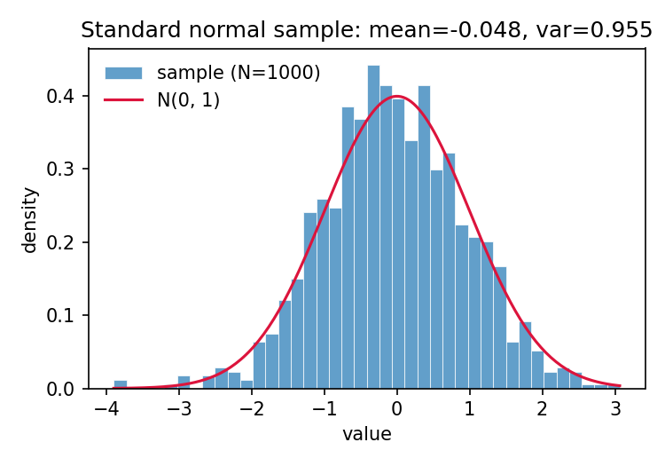

# test_basic_compute — report

Smoke-test experiment. See `test_basic_compute_spec.md`. Not a real result — exists only to exercise the experiment scaffolding (spec → scripts → report → assets → finalize).

## Results

| quantity      | value     | expected |
|---------------|-----------|----------|
| sample mean   | $-0.048$  | $0$      |
| sample variance ($s^2$) | $0.955$ | $1$ |
| Pearson $r$ (two independent draws) | $0.059$ | $0$ |

All three sit inside their respective sampling distributions for $N=1000$ (std. error of the mean $\approx 0.032$; std. error of $r$ under $H_0$ $\approx 0.032$). Nothing to interpret beyond "the harness ran end-to-end."

## Files

- `scripts/test_basic_compute/run.py` — single-file experiment runner.
- `experiments/test_basic_compute/results.json` — raw numeric outputs.
- `experiments/test_basic_compute/assets/plot_051126_normal_histogram.png` — histogram with analytic overlay.
