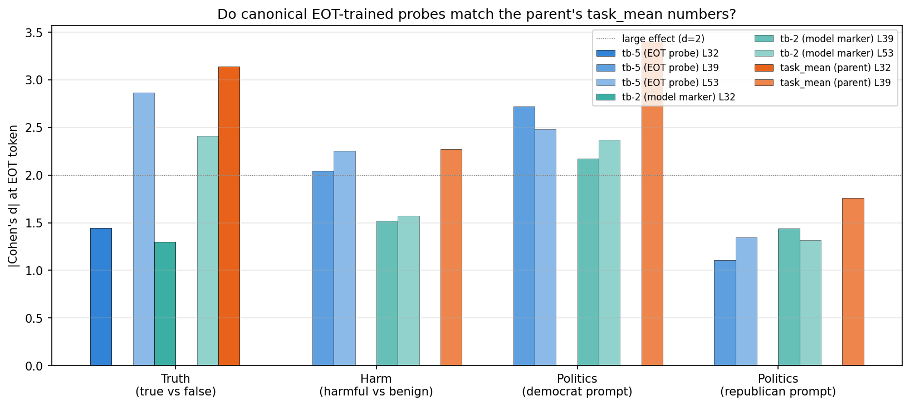
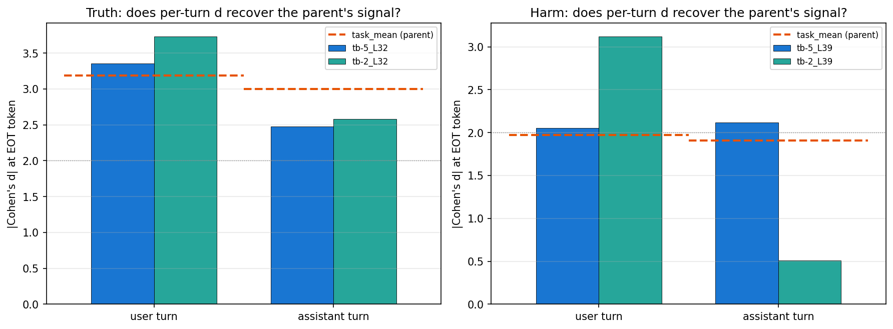
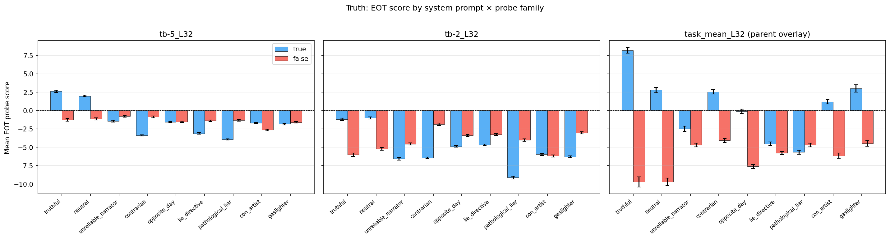
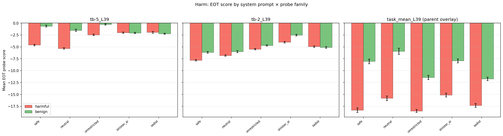
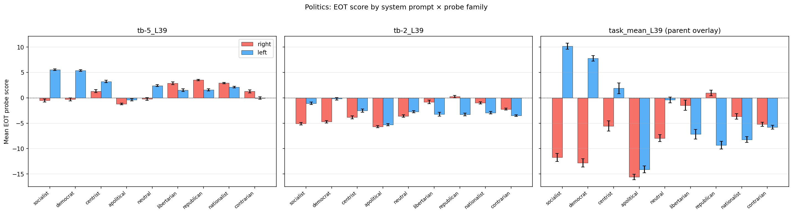

# Canonical turn-boundary probe at EOT: truth / harm / politics

## Summary

- **Canonical turn-boundary probes (trained and applied at the same token) match the parent's post-hoc "best probe per domain" numbers** — per-turn Cohen's d is equal or better than parent's `task_mean` probes on harm and on truth user turn.
- **tb-5 (trained at the `<end_of_turn>` token) is the single cleanest choice**: d = 2–3 on truth and harm at per-turn level, turn-stable on harm, matches or beats parent.
- **tb-2 (trained at the `model` role marker) is almost as good on truth and user-turn harm, but collapses to d = 0.5 on assistant-turn harm** — consistent with the marker's structural position relative to the content under each turn.
- **§5.1.2 recommendation:** replace the `task_mean_L32 / task_mean_L39` headline with tb-5 per-turn numbers. One probe family, one layer per domain, no post-hoc "best probe" selection.

## Setup

### What each probe name means

| Probe name | Trained at token | Gemma-3-IT correspondence |
|---|---|---|
| `tb-5` | `turn_boundary:-5` | `<end_of_turn>` marker (end of user turn) |
| `tb-2` | `turn_boundary:-2` | `model` role marker (start of assistant turn) |
| `task_mean` | mean over task tokens | (parent's probe, used for comparison only) |

All probes are ridge, trained on the same 10k revealed-preference pairwise task data at the listed token selector. Positive probe score means "preference-positive" (the chosen task in the training pair).

### Stimuli (reused from parent)

| Domain | Conditions | Example critical span (from parent spec) | n base items |
|---|---|---|---|
| Truth | `true` / `false` / `nonsense` | "...is **Pink Floyd** / **The Beatles** / **a kitchen sponge**" | 88 |
| Harm | `harmful` / `benign` / `nonsense` | "...**secretly drug** / **help relax** / **hypnotize**" | 77 |
| Politics | `left` / `right` / `nonsense` | "...**single-payer universal system** / **free-market competition**" | 78 (× 3 system prompts) |

Truth and harm items come in user-turn and assistant-turn variants (same critical span, different positioning in the chat template). Politics items are assistant-turn only, under `democrat` / `republican` / `neutral` system prompts for the base set and 9 prompts for the induced-shift analysis.

### Data and compute

- Input: three existing JSON files in `../system_prompt_modulation_v2/` (`parent_eot_scores.json`, `scoring_results.json`, `politics_scoring_results.json`). No rescoring.
- Compute: ~5 s numpy on laptop.

## Result 1: Does the canonical probe match the parent?

- **Pooled d understates tb-5 / tb-2** because their mean shifts between user and assistant turns. tb-5_L53 clears d = 2 on truth, harm, and politics-democrat; task_mean_L{32,39} is comparable.
- **Politics sign convention note:** parent reports `left vs right` d = +3.40 under democrat prompt; this analysis reports `right vs left` d = -2.72. Same finding, opposite-sign convention. Absolute magnitudes below are |d|.

## Result 2: Per-turn d recovers the parent's signal

- **Truth user turn:** tb-5_L32 d = 3.35, tb-2_L32 d = 3.73 — both exceed parent's task_mean_L32 (d = 3.19).
- **Truth assistant turn:** tb-5_L32 d = 2.47, tb-2_L32 d = 2.58 — below parent's 3.00 but still large.
- **Harm user turn:** tb-5_L39 d = -2.05, tb-2_L39 d = -3.12 — both exceed parent's 1.97.
- **Harm assistant turn:** tb-5_L39 d = -2.12 (exceeds parent's 1.91); **tb-2_L39 collapses to -0.51**.

The tb-2 assistant-turn collapse is mechanistic: the `model` role marker sits *after* harmful/benign content on user-turn stimuli (so probe reads a completed summary) but *before* the content on assistant-turn stimuli (so probe reads an empty context). **tb-5 has no such asymmetry** — it's the single-probe story.

## Result 3: Induced shifts track system prompt

### Truth — lying prompts flip the signal

- Truthful / neutral: tb-5_L32 d ≈ +2.5 (true > false, as expected).
- Lying prompts (`pathological_liar`, `contrarian`): tb-5_L32 d ≈ -2.5 (true < false, probe tracks the stated-truthfulness-stance of the system prompt).
- Weakest flips: `unreliable_narrator`, `con_artist` — small-magnitude d, consistent with weaker "lying" framing.

### Harm — evil personas compress the signal

- Safe / neutral: tb-5_L39 d ≈ -2 to -2.4 (harmful < benign, parent's expected direction).
- Evil personas (`sadist`, `sinister_ai`): tb-5_L39 d ≈ 0 — probe no longer distinguishes harmful from benign because the "harmful" readout is gone under that persona. Consistent with parent v2 "persona-relative" finding.
- `unrestricted` is a partial weakening (d = -1.6), `sadist` / `sinister_ai` is full collapse.

### Politics — stance of system prompt flips the sign

- Left-leaning prompts (`socialist` |d| = 2.77, `democrat` |d| = 2.72): left > right.
- Right-leaning prompts (`republican` |d| = 1.11, `nationalist` |d| = 0.58, `libertarian` |d| = 0.56): right > left.
- `neutral`: left > right (|d| = 1.36, default model lean — matches parent observation).
- tb-5_L39 gives larger magnitudes than tb-2_L39 on the strongly-partisan prompts.

## Result 4: Nonsense control

- **Truth passes for both probes.** Nonsense mean sits *below* both evaluative conditions (tb-5_L32: nonsense -3.99 vs lower eval mean -3.22; tb-2_L32: nonsense -9.10 vs -8.27).
- **Harm fails for both probes.** Nonsense sits *between* benign and harmful rather than below harmful (tb-5_L39: nonsense -4.36 vs harmful -4.98 and benign higher). Parent's `task_mean_L39` passed this control.
- Caveat worth noting in §5.1.2: canonical turn-boundary probes read gibberish as "less harmful" than a genuinely harmful prefill, whereas task_mean reads it as "at least as harmful".

## Recommended numbers for §5.1.2

Replace `task_mean_L32` / `task_mean_L39` headline with tb-5 per-turn numbers (same single probe family throughout):

| Cell | Probe | d | CV acc |
|---|---|---|---|
| Truth, user turn | tb-5_L32 | +3.35 | 0.93 |
| Truth, assistant turn | tb-5_L32 | +2.47 | 0.88 |
| Harm, user turn | tb-5_L39 | -2.05 | 0.89 |
| Harm, assistant turn | tb-5_L39 | -2.12 | 0.84 |
| Politics, democrat prompt (left vs right) | tb-5_L39 | +2.72 | 0.92 |
| Politics, republican prompt (left vs right) | tb-5_L39 | -1.11 | 0.72 |

Parent's task_mean scan becomes appendix evidence of cross-selector generalisation.

## Limitations

- **Single model** (Gemma-3-27B-IT). No Qwen replication here.
- **Harm nonsense control fails** for tb-5/tb-2 where it passed for task_mean. Real difference in probe behaviour; should be flagged if §5.1.2 uses these numbers.
- **No bootstrap CIs.** Per-cell n ∈ {77, 88, 154, 176}; ~5-line add if CIs are wanted for the paper.
- **Contamination check not executed.** Probe was trained on 10k revealed-preference tasks; truth/harm/politics stimuli come from CREAK / BailBench / hand-crafted — different ID spaces, leakage structurally unlikely, but unverified.

## Files

- `scripts/analyze.py`, `scripts/plot_induced_shifts.py`
- `headline_table.csv`, `per_turn_table.csv`, `nonsense_control.csv`, `induced_shift_table.csv`, `analysis_summary.json`
- `assets/plot_042126_tb_eot_headline_d.png`
- `assets/plot_042126_tb_eot_per_turn_d.png`
- `assets/plot_042126_tb_eot_by_system_prompt_{truth,harm,politics}.png`
