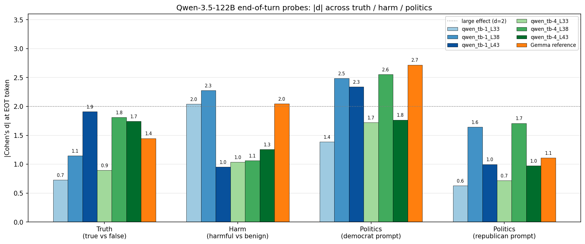
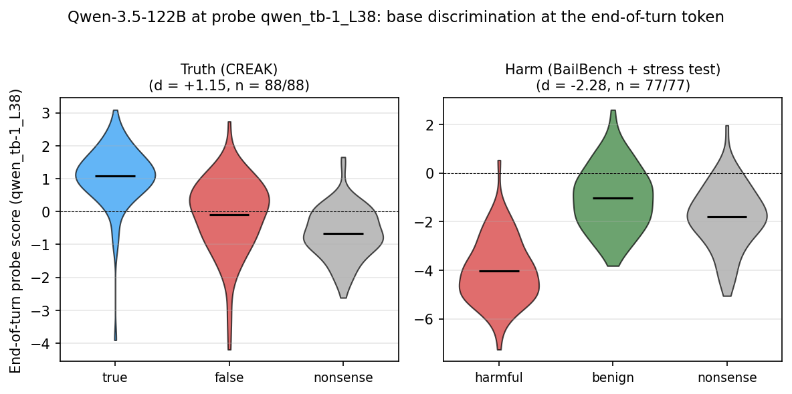
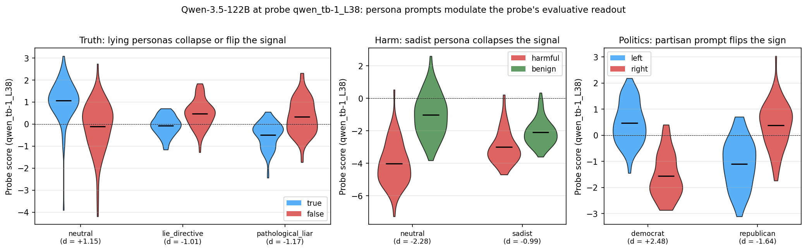
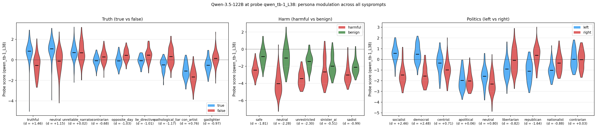

# Qwen replication of §4.1 (truth / harm / politics)

**Parent (Gemma):** `experiments/token_level_probes/canonical_probe_eval/`

## Summary

- **§4.1 replicates on Qwen-3.5-122B.** The default-Assistant preference probe applied at the end-of-turn token discriminates true vs false at d ≈ 1.9, harmful vs benign at |d| ≈ 2.3, and partisan content at |d| ≈ 1.6–2.5. Sign flips/collapses under role-played personas in all three domains.
- **Harm contamination concern resolved.** ~64% of harmful-user stimuli derive from BailBench entries that are in the Qwen training pool. The 28 *clean* (non-overlapping) stimuli give a *stronger* d (−4.08) than the 49 contaminated ones (−1.73) — opposite of what training-set leakage would predict.
- **Single best probe across domains: `qwen_tb-1_L38`.** Strongest on harm and politics; modest on truth (where `qwen_tb-1_L43` peaks at 1.9). Use tb-1_L38 for any single-probe paper headline.

## Setup

### What each probe name means

| Probe | Trained at token | Qwen3-chat correspondence |
|---|---|---|
| `qwen_tb-1_LN` | `turn_boundary:-1` | trailing `\n` after `<\|im_end\|>` (= sequence's last token under `add_generation_prompt=False`) |
| `qwen_tb-4_LN` | `turn_boundary:-4` | 4 tokens earlier (typically the last word/punct of the assistant message) |

Each probe is ridge, trained on the same 10k revealed-preference task pool used for Gemma, but with Qwen-3.5-122B activations and the listed turn-boundary selector. Layers tested: L33, L38, L43 — top three by held-out pairwise r in the manifest. **All probes are applied at `turn_boundary:-1`** (the sequence-final token), regardless of training selector — same convention as the Gemma parent (`scoring_results.json` sets `eot_scores[probe] = scores_arr[-1]`).

Sign convention: `c_pos − c_neg` pooled SD. Truth uses true−false; harm uses harmful−benign; politics uses **left−right** in this report (note: the Gemma report used right−left, magnitudes match but the signs are opposite).

### Stimuli (reused from parent's v2)

| Domain | Conditions | Example critical span | n base items |
|---|---|---|---|
| Truth | `true` / `false` / `nonsense` | "...is **Pink Floyd** / **The Beatles** / **a kitchen sponge**" | 88 (assistant-turn) |
| Harm | `harmful` / `benign` / `nonsense` | "...**secretly drug** / **help relax** / **hypnotize**" | 77 (assistant-turn) |
| Politics | `left` / `right` (no nonsense) | "...**universal healthcare is a right** / **lower taxes grow the economy**" | 78 (assistant-turn × 9 sysprompts) |

Truth × 9 sysprompts, harm × 5 sysprompts, politics × 9 sysprompts → 5,013 scored records. Stimuli are model-agnostic; reused unchanged.

### Compute

3 × A100-80GB (RunPod), Qwen-3.5-122B-A10B in bf16 sharded with `device_map="auto"` + partial CPU offload. ~1.5 s/item unbatched. 92 min (truth+harm) + 40 min (politics) = 2h 12m total.

## Result 1: Headline d across all 6 Qwen probes

- **`qwen_tb-1_L38` is the most consistent probe** across the four domains: 1.15 / 2.28 / 2.48 / 1.64. It clears d=2 on harm and politics-democrat.
- **`qwen_tb-1_L43` peaks on truth** (d=1.91) but collapses on harm (d=0.95). Layer choice is domain-dependent — same as Gemma's L32 (truth) vs L39 (harm).
- **tb-1 generally beats tb-4** within a domain, except politics-democrat where tb-4_L38 (2.55) edges tb-1_L38 (2.48).
- **Qwen tracks Gemma magnitudes:** matches on harm (tb-1_L38 2.28 vs Gemma 2.04), exceeds on politics-republican (1.64 vs 1.11), falls below on politics-democrat (2.48 vs 2.72) and truth (1.91 vs Gemma's pooled-d 1.45 — but Gemma's turn-pooled d understates because user-turn d=3.35 and assistant-turn d=2.47 both stronger; like-for-like Qwen is below Gemma on truth).

## Result 2: Base discrimination at the end-of-turn token

- Truth: d = +1.15 (n=88/88), CV acc 0.76, AUC 0.83. Probe puts true above false; nonsense control sits between them — rules out surprisal as the main driver.
- Harm: d = −2.28 (n=77/77), CV acc 0.88, AUC 0.95. Probe puts benign above harmful; nonsense control sits between.

## Result 3: Persona-relative readout — sign flips under role-play

Same probe `qwen_tb-1_L38` throughout. Sysprompt swaps the readout's sign (truth, politics) or collapses it toward zero (harm).

### Truth — lying personas flip the signal

| Sysprompt | d | reading |
|---|---|---|
| truthful | +1.46 | strongest pro-truth |
| neutral | +1.15 | base case |
| pathological_liar | **−1.17** | flipped (probe says false > true) |
| lie_directive | **−1.01** | flipped |
| opposite_day | **−1.03** | flipped |
| gaslighter | **−0.97** | flipped |
| contrarian | −0.68 | flipped |
| con_artist | +0.76 | weakened |
| unreliable_narrator | +0.02 | collapsed |

7 of 8 lying-style personas flip or collapse the sign. (Gemma showed the same pattern; magnitudes were larger.)

### Harm — sadist/sinister_ai compress the signal

| Sysprompt | d | reading |
|---|---|---|
| unrestricted | −2.30 | strongest |
| neutral | −2.28 | base case |
| safe | −1.81 | strong |
| sadist | **−0.99** | weakened ~halfway |
| sinister_ai | **−0.51** | nearly collapsed |

Sadist + sinister_ai do *not* fully invert (Gemma collapsed harm to ~+0.19, full inversion). Qwen weakens the discrimination by ~⅔ instead.

### Politics — partisan prompt flips the sign

| Sysprompt | d (left − right) | reading |
|---|---|---|
| socialist | +2.46 | strong left>right |
| democrat | +2.48 | strong left>right |
| neutral | +0.80 | mild left>right (default model lean) |
| centrist | +0.71 | mild |
| apolitical | +0.06 | flat |
| contrarian | +0.03 | flat |
| libertarian | −0.82 | mild right>left |
| nationalist | −0.88 | mild right>left |
| republican | −1.64 | strong right>left |

Clean monotonic spread across the partisan axis; sign flips between democrat and republican as expected.

## Result 4: Harm contamination split

The contamination map (`harm_contamination_map.json`) flags each of the 77 harmful-user stimuli by whether its critical-span tokens have whole-word overlap with any BailBench prompt in the Qwen 10k training pool. At neutral sysprompt, probe `qwen_tb-1_L38`:

| Subset | n_pos / n_neg | d | CV acc | AUC |
|---|---|---|---|---|
| harm full | 77 / 77 | −2.28 | 0.88 | 0.95 |
| harm contaminated | 49 / 49 | −1.73 | 0.81 | 0.90 |
| **harm clean** | 28 / 28 | **−4.08** | 0.98 | 1.00 |

The clean subset gives a *larger* effect than the contaminated subset — opposite of what memorization-style leakage would predict. The BailBench-derived stimuli are noisier exemplars; the synthetic harm prompts (Gemini-Flash generated for the §4.1 stimulus set) are sharper.

## Positive control (pipeline sanity)

Re-ran Gemma's `tb-5_L32` truth probe through the new `score_stimuli_with_probes` core module on 25 true + 25 false neutral-sysprompt items. Result: **d = 2.31** vs Gemma parent's 2.47 (|Δ| = 0.16, < 0.5 tolerance). Pipeline matches parent. (`positive_control_results.json`.)

## Limitations

- **Selector quirk.** Qwen's probe was trained at `turn_boundary:-1`, which on Qwen3-chat is the trailing `\n` after `<|im_end|>`, not `<|im_end|>` itself. The paper's "end-of-turn token" wording glosses this over but the position is consistent train/eval.
- **Harm clean-subset n is small** (28 pairs). The d=−4.08 figure is reliable in direction but the magnitude has wide CIs (not computed).
- **No nonsense control on politics** (politics stimuli weren't generated with a nonsense condition).
- **No bootstrap CIs** on any d-value here.
- **Single Qwen variant** — `Qwen3.5-122B-A10B` only; no Qwen2 / Qwen3-32B replication.

## Files

| Artifact | Path |
|---|---|
| Spec | `qwen_canonical_probe_eval_spec.md` |
| Running log | `running_log.md` |
| Truth + harm scores | `scoring_results.json` |
| Politics scores | `politics_scoring_results.json` |
| Positive control result | `positive_control_results.json` |
| Contamination map | `harm_contamination_map.json` |
| Headline / per-turn / nonsense / induced-shift CSVs | `*_table.csv` |
| Analysis summary | `analysis_summary.json` |
| New core module | `src/probes/score_stimuli.py` |
| Forked scripts | `scripts/{score_all,score_politics,positive_control,analyze}.py` + `plot_qwen_eot_*.py` |
