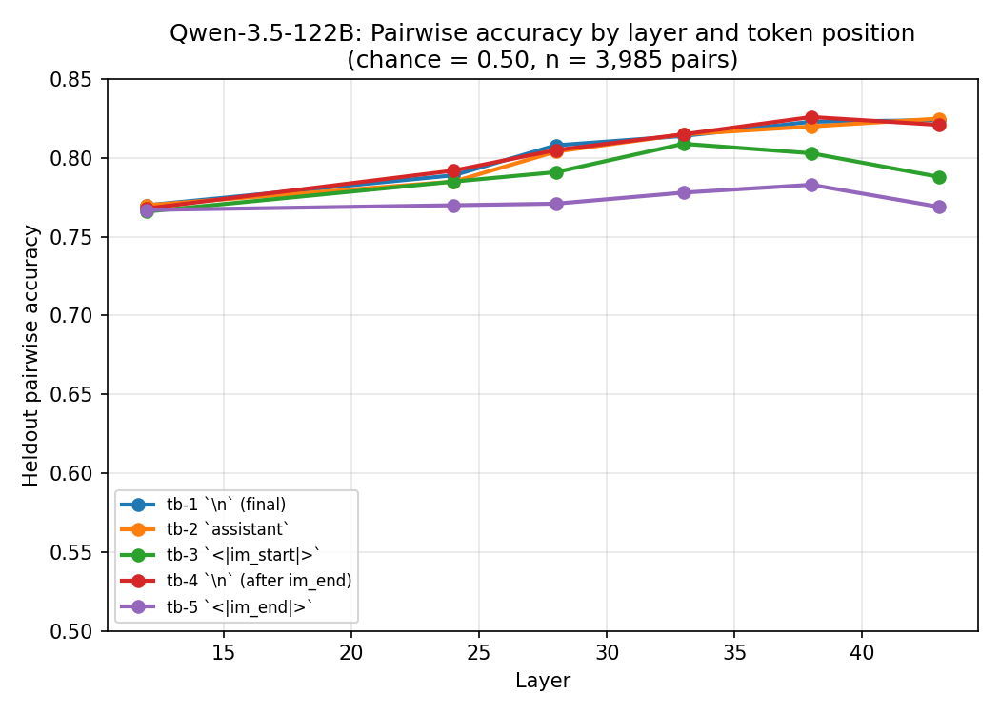
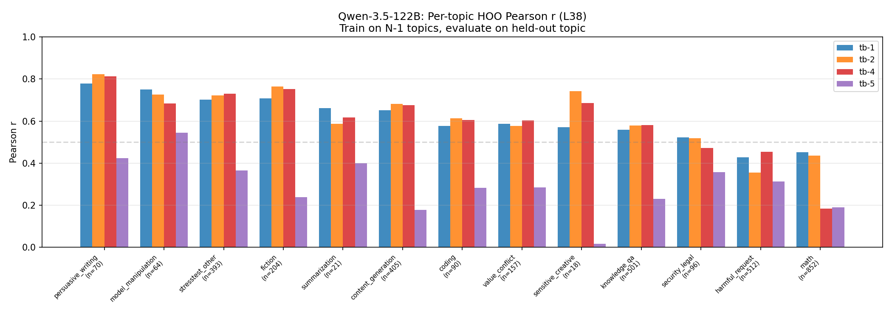

# Qwen-3.5-122B Turn Boundary Probe Sweep

## Summary

Ridge probes on Qwen-3.5-122B activations predict held-out Thurstonian preference scores with r=0.946 (best position/layer), substantially outperforming the same protocol on Gemma-3-27B (r=0.874). Signal is distributed uniformly across turn boundary positions — the worst position (`<|im_end|>`, r=0.889) still exceeds Gemma's best. This contrasts with Gemma, where `<start_of_turn>` collapsed to r=0.767.

## Setup

**Model**: Qwen-3.5-122B-A10B (MoE, 122B total / 10B active), nothink variant (`/no_think` system prompt to disable chain-of-thought).

**Tasks**: Probes trained on 10,000 Thurstonian preference scores (active learning), evaluated on a disjoint 4,038-task heldout set. Both sets drawn from wildchat, alpaca, math, bailbench, and stress_test.

**Token positions**: Activations extracted at 5 positions in the ChatML turn boundary, counting backward from the first completion token:

```
... user message <|im_end|>  \n  <|im_start|>  assistant  \n  [completion starts]
                    tb-5    tb-4      tb-3        tb-2    tb-1
```

Note: these are positional offsets, not semantic matches. Gemma-3-27B uses a different template (`<end_of_turn> \n <start_of_turn> model \n`) so tb-N refers to different tokens across models.

**Layers**: 12, 24, 28, 33, 38, 43 (25%, 50%, 58%, 69%, 79%, 90% of 48 layers).

**Probes**: Ridge regression. Alpha swept on one half of the 4k heldout set, evaluated on the other half. Metric: Pearson r against Thurstonian scores.

## Results




Best probe: r=0.946, 82.6% pairwise accuracy (tb-4 `\n` after im_end, layer 38). Top 3 positions are within 0.003r of each other. tb-3 (`<|im_start|>`) is 0.02r below, with a decline at layer 43 (0.924 → 0.903). tb-5 (`<|im_end|>`) is weakest by 0.06r — inverted relative to Gemma, where `<end_of_turn>` was one of the strongest positions.

### Cross-topic generalization (hold-one-out)

Train on 13 topics, evaluate on the held-out 14th. Task-weighted mean r across 14 folds. Tests whether the probe generalizes to unseen content domains rather than memorizing topic-level patterns.


The heldout-to-HOO gap is substantial: best heldout r=0.946 vs best HOO r=0.558 (tb-1, L38). This gap is larger than Gemma's (0.874 → 0.778), suggesting Qwen's heldout gains are partly topic-specific. tb-5 (`<|im_end|>`) is near-useless for cross-topic transfer (r=0.26), consistent with it also being the weakest on heldout.

### Per-topic HOO breakdown



Generalization varies widely by topic. Persuasive writing (r~0.8) and fiction (r~0.75) transfer well, while math (r~0.2–0.45) and harmful requests (r~0.35–0.45) are hard. tb-4 (`\n` after im_end) — the best heldout selector — collapses on math (0.18), while tb-1 and tb-2 hold at ~0.45. tb-5 (`<|im_end|>`) is below 0.4 on most topics.

## Comparison with Gemma-3-27B

Both models used the same protocol: 10k training tasks, 4k heldout eval, Ridge probes, Thurstonian scores.


| | Gemma-3-27B | Qwen-3.5-122B |
|---|---|---|
| Best r | 0.874 (tb-2 `model`, L32) | 0.946 (tb-4 `\n`, L38) |
| Worst r | 0.767 (tb-3 `<start_of_turn>`, L25) | 0.889 (tb-5 `<\|im_end\|>`, L38) |
| Best–worst spread | 0.107 | 0.057 |
| Peak layer (% depth) | L32 (52%) | L38 (79%) |

**Qwen probes are much more accurate** (+0.07r at best position). **Signal is uniform across positions** — Qwen's `<|im_start|>` (r=0.924) exceeds Gemma's *best* (0.874), while Gemma's `<start_of_turn>` collapses to 0.767. **Peak layers are deeper** (79–90% vs 52% depth).

## Reproduction

```bash
# Extract activations (requires multi-GPU pod for 122B MoE)
python -m src.probes.extraction.run configs/extraction/qwen35_122b_turn_boundary_sweep.yaml --resume

# Train probes (CPU, ~5 min per selector)
python -m src.probes.experiments.run_dir_probes --config configs/probes/qwen35_122b/qwen35_122b_heldout_turn_boundary_m1.yaml
python -m src.probes.experiments.run_dir_probes --config configs/probes/qwen35_122b/qwen35_122b_heldout_turn_boundary_m2.yaml
python -m src.probes.experiments.run_dir_probes --config configs/probes/qwen35_122b/qwen35_122b_heldout_turn_boundary_m3.yaml
python -m src.probes.experiments.run_dir_probes --config configs/probes/qwen35_122b/qwen35_122b_heldout_turn_boundary_m4.yaml
python -m src.probes.experiments.run_dir_probes --config configs/probes/qwen35_122b/qwen35_122b_heldout_turn_boundary_m5.yaml
```
